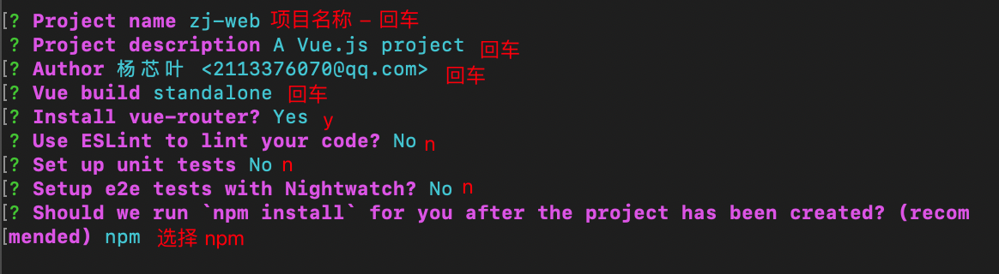
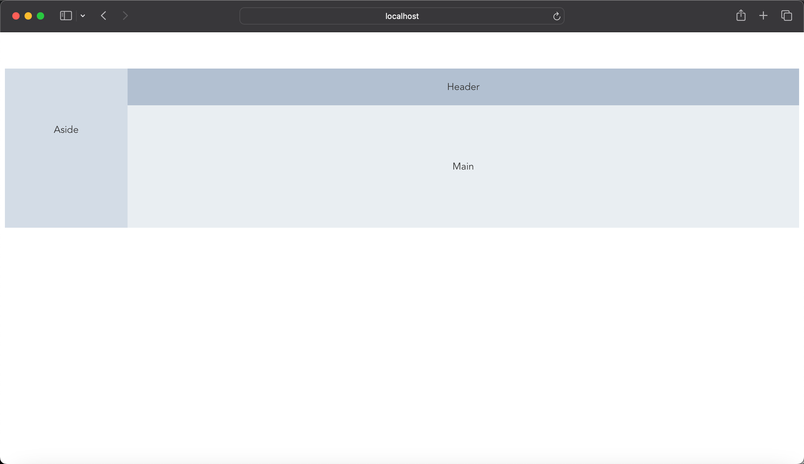
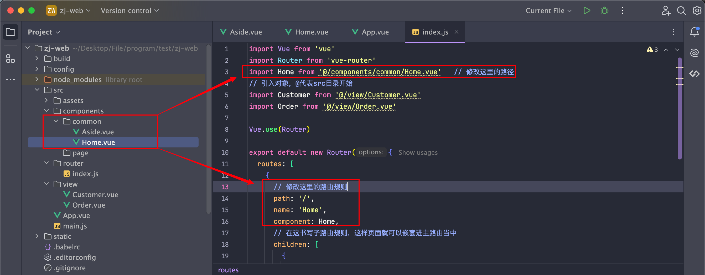
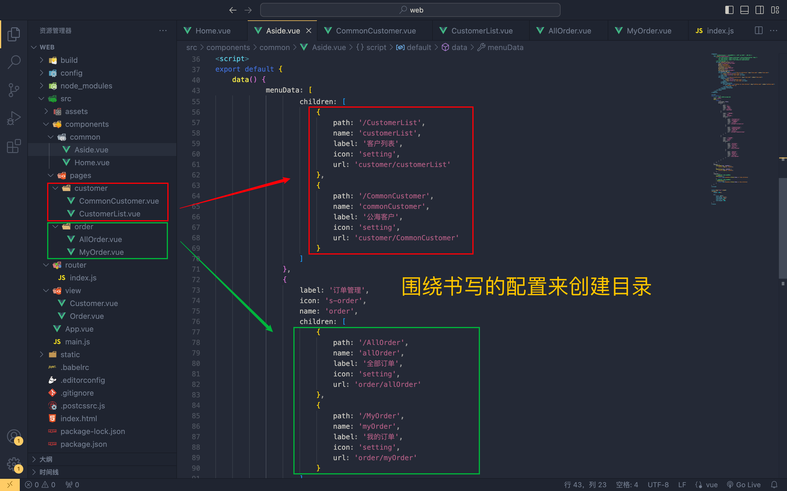
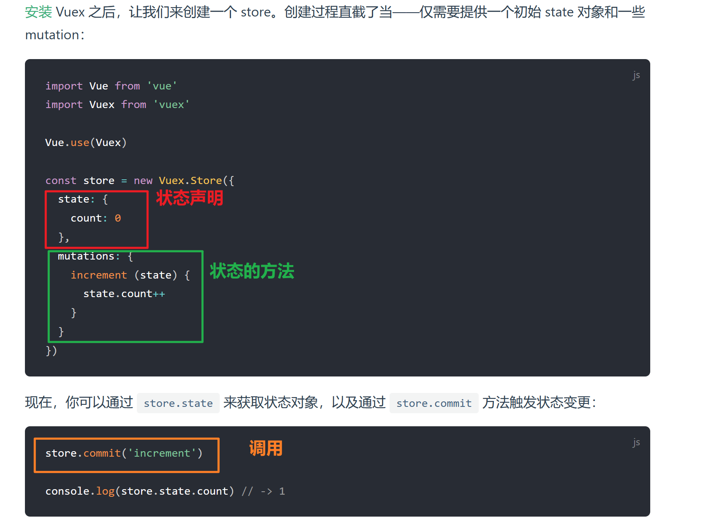
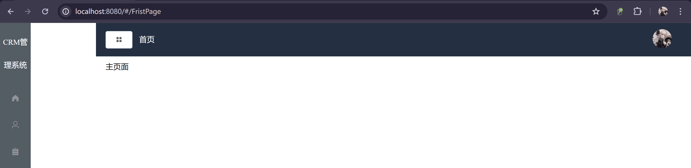
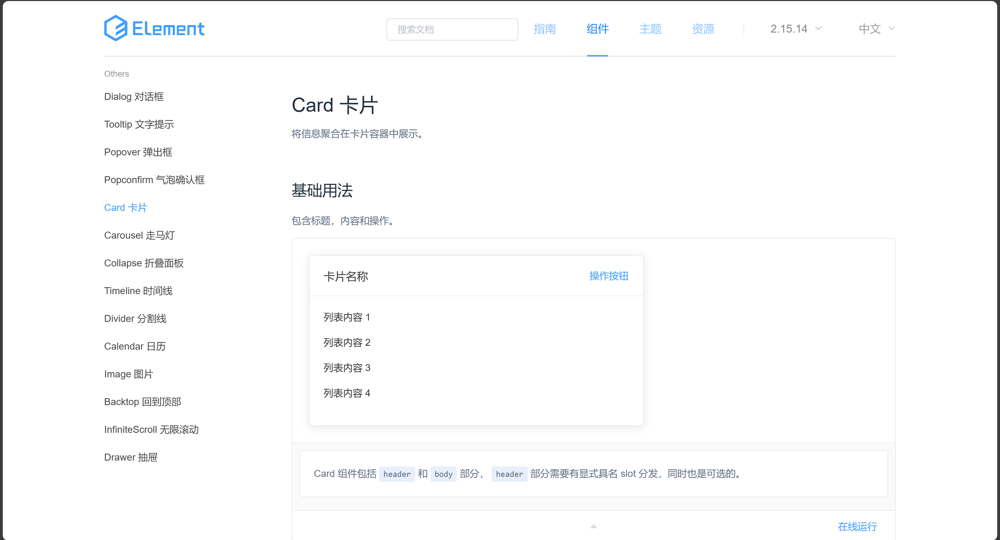
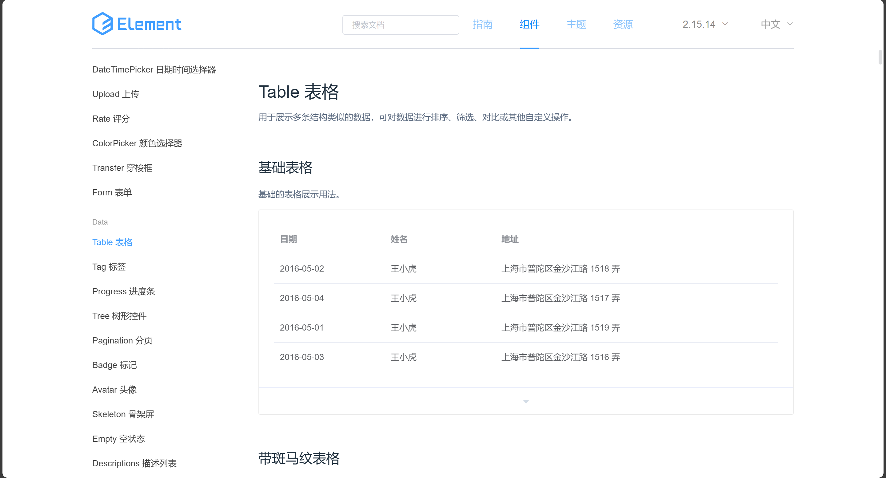
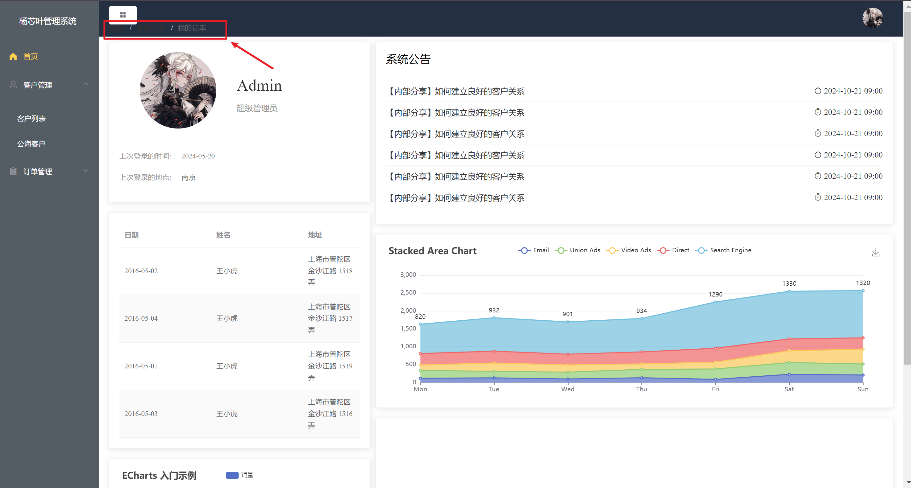

# 搭建脚手架Vue-cli 

## 环境准备

安装node，这里是16版本的node为例子

## 介绍

https://cli.vuejs.org/guide/

## 安装

### 安装环境

运行环境

```shell
npm install -g @vue/cli
```

打包环境

```shell
npm i -g @vue/cli-init
```

### 验证

```shell
 vue --version
```

### 安装脚手架 - 方式1

```shell
vue create 项目目录名
```


安装完成


看到这一步我们就可以打开VS code工具了，并且运行提示的命令`npm run serve`


最后在浏览器可以看到`vue-cli`的欢迎页


但是这种方式十分麻烦，只能创建最基础的vue脚手架工具，所以建议我们使用`webpack`打包工具构建

### 安装脚手架 - 方式2

```shell
vue init webpack 项目目录名
```

选择配置项，除了`route`和`npm`其他回车就好



安装完成能够看到和之前一样的提示信息


这时可以打开VS code再次运行


最后依然可以在浏览器看到vue的欢迎页

# 导入样式组件- Element UI

## 说明

https://element.eleme.cn/#/zh-CN

## 安装

```shell
npm i element-ui -S
```

## 引入方式

### 完整引入

在 `main.js` 中写入以下内容：

```javascript
import Vue from 'vue';
import App from './App.vue';
import ElementUI from 'element-ui';
import 'element-ui/lib/theme-chalk/index.css';

Vue.use(ElementUI);

new Vue({
  el: '#app',
  render: h => h(App)
});
```

修改文件，删除`hello`元素中的全部内容，以及所有样式，并从官网复制图标样式测试

```html
<template>
  <div class="hello">
    <!-- 清空全部内容并从官网复制样式 -->
    <el-row>
      <el-button plain>朴素按钮</el-button>
      <el-button type="primary" plain>主要按钮</el-button>
      <el-button type="success" plain>成功按钮</el-button>
      <el-button type="info" plain>信息按钮</el-button>
      <el-button type="warning" plain>警告按钮</el-button>
      <el-button type="danger" plain>危险按钮</el-button>
    </el-row>

  </div>
</template>


<script>
export default {
  name: 'HelloWorld',
  data() {
    return {
      msg: 'Welcome to Your Vue.js App'
    }
  }
}
</script>

<!-- 删除全部样式 -->
<style scoped></style>

```


### 按需引入

借助 [babel-plugin-component](https://github.com/QingWei-Li/babel-plugin-component)，我们可以只引入需要的组件，以达到减小项目体积的目的。

首先，安装 babel-plugin-component：

```bash
npm install babel-plugin-component -D
```

然后，将 .babelrc 修改为：

```json
{
  "presets": [["es2015", { "modules": false }]],
  "plugins": [
    [
      "component",
      {
        "libraryName": "element-ui",
        "styleLibraryName": "theme-chalk"
      }
    ]
  ]
}
```

# Vue的路由

## 简单路由

在src下创建路由访问页面目录`view`并在其中创建老公访问页面`Customer.vue`和`Order.vue`

```html
// Customer.vue
<template>
    <div>客户管理</div>
</template>

<script>
    export default {
        name:' customer',
        data() {
            return {}
        }
    }
</script>


// Order.vue
<template>
    <div>订单管理</div>
</template>

<script>
    export default {
        name:' order',
        data() {
            return {}
        }
    }
</script>
```


在路由目录`route`的主文件`index.js`中配置路由访问路径

```javascript
// 引入对象，@代表src目录开始
import Customer from '@/view/Customer.vue'
import Order from '@/view/Order.vue'
```


设置每个路由规则

```javascript
export default new Router({
  routes: [
    {
      path: '/',
      name: 'HelloWorld',
      component: HelloWorld
    },
    {
      path: '/Customer',
      name: 'Customer',
      component: Customer
    },
    {
      path: '/Order',
      name: 'Order',
      component: Order
    }
  ]
})
```


挂载我们的`router`实例，不过这一块我们在用`webpack`安装脚手架的时候已经自动为我们写好在`main.js`中

```javascript
import Vue from 'vue';
import App from './App';
import router from './router';		// 在这已经为我们引用好了
import ElementUI from 'element-ui';
import 'element-ui/lib/theme-chalk/index.css';


Vue.use(ElementUI);
Vue.config.productionTip = false

new Vue({
  el: '#app',
  router,  // 在这已经为我们挂载好了
  components: { App },
  template: '<App/>'
})

```

接下来中全局组件`App.vue`中渲染，此时需要定义路由出口利用`router-view`标签

```html
<template>
  <div id="app">
    
    <!-- 在这渲染我们配置好的路由 -->
    <router-view/>
  </div>
</template>
```

### 测试访问

访问`http://localhost:8080/#/Customer`


访问`http://localhost:8080/#/Order`


## 嵌套路由

嵌套路由分为主路由和子路由，子路由通过关键字`children`嵌套在主路由当中

### 修改路由

修改`router`中在`index.js`中写好的路由规则，将`/`看为主路由，其他看作子路由放进`children`当中

```javascript
export default new Router({
  routes: [
    {
      path: '/',
      name: 'HelloWorld',
      component: HelloWorld,
      // 在这书写子路由规则，这样页面就可以嵌套进主路由当中
      children: [
        {
          path: 'Customer',   // 注意这里没有斜杠了
          name: 'Customer',
          component: Customer
        },
        {
          path: 'Order',   // 注意这里没有斜杠了
          name: 'Order',
          component: Order
        }
      ]
    }
  ]
})
```

此时依然需要在`main.js`中挂载，并且在`App.vue`中渲染，不过此时需要单独在`HelloWorld.vue`中利用标签`router-view`单独声明在此页面中需要使用嵌套路由

```html
<template>
  <div class="hello">
    <!-- 清空全部内容并从官网复制样式 -->
    <el-row>
      <el-button plain>朴素按钮</el-button>
      <el-button type="primary" plain>主要按钮</el-button>
      <el-button type="success" plain>成功按钮</el-button>
      <el-button type="info" plain>信息按钮</el-button>
      <el-button type="warning" plain>警告按钮</el-button>
      <el-button type="danger" plain>危险按钮</el-button>
    </el-row>
    <!-- 在这单独给出路由出口 -->
    <router-view/>
    </div>
</template>
```

### 测试访问


# 主页面配置

## 准备目录

在`components`组件目录下创建布局的组件目录`common`以及页面目录`page`


## 选择布局样式

进入`Element UI`的首页选择合适的布局样式


放入`HelloWorld.vue`当中，调整顶部和侧边栏的位置来测试一下效果

```vue
<template>
  <div class="hello">
     <!-- 删除路由引入也没关系 -->
    <el-container>
      <el-aside width="200px">Aside</el-aside>
      <el-container>
        <el-header>Header</el-header>
        <el-main>Main</el-main>
      </el-container>
    </el-container>
  </div>
</template>


<script>
export default {
  name: 'HelloWorld',
  data() {
    return {}
  }
}
</script>

<!-- scoped 代表当前页面样式 -->
<style scoped>
.el-header,
.el-footer {
  background-color: #B3C0D1;
  color: #333;
  text-align: center;
  line-height: 60px;
}

.el-aside {
  background-color: #D3DCE6;
  color: #333;
  text-align: center;
  line-height: 200px;
}

.el-main {
  background-color: #E9EEF3;
  color: #333;
  text-align: center;
  line-height: 160px;
}

body>.el-container {
  margin-bottom: 40px;
}

.el-container:nth-child(5) .el-aside,
.el-container:nth-child(6) .el-aside {
  line-height: 260px;
}

.el-container:nth-child(7) .el-aside {
  line-height: 320px;
}
</style>

```


删除`App.vue`中的图片引用``，保存后查看页面



# 主页面侧边栏配置

在`Element UI`中找到导航栏设置


## 配置内容

### 选择内容


### 修改代码

在`component`目录下创建专门管理==侧边栏==的组件文件`Aside.vue`，并将复制的内容粘贴进去

```vue
<template>
		<!--  asideContainer是一个Vue组件，用于实现侧边栏的布局和样式。-->
    <div class="asideContainer">
        <el-radio-group v-model="isCollapse" style="margin-bottom: 20px;">
            <el-radio-button :label="false">展开</el-radio-button>
            <el-radio-button :label="true">收起</el-radio-button>
        </el-radio-group>
        <el-menu default-active="1-4-1" class="el-menu-vertical-demo" @open="handleOpen" @close="handleClose"
            :collapse="isCollapse">
            <el-submenu index="1">
                <template slot="title">
                    <i class="el-icon-location"></i>
                    <span slot="title">导航一</span>
                </template>
                <el-menu-item-group>
                    <span slot="title">分组一</span>
                    <el-menu-item index="1-1">选项1</el-menu-item>
                    <el-menu-item index="1-2">选项2</el-menu-item>
                </el-menu-item-group>
                <el-menu-item-group title="分组2">
                    <el-menu-item index="1-3">选项3</el-menu-item>
                </el-menu-item-group>
                <el-submenu index="1-4">
                    <span slot="title">选项4</span>
                    <el-menu-item index="1-4-1">选项1</el-menu-item>
                </el-submenu>
            </el-submenu>
            <el-menu-item index="2">
                <i class="el-icon-menu"></i>
                <span slot="title">导航二</span>
            </el-menu-item>
            <el-menu-item index="3" disabled>
                <i class="el-icon-document"></i>
                <span slot="title">导航三</span>
            </el-menu-item>
            <el-menu-item index="4">
                <i class="el-icon-setting"></i>
                <span slot="title">导航四</span>
            </el-menu-item>
        </el-menu>
    </div>
</template>

<script>
export default {
  // 添加 name 选项，其他不用管
    name:'Aside',
    data() {
        return {
            isCollapse: true
        };
    },
    methods: {
        handleOpen(key, keyPath) {
            console.log(key, keyPath);
        },
        handleClose(key, keyPath) {
            console.log(key, keyPath);
        }
    }
}
</script>


<style>
.el-menu-vertical-demo:not(.el-menu--collapse) {
    width: 200px;
    min-height: 400px;
}
</style>

```


### 重写

重新配置`HelloWorld.vue`文件，修改文件名为`Home.vue`并放入`common`目录下，同时需要配置`router`目录下的路由配置文件`index.js`


#### router/index.js

```javascript
··· ···
import Home from '@/components/common/Home.vue'		// 修改这里的路径
··· ···

export default new Router({
  routes: [
    {
      // 修改这里的路由规则
      path: '/',
      name: 'Home',
      component: Home,
    ··· ··· ···
    }
  ]
})

```



配置好了路由规则后，开始在`Home.vue`当中引用我们的侧边栏组件`Aside.vue`，根据页面布局中的提示找到我们应该修改的部分为`Aside`所以找到对应的内容是`<el-aside width="200px">Aside</el-aside>`，接下来我们只需要把`Aside`这个内容换成我们的组件即可，不过需要先引用

```vue
<template>
  <div class="hello">
					··· ···
      <el-aside width="200px">
        <!-- 调用组件 -->
        <Aside/>
      </el-aside>
    		 ··· ···
  </div>
</template>

<script>
// 引入组件
import Aside from './Aside.vue'

export default {
  name: 'Home',
  data() {
    return { }
  },
  // 声明组件
  components: {
    Aside
  }
}
</script>

```


### 修改样式

侧边栏默认打开是折叠状态，我们现在希望通过控制属性让他不要折叠


来到`Aside.vue`中，找到折叠属性`isCollapse`调整为false即可

```js
    data() {
        return {
            isCollapse: false
        };
    }
```


删除`el-menu`中的多余项，让导航二变成导航一，导航一变成导航二，注意挪动时要修改`index`值

```html
<template>
<!--  asideContainer是一个Vue组件，用于实现侧边栏的布局和样式。-->
    <div class="asideContainer">
		<el-menu>
          <el-menu-item index="1">
            <i class="el-icon-menu"></i>
            <span slot="title">导航一</span>
          </el-menu-item>
            <el-submenu index="2">
                <template slot="title">
                    <i class="el-icon-location"></i>
                    <span slot="title">导航二</span>
                </template>
									··· ···
            </el-submenu>
        </el-menu>
    </div>
</template>

```


修改分组样式

```html
<template>
<!--  asideContainer是一个Vue组件，用于实现侧边栏的布局和样式。-->
    <div class="asideContainer">
								··· ···
          <el-menu-item index="1">
            <i class="el-icon-menu"></i>
            <span slot="title">导航一</span>
          </el-menu-item>
            <el-submenu index="2">
                <template slot="title">
                    <i class="el-icon-location"></i>
                    <span slot="title">导航二</span>
                </template>
                <el-menu-item-group>
                    <el-menu-item index="1-1">选项1</el-menu-item>
                    <el-menu-item index="1-2">选项2</el-menu-item>
                </el-menu-item-group>
            </el-submenu>
        ··· ···
    </div>
</template>
```


最终效果


上面的菜单数据我们是固定的写在代码中的，我们在真实开发中肯定是需要通过后端服多来灵活的获取菜单信
息的。这时我们先模拟后端的数据。

在`Aside.vue`的`data()`中新建一个选项`menuData`，放入虚拟路由数据

```javascript
 data() {
        return {
            // 默认取消折叠状态
            isCollapse: false,
            menuData: [// 在这放入数据··· ···]
        };
    },
}
```

虚拟路由数据

```javascript
 data() {
        return {
            isCollapse: false,
            menuData: [
                {
                    path: '/',
                    name: 'main',
                    label: '首页',
                    icon: 's-home',
                    url: 'Home/Home'
                },
                {
                    label: '客户管理',
                    icon: 'user',
                    name: 'customer',
                    children: [
                        {
                            path: '/customerList',
                            name: 'customerList',
                            label: '客户列表',
                            icon: 'setting',
                            url: 'customer/customerList'
                        },
                        {
                            path: '/CommonCustomer',
                            name: 'commonCustomer',
                            label: '公海客户',
                            icon: 'setting',
                            url: 'customer/CommonCustomer'
                        }
                    ]
                },
                {
                    label: '订单管理',
                    icon: 's-order',
                    name: 'order',
                    children: [
                        {
                            path: '/allOrder',
                            name: 'allOrder',
                            label: '全部订单',
                            icon: 'setting',
                            url: 'order/allOrder'
                        },
                        {
                            path: '/MyOrder',
                            name: 'myOrder',
                            label: '我的订单',
                            icon: 'setting',
                            url: 'order/myOrder'
                        }
                    ]
                }
            ]
        };
    }
```

与`method`同级创建`computed`来设置过滤数据的规则，这里刚好对应之前的两个菜单

```javascript
    computed: {
        // 获取只有一级菜单的数据
        noChildren() {
            return this.menuData.filter(item => !item.children)
        }
        // 获取只有二级菜单的数据
        , hasChildren() {
            return this.menuData.filter(item => item.children)
        }
    }
```

到此完整的数据结构如下图


在标签内输出我们设定的假数据，利用`v-for`来输出

```html
<!-- 渲染只有一级菜单的菜单项 -->
<el-menu-item index="1" 
              v-for="item in noChildren" 
              :key="item.name" 
              :index="item.name">
    <i class="el-icon-menu"></i>
    <span slot="title">{{ item.label }}</span>
</el-menu-item>

<!-- 渲染含有二级菜单的子菜单 -->
<el-submenu v-for="item in hasChildren" :key="item.name" :index="item.name">
    <template slot="title"> <!-- 为菜单项添加模板标题 -->
        <i class="el-icon-location"></i> <!-- 图标 -->
        <span slot="title">{{ item.label }}</span> <!-- 菜单项标题 -->
    </template>
    <el-menu-item-group> <!-- 分组内的菜单项 -->
        <el-menu-item v-for="subItem in item.children" 
                      :key="subItem.name"
                      :index="subItem.name">
            {{ subItem.label }} <!-- 显示子菜单项的标签 -->
        </el-menu-item>
    </el-menu-item-group>
</el-submenu>

```


## 动态设置图标

### 静态获取

在代码中的图标我们是写死的，是对应element-ui官网中的图标

```vue
<i class="el-icon-menu"></i>
```


其实我们中模拟数据当中是已经在`icon`属性中写好了每个图标的后缀

```javascript
                {
                    path: '/',
                    name: 'main',
                    label: '首页',
                    icon: 's-home',
                    url: 'Home/Home'
                },
```

### 动态获取

接下来我们修改标签`<i>`内的代码

```vue
<i :class="`el-icon-${item.icon}`"></i>
```


# 侧边栏样式修改

删除`Home.vue`中的全部样式

### 颜色修改

在官网中找到`侧栏`第二个侧边栏的样式代码中找到颜色效果，放到相同位置即可

```css
background-color="#545c64"
text-color="#fff"active-text-color="#ffd04b"
```


```vue
        <el-menu default-active="1-4-1" 
            class="el-menu-vertical-demo" 
            @open="handleOpen" 
            @close="handleClose"
            :collapse="isCollapse" 
            background-color="#545c64" 
            text-color="#fff" 
            active-text-color="#ffd04b">
```


#### 效果

查看效果如何是否和官网的一样

##### 官网


##### 代码


### 高度修改

在`Aside.vue`中添加完样式后会有一点小bug，不过没有关系，

```css
.el-menu {
    height: 100vh;
}
```

# Less

官网地址：**https://less.bootcss.com/**

## 安装 less 和 less-loader

安装less-loader提示和 webpack 版本冲突 

- less-loader@12.2.0 依赖于 webpack@5.91.0。
- 但 less-loader 还有一个 peerOptional 依赖，需要 webpack@"^5.0.0"。
- 然而，已经安装的 webpack 版本是 3.12.0，不符合要求。


卸载webpack后安装指定版本的webpack

```bash
# 查看依赖的版本号
npm view less-loader@5 peerDependencies

# 重新安装
npm i less@3.0.4 less-loader@4.1.0 --save-dev
```

## 菜单样式调整

先添加一个 h3 项目标题，注释掉展开收起


在 `AsideMenu` 中通过 `less` 来设置相关的样式

```css
<style lang="less" scoped>
.el-menu {
    height: 100vh;

    h3 {
        color: #fff;
        text-align: center;
        line-height: 48px;
        font-size: 16px;
        font-weight: 400;
    }
}
</style>
```

同时我们需要添加整体页面的内边距和外边界，在 `App.vue` 中整体设置

```css
<style lang="less">
html,
body {
  margin: 0;
  padding: 0;
}
</style>
```

最终效果


# 菜单路由

## 修改路径

将`AsideMenu` 中的`path`首字母全部改成大写，`url`第二个单词首字母小写

```javascript
// 改的只有这两个地方，仔细查看，必须首字母大写

    path: '/CustomerList',
    name: 'customerList',
    label: '客户列表',
    icon: 'setting',
    url: 'customer/customerList'


    path: '/AllOrder',
    name: 'allOrder',
    label: '全部订单',
    icon: 'setting',
    url: 'order/allOrder'

```

## 菜单组件

创建在`AsideMenu` 中需要涉及到的相关组件



## 书写内容

==CommonCustomer.vue==

```vue
<template>
  <div>
    公海客户
  </div>
</template>

<script>
export default {
  name: 'commonCustomer',
  data() {
    return {}
  }
}
</script>

<style scoped>

</style>
```

==CustomerList.vue==

```vue
<template>
  <div>
    客户列表
  </div>
</template>

<script>
export default {
  name: 'customerList',
  data() {
    return {}
  }
}
</script>

<style scoped>

</style>

```

==AllOrder.vue==

```vue
<template>
  <div>
    全部订单
  </div>
</template>

<script>
export default {
  name: 'allOrder',
  data() {
    return {}
  }
}
</script>

<style scoped>

</style>

```

==MyOrder.vue==

```vue
<template>
  <div>
    我的订单
  </div>
</template>

<script>
export default {
  name: 'myOrder',
  data() {
    return {}
  }
}
</script>

<style scoped>

</style>

```

## 修改路由

访问`router/index.js`通过 `import` 导入组件和路由配置，注释之前的路由

```js
import Vue from 'vue'
import Router from 'vue-router'
import Home from '@/components/common/Home.vue'		// 修改这里的路径
// 引入对象，@代表src目录开始
// import Customer from '@/view/Customer.vue'
// import Order from '@/view/Order.vue'

import CustomerList from '@/components/pages/customer/CustomerList.vue'
import CommonCustomer from '@/components/pages/customer/CommonCustomer.vue'
import AllOrder from '@/components/pages/order/AllOrder.vue'
import MyOrder from '@/components/pages/order/MyOrder.vue'

Vue.use(Router)

export default new Router({
  routes: [
    {
      // 修改这里的路由规则
      path: '/',
      name: 'Home',
      component: Home,
      // 在这书写子路由规则，这样页面就可以嵌套进主路由当中
      children: [
        {
          path: '/CustomerList', 
          name: 'customerList',
          component: CustomerList
        },
        {
          path: '/CommonCustomer',
          name: 'commonCustomer',
          component: CommonCustomer
        },
        {
          path: '/AllOrder',
          name: 'allOrder',
          component: AllOrder
        },
        {
          path: '/MyOrder',
          name: 'myOrder',
          component: MyOrder
        }
      ]
    }
  ]
})
```

在`common/Home.vue`中设置路由出口

```vue
<template>
  <div class="hello">
     <!-- 删除路由引入也没关系 -->
    <el-container>
      <el-aside width="200px">
        <!-- 调用组件 -->
        <Aside/>
      </el-aside>
      <el-container>
        <el-header>Header</el-header>
        <!-- 删除 main 设置成路由出口 -->
        <el-main>
          <router-view />
        </el-main>
      </el-container>
    </el-container>
  </div>
</template>
```

### 浏览器测试访问

按照自己设定的路径和内容依次访问


## 点击菜单跳转

我们可以在每个菜单上绑定一个点击事件，然后在点击事件中根据我们的配置路由到对应的页面。


点击事件的方法，简单来说就是通过`v-for`遍历出来的数据来获取其中的`path`的值来找到指定路径

```js
    methods: {
      
				··· ···
        
        clickMenu(item) {
            // console.log(item)
            this.$router.push(item.path)
        }
    },
```


### 测试

接下来点击菜单来测试访问的页面和路径


## 创建主页面

### 创建文件

创建`src/components/pages/FristPage.vue`文件用来充当主页

```vue
<template>
    <div>主页面</div>
</template>

<script>
    export default {
        name:' FristPage',
        data() {
            return {}
        }
    }
</script>
```

## 书写路由

注意这是子路由，需要写到`children`中

```js
        {
          path: '/',
          name: 'FristPage',
          component: FristPage
        },
```


### 测试访问


### 问题1

但是正常来说，我们肯定不能让路由是一样的，所以需要修改`index`的路由

```js
        {
          path: '/FristPage',
          name: 'FristPage',
          component: FristPage
        },
```

但是这样修改就会报错，先点下面的再点上面的，会没有内容


如果再次点击就会报错


那面对这个情况我们只需要使用重定向来解决

```js
      path: '/',
      name: 'Home',
      redirect:'FristPage',
      component: Home,
```


### 问题2

此时还有一个问题，虽然内容出来了，但是只要再多点一次菜单中的任何一个内容都会报错


原因是连续访问相同的地址会出现的错误。这时我们需要在`Aside.vue`的点击菜单的方法`clickmenu()`中做一些判断就可以了

```js
        clickMenu(item) {
            // $route 当前路由 $router 路由实例，用来判断需要更新的路由是否和当前访问的一致
            if (this.$route.path !== item.path && !(this.$route.path === '/FristPage' && item.path === '/')) {
                this.$router.push(item.path)
            }
        }
```


# Header布局

## 创建组件

Header部分我们可以创建一个单独的组件来使用

```vue
<template>
    <div class="header-container">
        Header
    </div>
</template>
<script>
export default {
    name: 'Header',
    data() {

    }
}
</script>

<style scoped>

</style>
```

### 引用组件

在 `Home.vue`中引入

```vue
<template>
  <div class="hello">
					··· ···
      <el-container>
        <el-header>
          <!-- 调用组件 -->
          <Header/>
        </el-header>
          ··· ···
    </el-container>
  </div>
</template>

<script>
// 引入组件
import Aside from './Aside.vue'
  // 引入新的组件
import Header from './Header.vue'

export default {
  name: 'HelloWorld',
  data() {
    return {
      msg: 'Welcome to Your Vue.js App'
    }
  },
  // 声明组件
  components: {
    Aside,
    // 添加新的组件
    Header
  }
}
</script>
```


## 样式处理

在`Header.vue`中添加样式

```css
.header-container {
    background-color: #242f42;
    height: 70px;
    color: #fff;
}
```


### 处理空白

因为是通用组件所以在 `Home.vue` 中设置 `padding` 属性值即可

```css
  .el-header {
    padding: 0;
  }
```


但是这边还是有个小缝隙，所以我们在`Aside.vue`中添加样式设置

```less
.el-menu {
    height: 100vh;
  /* 添加的这一行 */
    border-right: none;
  
    h3 {
        color: #fff;
        text-align: center;
        line-height: 48px;
        font-size: 16px;
        font-weight: 400;
    }
}
```


## 头部布局

### 添加元素

在 `Header.vue` 中添加元素，图标是`element-ui`中的内容

```VUE
<template>
    <div class="header-container">
        <div class="l-context">
            <el-button icon="el-icon-menu" size="medium"></el-button>
        </div>
        <div class="r-context">
            2
        </div>
    </div>
</template>
```

### 设置样式

```CSS
<style lang="less" scoped>
    .header-container {
        background-color: #242f42;
        height: 70px;
        color: #fff;
        padding: 0 20px;
        display: flex;
        justify-content: space-between;
        align-items: center;
    }
</style>
```


### 添加文字

```vue
        <div class="l-context">
            <el-button icon="el-icon-menu" size="medium"></el-button>
            <span class="firstPage">首页</span>
        </div>


<style lang="less" scoped>
        .header-container {
            padding: 0 20px;
            background-color: #242f42;
            height: 70px;
            color: #fff;
            display: flex;
            justify-content: space-between;
            align-items: center;
    		/* 添加样式 */
            .firstPage {
                color: #fff;
                font-size: 16px;
                margin-left: 10px;
            }
        }
</style>
```


## 右侧头像

### 添加图片目录


### 添加元素

在`element-ui`的官网找到下拉菜单选项，选择样式来设置

```HTML
        <div class="r-context">
            <el-dropdown>
                <span class="el-dropdown-link">
                    
                </span>
                <el-dropdown-menu slot="dropdown">
                    <el-dropdown-item>个人信息</el-dropdown-item>
                    <el-dropdown-item>注销</el-dropdown-item>
                </el-dropdown-menu>
            </el-dropdown>
        </div>
```

### 设置样式

放在`header-container`内

``` CSS
		/* 设置的样式 */
        .r-context {
            padding-right: 20px;

            .user_img {
                width: 40px;
                height: 40px;
                border-radius: 50%;
            }
		}
```


# 侧边栏折叠

## 分析

在之前我们已经知道，菜单栏的收缩是通过`collapse`来进行控制，而现在需要传值，也就是组件之间的传值


## Vuex

[Vuex 是什么？ | Vuex (vuejs.org)](https://v3.vuex.vuejs.org/zh/)

### 安装

```bash
npm i vuex@3.6.2
```

### 简单描述



## 实现功能

在`src`下创建一个 `store` 目录，在`store`目录中创建`table.js`用来管理我们在之前提到的`collpase`的状态值，然后在`table.js`中定义对应的`module`内容

```js
export default {
    state: {
        isCollapse: false // 控制菜单的状态
    },
    mutations: {
        collapseChange(state) {
            state.isCollapse = !state.isCollapse
        }
    }
}
```

再创建`index.js`

```JS
import Vue from 'vue'
import Vuex from 'vuex'
import tab from './table'


Vue.use(Vuex)
export default new Vuex.Store({
    modules: {
        tab
    }
})
```

接下来在`main.js`中进行全局的引用

```js
import Vue from 'vue';
import App from './App';
import router from './router';
import ElementUI from 'element-ui';
import 'element-ui/lib/theme-chalk/index.css';
import store from './store'	// 引用


Vue.use(ElementUI);
Vue.config.productionTip = false

new Vue({
  el: '#app',
  router,
  store,	// 暴露组件的配置
  components: { App },
  template: '<App/>'
})
```

### 完整目录结构


### 修改事件

给 `Header.vue` 中的按钮绑定对应的点击事件

 ```vue
 <!-- 添加点击事件 -->
 <el-button icon="el-icon-menu" size="medium" @click="handleMenu"></el-button>
 
 <script>
 export default {
     name: 'Header',
     data() {
 
     },
     // 设置绑定事件
     methods: {
         handleMenu() {
             this.$store.commit('collapseChange')
         }
     }
 }
 </script>
 ```


最后在菜单栏`Aside.vue`我们需要获取对应的菜单状态。

```vue
       ··· ··· 
<!-- 添加状态的动态控制 :collapse -->
<el-menu default-active="1-4-1" 
            class="el-menu-vertical-demo" 
            @open="handleOpen" 
            @close="handleClose"
            :collapse="isCollapse" 
            background-color="#545c64" 
            text-color="#fff" 
            active-text-color="#ffd04b"
            >
    	··· ···
    <script>
export default {
    // 添加 name 选项，其他不用管
    name: 'Aside',
    data() {
        return {
            // 注释这里写死的 false
            // isCollapse: false,
            ··· ···
        	}
    	},
    computed: {
			··· ···
        //  状态的传值
        isCollapse() {
            return this.$store.state.tab.isCollapse
        }
    }
}
</script>

```


点击有效果，但是看到项目标题和中间的空隙我们需要调整。



标题我们可以通过一个 三目运算 来搞定

```vue
<h3>{{isCollapse?'杨芯叶':'杨芯叶管理系统'}}</h3>
```


空白间距是我们之前有给固定的宽度，改成`auto`即可

```html
<el-aside width="auto">
```


## 区别

### auto

如果改成auto，那么在展开的时候右边的箭头就看不到了，只有点击才能看到


### 200px

如果是固定值，那么展开的时候能够看到右侧的箭头


# 首页布局

## 整体布局

我们使用`element-ui`的`Layout 布局`来使用


## 开始布局

### 添加元素

找到首页面的页面`pages/FristPage.vue`

```vue
<template>
    <div>
        <el-row>
            <el-col :span="8">
                <div class="grid-content bg-purple"></div>
            </el-col>
            <el-col :span="16">
                <div class="grid-content bg-purple-light"></div>
            </el-col>
        </el-row>
    </div>
</template>

··· ···

<style>
在官网复制测试样式
</style>
```


### 删除测试内容

```vue
<template>
  <div>
    <el-row>
      <el-col :span="8">
      </el-col>
      <el-col :span="16">

      </el-col>
    </el-row>
  </div>
</template>

<script>
export default {
  name:' FristPage',
  data() {
    return {}
  }
}
</script>

<style scoped>

</style>
```

# 用户信息

## 样式使用

在首页的各种展示信息我们都使用`ElementUI`的卡片组件来实现。



### 添加元素

在`pages/FristPage.vue`的布局中给占用`8`个空间的位置放置卡片

```vue
<el-col :span="8">
    <el-card class="box-card">

    </el-card>
</el-col>
```

###  用户信息

添加放置用户信息的空间

```VUE
<el-col :span="8">
    <el-card class="box-card">
        <div class="user">
            
            <div class="userinfo">
                <p class="name">Admin</p>
                <p class="access">超级管理员</p>
            </div>
        </div>
        <div class="login-info">
            <p>上次登录的时间:<span>2024-05-20</span></p>
            <p>上次登录的地点:<span>南京</span></p>
        </div>
    </el-card>
</el-col>
```

#### 样式修改

```less
.user {
    padding-bottom: 20px;
    margin-bottom: 20px;
    border-bottom: 1px solid #ccc;
    display: flex;
    align-items: center;

    img {
        margin-left: 40px;
        width: 150px;
        height: 150px;
        border-radius: 50%;
    }

    .userinfo {
        margin-left: 40px;

        .name {
            font-size: 32px;
            margin-bottom: 10px;

        }

        .access {
            color: #999;
        }
    }
}

.login-info {
    p {
        line-height: 28px;
        font-size: 14px;
        color: #999999;

        span {
            color: #666666;
            margin-left: 20px;
        }
    }
}
```


# 表格信息

## 表格使用

展示的表格数据直接用的`ElementUI`中的样例数据了



### 使用

直接在`8`个空间的地方继续添加一个`el-card`在内部放入表格，数据也用官网提供的即可

```VUE
<el-card style="margin-top: 20px">
    <el-table :data="tableData" stripe style="width: 100%">
        <el-table-column prop="date" label="日期" width="180">
        </el-table-column>
        <el-table-column prop="name" label="姓名" width="180">
        </el-table-column>
        <el-table-column prop="address" label="地址">
        </el-table-column>
    </el-table>
</el-card>

<script>
    export default {
        name:'fristpage',
        data() {
            return {
                tableData: [{
                    date: '2016-05-02',
                    name: '王小虎',
                    address: '上海市普陀区金沙江路 1518 弄'
                }, {
                    date: '2016-05-04',
                    name: '王小虎',
                    address: '上海市普陀区金沙江路 1517 弄'
                }, {
                    date: '2016-05-01',
                    name: '王小虎',
                    address: '上海市普陀区金沙江路 1519 弄'
                }, {
                    date: '2016-05-03',
                    name: '王小虎',
                    address: '上海市普陀区金沙江路 1516 弄'
                }]
            }
        }
    }
</script>
```

 

# 系统公告

## 使用卡片

这次是放到右边占满`16`格位置的地方，需要和左边保持距离所以在`el-col`添加了`padding-left`

```VUE
<el-col :span="16" style="padding-left: 10px">
    <el-card class="box-card system_bulletin">
        <div slot="header" class="system_title">
            <span>系统公告</span>
        </div>
        <div v-for="item in systemData" :key="item.id" class="system_context item">
            <div>{{ item.title }}</div>
            <div><i :class="`el-icon-${item.icon}`"> {{ item.date }}</i></div>
        </div>
    </el-card>
</el-col>
```

放入模拟数据

```js
systemData: [
                {
                    id: 1,
                    date: "2024-10-21 09:00",
                    title: "【内部分享】如何建立良好的客户关系",
                    icon: 'timer'
                },
                {
                    id: 2,
                    date: "2024-10-21 09:00",
                    title: "【内部分享】如何建立良好的客户关系",
                    icon: 'timer'
                },
                {
                    id: 3,
                    date: "2024-10-21 09:00",
                    title: "【内部分享】如何建立良好的客户关系",
                    icon: 'timer'
                },
                {
                    id: 4,
                    date: "2024-10-21 09:00",
                    title: "【内部分享】如何建立良好的客户关系",
                    icon: 'timer'
                },
                {
                    id: 5,
                    date: "2024-10-21 09:00",
                    title: "【内部分享】如何建立良好的客户关系",
                    icon: 'timer'
                },
                {
                    id: 6,
                    date: "2024-10-21 09:00",
                    title: "【内部分享】如何建立良好的客户关系",
                    icon: 'timer'
                },
            ]
```

样式修改

```less
.system_bulletin {
    .system_title {
        font-size: 22px;
        color: #000000;
    }

    .system_context {
        padding-bottom: 10px;
        margin-bottom: 10px;
        border-bottom: 1px solid rgb(242, 242, 242);
        display: flex;
        justify-content: space-between;
        align-items: center;
    }
}
```


# ECharts使用

## 介绍

[Apache ECharts](https://echarts.apache.org/zh/index.html)

## 使用

在首页中的相关统计信息我们可以通过 `ECharts` 来实现，先来安装

```bash
npm i echarts@5.1.2
```

### 第一步

引用`ECharts`

```js
import * as echarts from 'echarts';
```

### 第二步

安装好echarts组件后我们需要在页面中来定义展示统计图的`div`位置

```html
<el-card style=" margin-top: 20px">
    <!--柱状图-->
    <div ref="echarts1" style="height:300px;"></div>
</el-card>

<el-card style=" margin-top: 20px">
    <!--折线图-->
    <div ref="echarts2" style="height:300px;"></div>
</el-card>

<el-card style=" margin-top: 20px">
    <!--散点图-->
    <div ref="echarts3" style="height:300px;"></div>
</el-card>
```


### 第三步

与`data`方法同级在`mounted`方法内初始化实例

```js
        mounted() {
        // 基于准备好的dom，初始化echarts实例
        var myChart1 = echarts.init(this.$refs.echarts1);
        var myChart2 = echarts.init(this.$refs.echarts2);
        var myChart3 = echarts.init(this.$refs.echarts3);
        }
```

### 第四步

写入实例方法，`option`的内容都是从官网复制过来的


### 第五步

绑定数据

```js
        myChart1.setOption(option1);
        myChart2.setOption(option2);
        myChart3.setOption(option3);
```

完整`script`


# 面包屑功能

## 使用样式

主页中的菜单导航这块我们需要使用到 面包屑 功能，通过`ElementUI`来实现。功能我们还是通过 vuex 来共享操作菜单相关的数据


在`Header.vue`中使用，放到左边的首页旁边，也就是首页代码的下面

```html
<el-breadcrumb separator="/">
    <el-breadcrumb-item :to="{ path: '/' }">首页</el-breadcrumb-item>
    <el-breadcrumb-item><a href="/">活动管理</a></el-breadcrumb-item>
    <el-breadcrumb-item>活动列表</el-breadcrumb-item>
    <el-breadcrumb-item>活动详情</el-breadcrumb-item>
</el-breadcrumb>
```

可以看到这里的数据我们应该从`Vuex`中获取，在`table.js`中声明，并提供对应的更新面包屑数据的方法

```js
import { name } from "file-loader"

export default {
    state: {
        isCollapse: false, // 控制菜单的状态
        tabsList: [
            // 面包屑数据
            {
                path: "/",
                name: "main",
                label: "首页",
                icon: "s-home",
                url: "firstPage"    // 这里是FristPage.vue中定义的name
            }
        ]
    },
    mutations: {
        collapseChange(state) {
            state.isCollapse = !state.isCollapse
        },
        selectMenu(state, val) {
            if (val.name !== 'main') {
                // 查询 集合数据中 对应名称的数据的索引
                const index = state.tabsList.findIndex(item => item.name === val.name)
                if (index === -1) {
                    // 说明不存在
                    state.tabsList.push(val)
                }
            }
        }
    }
}
```

我们期望的结果是点击左侧菜单栏的时候可以更新在`Vuex`中定义的数据，在`Aside.vue`中触发修改数据，因为是点击菜单触发状态修改，所以找到`clickMenu`方法，在里面触发即可

```js
clickMenu(item) {
    // console.log(item)
    if (this.$route.path !== item.path && !(this.$route.path === '/FristPage' && item.path === '/')) {
        this.$router.push(item.path)
    }
    // 触发面包屑
    this.$store.commit("selectMenu",item);
}
```

最后在头部`Header.vue`中加载面包屑数据，利用`Vuex`提供给我们的方法

```vue
<el-breadcrumb separator="/" style="padding-left: 15px;">
    <el-breadcrumb-item v-for="item in tags" :key="item.path" :to="{ path: item.path }">
        {{ item.label }}
    </el-breadcrumb-item>
</el-breadcrumb>

<script>
import { mapState } from 'vuex';

export default {
    name: 'Header',
    data() {
        return {

        }
    },
    methods: {
        handleMenu() {
            this.$store.commit('collapseChange')
        }
    },
    computed: {
        ...mapState({
            tags:state => state.tab.tabsList
        })
    }
}
</script>
```



### 修改样式

将样式加在`.header-container `下级处，也就是`二级`，并且添加左边距

==<el-breadcrumb separator="/" style="padding-left: 15px;">==

```less
.l-context {
    display: flex;
    align-items: center;

    /deep/.el-breadcrumb__item {
        .el-breadcrumb__inner {
            font-weight: normal;

            &.is-link {
                color: #f8d173;
                transition: color 1s;
            }
            &:hover {
                color: aqua;
            }
        }

        &:last-child {
            .el-breadcrumb__inner {
                color: #fff;
            }
            .el-breadcrumb__inner:hover{
                color: aqua;
                transition: color 1s;
                cursor: pointer;
            }
        }
    }
}
```


# Tab标签

## 使用样式

在`element-ui`中找到标签选项


首先我们需要搞明白这块的Tag数据和我们前面做的面包屑的数据其实是一样的，都需要通过`Vuex`来共享操作。先单独在`common`下创建标签组件`CommonTag.vue`。

```vue
<template>
    <div class="tabs">
        <el-tag v-for="(item, index) in tags" :key="item.path" :closable="item.name !== 'home'"
            :effect="$route.name === item.name ? 'dark' : 'plain'" @click="changeMenu(item)"
            @close="handleClose(item, index)">
            {{ item.label }}
        </el-tag>
    </div>
</template>
<script>
import { mapState, mapMutations } from "vuex";

export default {
    name: "CommonTag",
    data() {
        return {};
    },
    computed: {
        ...mapState({
            tags: (state) => state.tab.tabsList,
        })
    }, methods: {
        ...mapMutations(['closeTag']),
        changeMenu(item) {
            this.$router.push(item.path)
        }, handleClose(item, index) {
          // 先定义好关闭标签的方法
            this.closeTag(item)
            const length = this.tags.length - 1;
            //this.$router.push({name:this.tags[length].name})
            if (item.name !== this.$route.name) {
                return
            }
            this.$router.push({ name: this.tags[0].name })
        }
    }
};
</script>
<style lang="less" scoped>
.tabs {
    position: relative;
    //height: 30px;
    overflow: hidden;
    background: #fff;
    //padding-right: 120px;
    box-shadow: 0 5px 10px #ddd;
    padding-bottom: 5px;
    padding-top: 5px;
    padding-left: 5px;

    .el-tag {
        margin-right: 15px;
        cursor: pointer
    }
}
</style>
```

在`Home.vue`中引入我们定义好的组件

```vue
<template>
  <div class="hello">
    <!-- 删除路由引入也没关系 -->
    <el-container>
      <el-aside width="auto">
        <!-- 调用组件 -->
        <Aside />
      </el-aside>
      <el-container>
        <el-header>
          <!-- 调用组件 -->
          <Header />
        </el-header>
        <!-- 调用组件 -->
        <CommonTag />
        <!-- 删除 main 设置成路由出口 -->
        <el-main>
          <router-view />
        </el-main>
      </el-container>
    </el-container>
  </div>
</template>

<script>
// 引入组件
import Aside from './Aside.vue'
import Header from './Header.vue'
import CommonTag from './CommonTag.vue';

export default {
  name: 'HelloWorld',
  data() {
    return {
      msg: 'Welcome to Your Vue.js App'
    }
  },
  // 声明组件
  components: {
    Aside,
    Header,
    CommonTag
  }
}
</script>

<style scoped>
  .el-header {
    padding: 0;
  }
</style>
```


在`Vuex`中添加删除的方法，也就是`table.js`

```js
        closeTag(state,item) {
            // 获取需要移除的数据的索引
            const index = state.tabsList.findIndex(val => val.name === item.name)
            // 从集合中移除数据
            state.tabsList.splice(index,1)
        }
```


## 问题

第一个：首页标签可以删除，我们希望首页标签不能删除

第二个：比如访问了订单管理这个页面，在订单管理页面下删除订单管理标签会白屏，我们希望可以返回到上个标签页的内容，而不是白屏

### 解决问题1

```js
        closeTag(state,item) {
            // 获取需要移除的数据的索引
            const index = state.tabsList.findIndex(val => val.name === item.name)
             // 如果是首页标签，直接返回，不执行删除操作
            if (item.name === 'main') {
                return;
            }
            // 从集合中移除数据
            if (index !== -1) {
                state.tabsList.splice(index, 1);
            }
        }
```

### 解决问题2

```js
        handleClose(item, index) {
            this.closeTag(item)
            const length = this.tags.length - 1;
            //this.$router.push({name:this.tags[length].name})
            if (item.name !== this.$route.name) {
                return
            }
            // 修改为关闭后显示左边即可
            this.$router.push({ path: this.tags[index - 1 >= 0 ? index - 1 : 0].path });
        }
```

## 最终效果


# 登录页面

## 登录组件

我们先来在`common`下创建`Login.vue`组件

```vue
<template>
    <div>登录页面</div>
</template>
<script>
export default {
    name: 'Login',
    data() {
        return {}
    }
}
</script>
```

在`index.js`中配置对应的路由 ，这里需要注意，`Login`是单独访问的，所以不能放在子路由中

```js
import Login from '@/components/common/Login.vue'


    {
      path: '/Login',
      name: 'Login',
      component: Login
    }
```


测试访问一下页面试试看效果


## 背景图片

然后我们来看看登录页面的样式怎么处理。先来添加背景图片

### 样式1

这样的图片是只会出现在正下方，适合背景图为白色的

```vue
<template>
    <div class="login_container">
    </div>
</template>
<script>
export default {
    name: 'Login',
    data() {
        return {}
    }
}
</script>
<style lang="less" scoped>
.login_container {
    width: 100%;
    height: 100vh;
    background-color: rgba(242, 242, 242, 1);
    background-image: url(../../assets/images/login_bg.jpeg);
    background-position: center bottom;
    background-repeat: no-repeat;
    background-attachment: scroll;
    background-size: 1278px 559px;
    background-origin: border-box;
    border: none;
    border-radius: 0px;
}
</style>
```

### 样式2

这样图片会正常铺满整个屏幕

```vue
<template>
    <div class="login_container">
    </div>
</template>
<script>
export default {
    name: 'Login',
    data() {
        return {}
    }
}
</script>
<style lang="less" scoped>
.login_container {
    width: 100vw; /* 使用视口宽度 */
    height: 100vh;
    background-color: rgba(242, 242, 242, 1);
    background-image: url(../../assets/images/login_bg.jpeg);
    background-position: center bottom;
    background-repeat: no-repeat;
    background-attachment: fixed; /* 修改为fixed */
    background-size: cover; /* 使用cover来铺满整个容器 */
    background-origin: border-box;
    border: none;
    border-radius: 0px;
}
</style>
```

## 登录页面

在`element-ui`中寻找模型


### 添加元素

```vue
<template>
    <div class="login_container">
        <div class="login_form">
            <p class="login_title">杨芯叶管理系统</p>
            <el-form :model="form" :rules="rules" status-icon label-width="100px" class="demo-ruleForm">
                <el-form-item label="账号" prop="username">
                    <el-input v-model="form.username" placeholder="请输入账号"></el-input>
                </el-form-item>
                <el-form-item label="密码" prop="password">
                    <el-input type="password" v-model="form.password" placeholder="请输入密码"></el-input>
                </el-form-item>
                <el-form-item>
                    <el-button type="primary" size="medium">登录</el-button>
                </el-form-item>
            </el-form>
        </div>
    </div>
</template>
```

### 设置规则

```js
export default {
    name: "Login",
    data() {
        return {
            form: {
                username: "",
                password: "",
            }, rules: {
                username: [
                    { required: true, message: '请输入账号', trigger: 'blur' }
                ], password: [
                    { required: true, message: '请输入密码', trigger: 'blur' }
                ]
            }
        };
    }
};
```

### 设置样式1

这组样式会让登录框在正中间

```less
.login_container {
  	/* 使用视口宽度 */
    width: 100vw;
    height: 100vh;
    background-color: rgba(242, 242, 242, 1);
    background-image: url(../../assets/images/login_bg.jpeg);
    background-position: center bottom;
    background-repeat: no-repeat;
  	/* 修改为fixed */
    background-attachment: fixed;
    /* 使用cover来铺满整个容器 */
    background-size: cover;
    background-origin: border-box;
    border: none;
    border-radius: 0px;
    display: flex;
    justify-content: center;
    align-items: center;

    .login_form {
        width: 510px;
        margin: 0px auto;
        padding: 0 55px 15px 35px;
        background-color: #fff;
        border: none;
        border-radius: 5px;
        // 添加阴影效果
        box-shadow: 0 0 25px #cac6c6;

        .login_title {
            font-family: '微软雅黑 Bold', '微软雅黑';
            font-weight: 700;
            text-decoration: none;
            color: rgb(0, 121, 254);
            font-size: 32px;
            margin-top: 50px;
            margin-bottom: 30px;
            text-align: center;
        }
    }
}
```

### 设置样式2

这组样式会让登录框在最右边

```less
.login_container {
  	/* 使用视口宽度 */
    width: 100vw;
    height: 100vh;
    background-color: rgba(242, 242, 242, 1);
    background-image: url(../../assets/images/login_bg.jpeg);
    background-position: center bottom;
    background-repeat: no-repeat;
  	/* 修改为fixed */
    background-attachment: fixed;
    /* 使用cover来铺满整个容器 */
    background-size: cover;
    background-origin: border-box;
    border: none;
    border-radius: 0px;
    display: flex;
    justify-content: flex-end;
    /* 让表单靠右对齐 */
    align-items: center;
    /* 垂直居中 */
    height: 100vh;

    .login_form {
        width: 510px;
      	/* 从右侧添加 50px 距离 */
        margin-right: 50px;
      	/* 上下各留出 20px 的空间 */
        padding: 20px 40px;
        background-color: #fff;
        border: none;
        border-radius: 5px;
      	/* 添加阴影效果 */
        box-shadow: 0 0 25px #cac6c6;

        .login_title {
            font-family: '微软雅黑 Bold', '微软雅黑';
            font-weight: 700;
            text-decoration: none;
            color: rgb(0, 121, 254);
            font-size: 32px;
            margin-top: 50px;
            margin-bottom: 30px;
            text-align: center;
        }
    }
}
```

## 效果


