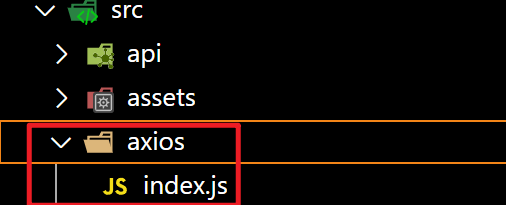
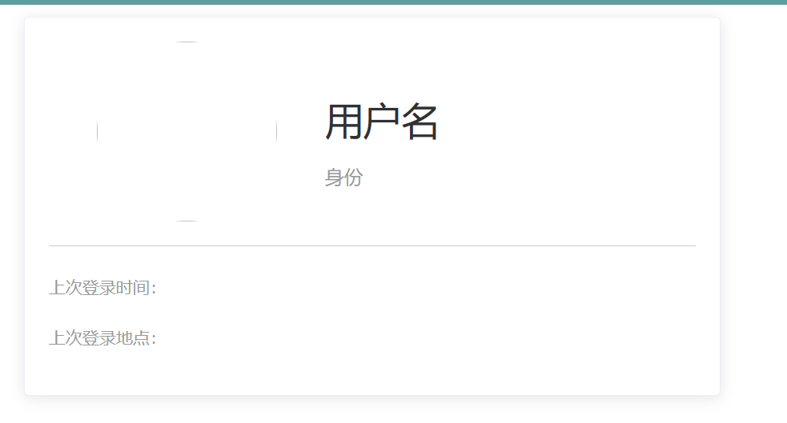
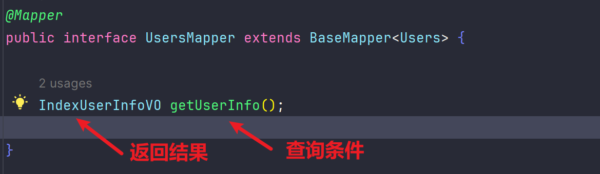
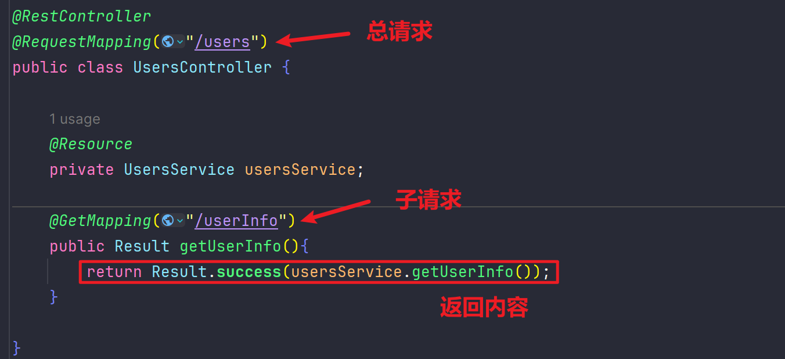
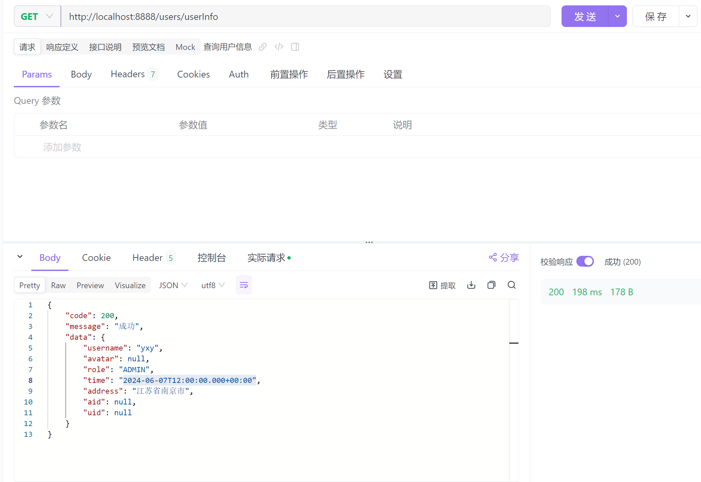
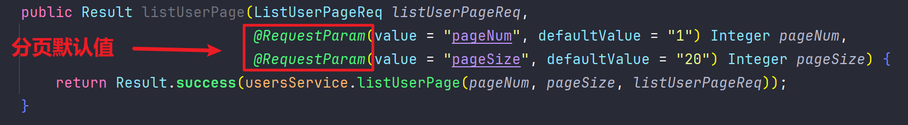
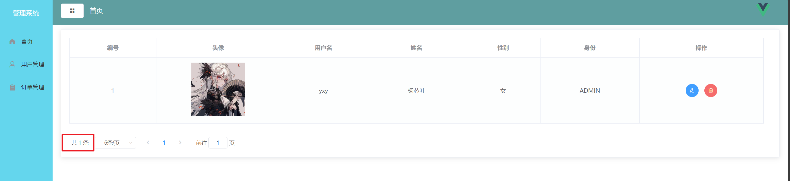
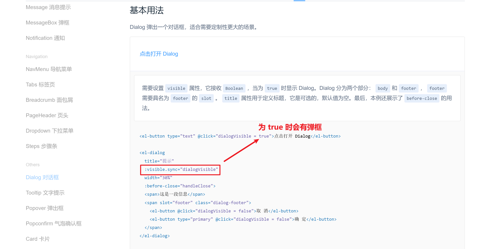
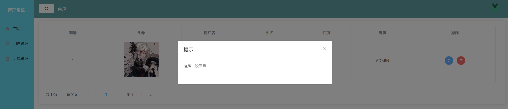
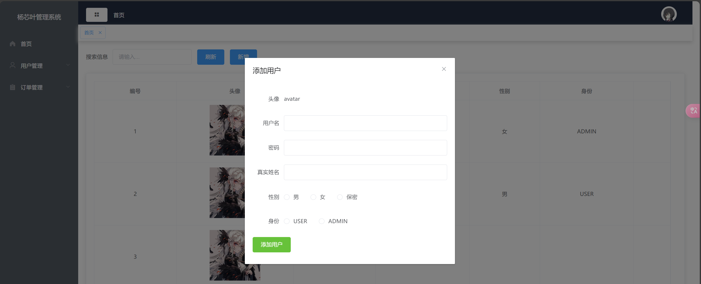

# Axios

## 介绍

Axios 是一个基于 *[promise](https://javascript.info/promise-basics)* 网络请求库，作用于[`node.js`](https://nodejs.org/) 和浏览器中。 它是 *[isomorphic](https://www.lullabot.com/articles/what-is-an-isomorphic-application)* 的(即同一套代码可以运行在浏览器和node.js中)。在服务端它使用原生 node.js `http` 模块, 而在客户端 (浏览端) 则使用 XMLHttpRequests。

## 安装

```bash
npm install axios@1.5.0
```

## 使用



```js
// 1. 引入
import axios from "axios";

// 2. 配置信息
let config = {
    // 每次请求的协议、IP地址。  设置该配置后，每次请求路径都可以使用相对路径，例如"/admin/login"
    baseURL: "http://localhost:8888",
    // 请求超时时间
    timeout: 10000,
    // 每次请求携带cookie
    withCredentials: true
}

// 3. 创建实例
const instance = axios.create(config)


// 4. 导出
export default instance
```

在`main.js`中引入axios，全局使用

```js
// 1. 引入实例
// 如果在 utils 文件夹下只创建了一个 index.js 文件，那么 webpack 会默认把该文件打包，所以路径可以不用加上 '/index.js' 
// 如果你创建的文件名不是 index，那么一定要加上文件名
// 如果你的 axios 配置文件跟我创建的路径不一样，那么按照你的路径引入就可以了
import axios from './axios';

// 2. 与Vue实例关联
Vue.prototype.$axios = axios
```

# 主页卡片展示

## 数据库

表ueses

```sql
CREATE TABLE `users` (
  `u_id` int NOT NULL AUTO_INCREMENT,
  `username` varchar(255) DEFAULT NULL,
  `password` varchar(255) DEFAULT NULL,
  `name` varchar(255) DEFAULT NULL,
  `avatar` varchar(255) DEFAULT NULL,
  `gender` varchar(10) DEFAULT NULL,
  `role` varchar(20) DEFAULT NULL,
  PRIMARY KEY (`u_id`)
) ENGINE=InnoDB AUTO_INCREMENT=2 DEFAULT CHARSET=utf8mb4 COLLATE=utf8mb4_0900_ai_ci;
```

表address

```sql
CREATE TABLE `address` (
  `a_id` int NOT NULL AUTO_INCREMENT,
  `u_id` int DEFAULT NULL,
  `ip` varchar(255) DEFAULT NULL,
  `address` varchar(255) DEFAULT NULL,
  `time` timestamp NULL DEFAULT NULL,
  PRIMARY KEY (`a_id`)
) ENGINE=InnoDB DEFAULT CHARSET=utf8mb4 COLLATE=utf8mb4_0900_ai_ci;
```

我需要获取的数据是

```sql
users表的：
username、avatar、role
address表的：
ip、address
```



sql语句

```sql
SELECT u.username, u.avatar,u.role, a.time, a.address 
FROM users u JOIN address a 
ON u.u_id = a.u_id
```

## Java

### 实体类

```java
@Data
public class IndexUserInfoVO {

    private Integer uId;
    private Integer aId;
    private  String username;
    private String avatar;
    private String role;
    private Timestamp time;
    private String address;

}
```

书写获取数据的mapper层



写对应的xml

```xml
<?xml version="1.0" encoding="UTF-8"?>
<!DOCTYPE mapper PUBLIC "-//mybatis.org//DTD Mapper 3.0//EN" "http://mybatis.org/dtd/mybatis-3-mapper.dtd">
<mapper namespace="com.iweb.mapper.UsersMapper">

    <!-- 通用查询结果列 -->
    <sql id="Base_Column_List">
        u_id, username, password, name, avatar, gender, role
    </sql>

    <select id="getUserInfo" resultType="com.iweb.vo.IndexUserInfoVO">
        SELECT u.username,
               u.avatar,
               u.role,
               a.time,
               a.address
        FROM users u
            LEFT JOIN address a ON u.u_id = a.u_id

    </select>


</mapper>
```

书写控制层controller



自动生成服务层和服务层的实现类

```java
public interface UsersService extends IService<Users> {

    IndexUserInfoVO getUserInfo();
}


@Service
public class UsersServiceImpl extends ServiceImpl<UsersMapper, Users> implements UsersService {

    @Resource
    private UsersMapper usersMapper;

    @Override
    public IndexUserInfoVO getUserInfo() {
        IndexUserInfoVO userInfo = usersMapper.getUserInfo();
        return userInfo;
    }
}
```

测试一下



### 问题

1. 没有返回用户id
2. 查询当前用户登录信息，需要带上用户的唯一标识符，就是u_id

mapper

```java
IndexUserInfoVO getUserInfo(@Param("userId") String userId);
```

xml

```xml
    <select id="getUserInfo" resultType="com.iweb.vo.IndexUserInfoVO">
        SELECT u.u_id,
               u.username,
               u.avatar,
               u.role,
               a.time,
               a.address
        FROM users u
            LEFT JOIN address a ON u.u_id = a.u_id
        <where>
            u.u_id = #{userId}
        </where>
    </select>
```

service

```java
    @Override
    public IndexUserInfoVO getUserInfo() {
        // todo 获取当前登录用户
        IndexUserInfoVO userInfo = usersMapper.getUserInfo("1");
        return userInfo;
    }
```

## 前端

在`FristPage`中获取数据

```vue
 <div class="userinfo">
     <p class="name">{{ name }}</p>
     <p class="access">{{access}}</p>
</div>

<script>
export default {
  name: "FristPage",
  data() {
    return {
      name: "",
      access: "",
      time: "",
      address: ""
    }
  },
  mounted() {
    this.getInfo()
  },
  methods: {
    getInfo() {
      this.$axios.get('/users/userInfo').then(res => {
        this.name = res.data.data.username
        if (this.access = res.data.data.role === "ADMIN") {
          this.access = "管理员"
        }
      })
    }
  }
}
</script>
```

# 表格数据

## Java

### 分页的实体类

```java
@Data
public class ListUserPageReq {

    /**
     * 用户名
     */
    private String username;

}
```

controller



service

```java
Page<Users> listUserPage(Integer pageNum, Integer pageSize, ListUserPageReq listUserPageReq);
```

impl

```java
    @Override
    public Page<Users> listUserPage(Integer pageNum, Integer pageSize, ListUserPageReq listUserPageReq) {
        LambdaQueryWrapper<Users> lambdaQuery = Wrappers.<Users>lambdaQuery();
        lambdaQuery.like(StrUtil.isNotBlank(listUserPageReq.getUsername()), Users::getUsername, listUserPageReq.getUsername());

        Page<Users> page = new Page<>(pageNum, pageSize);
        Page<Users> resultPage = baseMapper.selectPage(page, lambdaQuery);
        return resultPage;
    }
```

## 前端

在`Aside.vue`中将客户管理改为用户管理

```vue
<template>
    <div>
        <el-card class="box-card">
            <el-table :data="records" border style="width: 99%">
                <el-table-column prop="uId" label="编号" width="210" header-align="center" align="center">
                </el-table-column>
                <el-table-column prop="avatar" label="头像" width="300" header-align="center" align="center">
                    
                </el-table-column>
                <el-table-column prop="username" label="用户名" width="210" header-align="center" align="center">
                </el-table-column>
                <el-table-column prop="name" label="姓名" width="240" header-align="center" align="center">
                </el-table-column>
                <el-table-column prop="gender" label="性别" width="180" header-align="center" align="center">
                </el-table-column>
                <el-table-column prop="role" label="身份" width="240" header-align="center" align="center">
                </el-table-column>
                <el-table-column label="操作" width="300" header-align="center" align="center">
                    <template slot-scope="scope">
                        <el-button type="primary" icon="el-icon-edit" circle size="small"></el-button>
                        <el-button type="danger" icon="el-icon-delete" circle size="small"></el-button>
                    </template>
                </el-table-column>
            </el-table>
            <el-pagination
                :current-page="pageIndex" :page-sizes="[5, 10, 20, 50, 100]" 
                :page-size="pageSize" 
                :total="total"
                layout="total, sizes, prev, pager, next, jumper" 
                style="margin-top:30px;">
        </el-pagination>
        </el-card>
    </div>
</template>

<script>
export default {
    name: 'CutomerList',
    data() {
        return {
            records: [],
            avatarUrl: 'https://yxy-live-share.oss-cn-beijing.aliyuncs.com/%E5%BE%AE%E4%BF%A1%E5%9B%BE%E7%89%87_20240419210622.jpg',
            pageIndex: 1,
            pageSize: 5,
            total: 0,
        }
    },
    mounted() {
        this.getUserList()
    },
    methods: {
        getUserList() {
            this.$axios.get('/users/list').then(res => {
                this.records = res.data.data.records

                // 如果图片不存在使用默认路径图片
                this.records.forEach(record => {
                    if(record.avatar === null) {
                        record.avatar = this.avatarUrl
                    }
                })
                // 获取总数据
                this.total = res.data.data.total
            })
        }
    }
}
</script>

<style scoped>

</style>

```



# 弹框

## 前端

### 说明



1.设定变量

```js
return {
    dialogFormVisible: false,
}
```

2.让主要值动态获取

```html
<el-dialog title="提示" :visible.sync="dialogFormVisible" width="30%" :before-close="handleClose">
    
<script>
    handleClose(done) {
      this.$confirm('确认关闭？')
        .then(_ => {
          done();
        })
    }
</script>
```

3.修改按钮设定点击事件函数，并写出对应方法

```html
<el-button type="primary" icon="el-icon-edit" circle size="small" @click="openDialog()"></el-button>

<script>
        openDialog() {
            // 打开窗口
            this.dialogFormVisible = true;
        }
</script>
```



# 新增数据

## Java

### 注意

1. 不会直接在`controller`中调用`mybatis-plus`自带的方法，都是放到最后的服务层调用
2. 因为肯定会写业务逻辑需要对参数进行校验、唯一性检查

controller

```java
    @PostMapping("/saveUser")
    public Result saveUser(@RequestBody Users users){
        usersService.saveUser(users);
        return Result.success();
    }
```

service

```java
void saveUser(Users users);
```

impl

```java
    @Override
    public void saveUser(Users users) {
        // todo 检查用户信息
        baseMapper.insert(users);
    }
```

## 前端

1.在表单中选择合适的样式并添加到弹出的表单中，希望点击新增按钮能够进行弹显示

```html
<el-form :inline="true" class="demo-form-inline">
    <el-form-item label="搜索信息">
        <el-input placeholder="请输入..."></el-input>
    </el-form-item>
    <el-form-item>
        <el-button type="primary" @click="openDialogInsert()">新增</el-button>
    </el-form-item>
</el-form>
```

```js
  openDialogInsert(){
      // 打开窗口
      this.dialogFormVisible = true;
  }
```

2.在弹出框选择合适的表单项

```html
        <el-dialog :title="title" :visible.sync="dialogFormVisible" width="30%" :before-close="handleClose">
            <el-form label-width="80px" :model="form">
                <el-form-item label="头像">
                    avatar
                </el-form-item>
                <el-form-item label="用户名">
                    <el-input v-model="form.username"></el-input>
                </el-form-item>
                <el-form-item label="密码">
                    <el-input v-model="form.password"></el-input>
                </el-form-item>
                 <el-form-item label="真实姓名">
                    <el-input v-model="form.username"></el-input>
                </el-form-item>
                <el-form-item label="性别">
                    <el-radio-group v-model="form.gender">
                        <el-radio label="男"></el-radio>
                        <el-radio label="女"></el-radio>
                        <el-radio label="保密"></el-radio>
                    </el-radio-group>
                </el-form-item>
                <el-form-item label="身份">
                    <el-radio-group  v-model="form.role">
                        <el-radio label="USER"></el-radio>
                        <el-radio label="ADMIN"></el-radio>
                    </el-radio-group>
                </el-form-item>
            </el-form>
        </el-dialog>
```

3.添加对应的数据选项

```js
return {
        form: {
            username: '',
            password: '',
            name:'',
            gender: '',
            role: ''
        }
}
```



4.添加按钮，用于确认提交数据

```html
<el-button type="success" @click="insertUser()">添加</el-button>
```

5.写出对应的添加数据方法

```js
        insertUser() {
            // 打开窗口
            this.dialogFormVisible = true;

            // 发送请求
            this.$axios.post('/users/saveUser', this.form).then(res => {
                if (res.data.code === 200) {
                    this.$message({
                        message: '添加成功',
                        type: 'success'
                    })
                    this.getUserList()
                    this.dialogFormVisible = false
                } else {
                    this.$message({
                        message: '添加失败',
                        type: 'error'
                    })
                }

            })
        }
```

## 问题1

此时前端一页有多条数据，并没有预期中的分页效果

1.添加方法

```html
<el-pagination 
               @size-change="sizeChangeHandle" 
               @current-change="currentChangeHandle"
    					 :current-page="pageIndex" 
               :page-sizes="[5, 10, 20, 50, 100]" 
               :page-size="pageSize" 
               :total="total"
    					 layout="total, sizes, prev, pager, next, jumper" 
               style="margin-top:30px;">
</el-pagination>
```

`sizeChangeHandle` 方法用于处理每页显示数量变化的事件。当选择不同的每页显示数量时（例如从 10 条切换到 20 条），该方法会被调用。它会将选中的每页显示数量更新到组件的`pageSize`属性中，并触发`getUserList`方法来重新获取用户列表数据。

` currentChangeHandle` 方法用于处理当前页码变化的事件。当点击分页组件的上一页、下一页或直接跳转到指定页码时，该方法会被调用。它会将当前页码更新到组件的`pageIndex`属性中，并触发`getUserList`方法来重新获取用户列表数据。

2.书写方法

```js
        // 每页数
        sizeChangeHandle(val) {
            this.pageSize = val;
            this.getUserList();
        },
        // 当前页
        currentChangeHandle(val) {
            this.pageIndex = val;
            this.getUserList();
        }
```

3.完善分页数据的获取，让每次获取到页码和每页数据传递给后端，让后端按照传递过来的参数进行值的返回

```js
        getUserList() {
            const params = {
                pageNum: this.pageIndex,
                pageSize: this.pageSize
            }
            this.$axios.get('/users/list', {params}).then(res => {
                this.records = res.data.data.records
                // 如果图片不存在使用默认路径图片
                this.records.forEach(record => {
                    if (record.avatar === null) {
                        record.avatar = this.avatarUrl
                    }
                })
                // 获取总数据
                this.total = res.data.data.total
            })
        },
```

# 修改数据

## Java

1.修改数据的传参名字，至此前端中所有的`uid`全部变成`uId`

```java
    @TableId(value = "u_id", type = IdType.AUTO)
    @JsonProperty(value = "uId")
    private Integer uId;
```

2.修改的控制层

```java
    @PostMapping("/updateUser")
    public Result updateUser(@RequestBody Users users){
        usersService.updateUser(users);
        return Result.success();
    }
```

3.修改的服务层和实现类

```java
void updateUser(Users users);

    @Override
    public void updateUser(Users users) {
      // 此方法，有id为修改
      // 无id为新增
        baseMapper.updateById(users);
    }
```

## 前端

1.修改弹框里面的按钮，让他可以拥有新增和修改两个功能

```html
<el-button type="success" @click="saveOrUpdate()">{{ title }}</el-button>


```

2.设定修改按钮的弹框，但是此次点击弹框前需要传入id

```html
<el-button type="primary" 
           icon="el-icon-edit" 
           circle size="small"
           @click="openDialogUpdate(scope.row)">
</el-button>
```

3.根据是否有id传入来执行新增或者修改，有id为修改

```js
        saveOrUpdate() {
            if (this.form.uId) {
                this.updateUser()
            } else {
                this.insertUser()
            }
        },
```

4.在打开窗口的时候需要获取id

```js
        openDialogUpdate(record) {
            // 打开窗口
            this.dialogFormVisible = true;
            this.title = '修改用户'
            this.form = {
                ...record
            }
        },
```

5.书写修改的方法

```js
        updateUser() {
            const data = {
                ...this.form
            }
            // 发送修改用户请求
            this.$axios.post('/users/updateUser', data).then(res => {
                if (res.data.code === 200) {
                    this.$message({
                        message: '修改成功',
                        type: 'success'
                    })
                    this.getUserList()
                    this.dialogFormVisible = false
                } else {
                    this.$message({
                        message: '修改失败',
                        type: 'error'
                    })
                }
            })
        },
```

# 删除数据

## Java

1.控制层

```java
    @PostMapping("/deleteUser/{id}")
    public Result deleteUser(@PathVariable("id") Integer id){
        usersService.deleteUser(id);
        return Result.success();
    }
```

2.服务层和实现类

```java
void deleteUser(Integer id);

    @Override
    public void deleteUser(Integer id) {
        baseMapper.deleteById(id);
    }

```

## 前端

1.添加删除按钮的点击事件，并传入当前的id

```html
<el-button type="danger" 
           icon="el-icon-delete" 
           circle size="small"
           @click="deleteUser(scope.row.uId)">
</el-button>
```

2.写出对应的方法

```js
        deleteUser(id) {
            this.$confirm('确定要删除该用户吗?', '提示', {
                confirmButtonText: '确定',
                cancelButtonText: '取消',
                type: 'warning'
            }).then(() => {
                this.$axios.delete('/users/deleteUser/' + id).then(res => {
                    if (res.data.code === 200) {
                        this.$message({
                            message: '删除成功',
                            type: 'success'
                        })
                        this.getUserList()
                    } else {
                        this.$message({
                            message: '删除失败',
                            type: 'error'
                        })
                    }
                })
            })
        },
```

# 登录

## Java

### 工具类

```java
public class JwtUtils {
    private static String signKey = "dsaasdsasadsasaddsaeyJhbGciOiJIUzI1NiIsInR5cCI6IkpXVCJ9eyJzdWIiOiIxMjM0NTY3ODkwIiwibmFtZSI6IkpvaG4gRG9lIiwiaWF0IjoxNTE2MjM5MDIyfQSflKxwRJSMeKKF2QT4fwpMeJf36POk6yJVdQssw5c";
    private static Long expire = 43200000L;

    // 获取jwt
    public static String generateJwt(Map<String, Object> claims) {
        String jwt = Jwts.builder()
                .addClaims(claims)
                .signWith(SignatureAlgorithm.HS256,signKey)
                 .setClaims(claims)
                // 设置令牌的过期时间 1分钟
                .setExpiration(new Date(System.currentTimeMillis() + expire))
                .compact();
        return jwt;
    }

    // 解析jwt
    public static Claims parseJwt(String jwt) {
        Claims claims = Jwts.parser()
                .setSigningKey(signKey)
                .parseClaimsJws(jwt)
                .getBody();
        return claims;
    }
}

```

### controller

```java
@Slf4j
@RestController
public class LoginController {

    @Resource
    private UsersService usersService;

    @PostMapping("/login")
    public Result login(@RequestBody Users users) {
        log.info("员工登录" + users.getName());
        Users u = usersService.login(users);
        // 登录失败或者成功
        if (u != null){
            Map<String, Object> claims = new HashMap<>();
            claims.put("id",u.getUId());
            claims.put("name",u.getName());
            claims.put("username",u.getUsername());

            String jwt = JwtUtils.generateJwt(claims);
            return Result.success(jwt);
        }
        // 登录失败
        return Result.failed("用户名或者密码错误");
    }
}

```

### Service

```java
 Users login(Users users);
```

### Impl

```java
    @Override
    public Users login(Users users) {
        return usersMapper.getByUserNameAndPassword(users);
    }
```

### Mapper

```java
    @Select("SELECT * FROM users WHERE username = #{username} AND password = #{password}")
    Users getByUserNameAndPassword(Users users);
```

## 书写拦截器

新建`interceptor`目录

```java
@Slf4j
@Component
public class LoginInterceptor implements HandlerInterceptor {

    @Override
    public boolean preHandle(HttpServletRequest request, HttpServletResponse response, Object handler) throws Exception{

        // 1. 获取请求的URL
        // 2. 判断请求中是否有login

        // 3. 获取请求头中的令牌（token - jwt）
        String token = request.getHeader("token");
        // 4. 判断令牌是否存在，不存在返回登录失败
        if (!StringUtils.hasLength(token)){
            log.info("token不存在");
            Result responseResult = Result.failed("NOT_LOGIN");
            String json = JSONObject.toJSONString(responseResult);
            response.setContentType("application/json;charset=utf-8");
            response.getWriter().write(json);
            return false;
        }
        // 5. 解析token，解析失败返回登录失败
        try{
            JwtUtils.parseJwt(token);
        }catch (Exception e){
            log.info("令牌解析失败");
            Result responseResult = Result.failed("NOT_LOGIN");
            String json = JSONObject.toJSONString(responseResult);
            response.setContentType("application/json;charset=utf-8");
            response.getWriter().write(json);
            return false;
        }
        // 6. 放行
        return true;
    }

}
```

### 书写拦截规则

```java
@Configuration
public class WebMvcConfig implements WebMvcConfigurer {

    @Resource
    private LoginInterceptor loginInterceptor;

    /**
     * 跨域配置
     */
    @Override
    public void addCorsMappings(CorsRegistry registry) {
		// 省略...
    }
    

    /*
    ** 拦截配置
     */
    @Override
    public void addInterceptors(InterceptorRegistry registry) {
        registry.addInterceptor(loginInterceptor)
                // 一级路径
                //.addPathPatterns("/**")
                // 任意路径
                .addPathPatterns("/**")
                // 指定路径不拦截
                .excludePathPatterns("/login");
                // depts下的任意一个路径
                // .addPathPatterns("/depts/*")
                // depts下的任意一个路径
                // .addPathPatterns("/depts/**");
    }
}

```

## 前端

### 添加代理

打开`config/index.js`

```js
const path = require('path')

module.exports = {
  dev: {

    // Paths
    assetsSubDirectory: 'static',
    assetsPublicPath: '/',
    proxyTable: {
      '/': {
          target: "http://localhost:8888", // 后端服务器地址
          changeOrigin: true,
          pathRewrite: {
            '^/': ''
          }
      }
  },
```

### Axios简单封装

创建`src/utils/request.js`

```js
import axios from "axios";
import router from '../router/index'
import { Message } from 'element-ui'  

const request = axios.create({
  // 同一请求前缀
  baseURL: "http://localhost:8080/",
  // 超时时间
  timeout: 5000,
});

// 请求拦截
request.interceptors.request.use(
      config => {
        // 请求头添加token
        const token = localStorage.getItem("token");
        if (token) {
          config.headers['token'] = token;
        }
        console.log(config);
        return config;
    }
)

// 响应拦截
request.interceptors.response.use(
    (response) => {
      // console.log(response.data.code);
        // 处理异常情况
        if (response.data.code == 500) {
            // do something
            // 跳转路由
            router.push('/Login')
            Message({
              message: '请先登录',
              type: 'error'
          })
          return Promise.reject(response.data);
        }else if(response.data.code == 401){
            // 跳转路由
            router.push('/Login')
            return Promise.reject(response.data);
        }

        return response.data;
    }
)

export default request;
```

创建`src/api/login.js`书写访问规则

```js
import http  from '../utils/request'

// 登录
export const login = (data) => {
    return http.post('/login',data)
}
```

在`Login.vue`中添加点击事件

```html
<el-button type="primary" size="medium" @click="login">登录</el-button>
```

书写登录规则前需要引入你写的`login`

```js
import { login } from "@/api/login";

methods: {
        login() {
            login(this.form).then(res => {
                // 存入token
                localStorage.setItem('token', res.data)
                // 跳转到首页
                this.$router.push('/')
            }).catch(err => {
                alert(err.data)
            })
        }
    }
```

# 修改接口

## 创建接口文件

创建`src/api/user.js`

```js
import http  from '../utils/request'

// 获取用户的数据
export const getUserList = (params) => {
    return http.get('/users/list', params)
}

// 修改用户的数据
export const updateUser = (params) => {
    return http.post('/users/updateUser', params)
}

// 删除用户的数据
export const deleteUser = (id) => {
    return http.post('/users/deleteUser/', id)
}

// 新增用户的数据
export const insertUser = (data) => {
    return http.post('/users/saveUser', data)
}
```

## 修改原来的请求方法

把所有的`this.$axios.xxx()`换成对应的方法，注意数据的获取是`res.data`和`res.code`

```js
import { getUserList, updateUser, insertUser, deleteUser } from '@/api/user'


methods: {
        getUserList() {
            const params = {
                pageNum: this.pageIndex,
                pageSize: this.pageSize
            }
            getUserList({ params }).then(res => {
								// 省略...
                this.total = res.data.total
            })
        },
        updateUser() {
            const data = {
                ...this.form
            }
            // 发送修改用户请求
            updateUser(data).then(res => {
								// 省略...
            })
        },
        insertUser() {
            insertUser(this.form).then(res => {
               // 省略...
            })
        },
        // 删除用户
        deleteUser(id) {
            this.$confirm('确定要删除该用户吗?', '提示', {
                confirmButtonText: '确定',
                cancelButtonText: '取消',
                type: 'warning'
            }).then(() => {
                deleteUser(id).then(res => {
                   // 省略...
                })
            })
        },
    }
}
</script>

```

