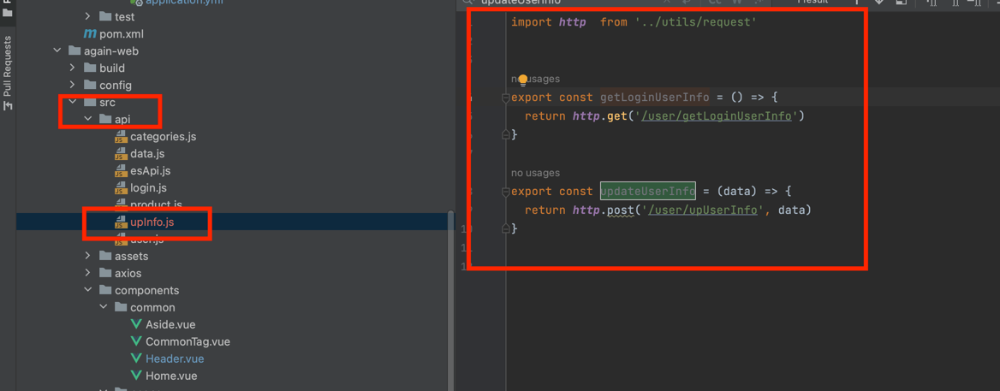

# 添加菜单
```sql
INSERT INTO `menu` (`id`, `name`, `label`, `icon`, `url`, `path`, `parent`) VALUES (25, 'userInfo', '个人信息', 'user', '/upInfo', '/upInfo', 0);
```

# 一、前端
## 1、修改 Header.vue 文件进行给个人信息按钮添加点击事件
```vue
<el-dropdown-item @click.native="upInfo">个人信息</el-dropdown-item>
```
个人信息按钮添加点击事件并且绑定 upInfo 方法
```js
upInfo(){
    this.$router.push('/upInfo')
}
```
methods 方法添加 upInfo 函数 
## 2、新增个人信息修改路由 router 文件夹下 index.js 文件
```js
 {
        path: '/upInfo',
        name: 'upInfo',
        component: UpInfo
}
```
修改右上角头像为当前登陆用户的,修改 Header.vue 文件
```js
14行改为

```
新增js方法
```js
data() {
    return {
      avatar:""
    }
},
mounted() {
    this.getInfo()
},
getInfo() {
    getHomeData().then(res => {
        this.avatar = res.data.avatar
    })
},
```
修改首页头像为当前登陆用户的 
修改 FristPage.vue 文件
```js
第7行改成

    
    
data() {
    return {
        username: "",
        access: "",
        time: "",
        address: "",
        avatar:""
    }
},
methods: {
    getInfo() {
        getHomeData().then(res => {
            this.username = res.data.username
            this.avatar = res.data.avatar;
            if (res.data.role === "ADMIN") {
                this.access = "管理员"
            }
        })
    }
}
```
## 3、新增 upInfo.js 文件到 api 目录下
```js
import http  from '../utils/request'

export const getLoginUserInfo = () => {
  return http.get('/user/getLoginUserInfo')
}

export const updateUserInfo = (data) => {
  return http.post('/user/upUserInfo', data)
}


```

## 4、新增 upInfo 文件夹到 pages 文件夹下，并且在 upInfo 文件夹下新增 upInfo.vue 文件
```vue
<template>
  <div>
    <el-form :model="ruleForm" status-icon :rules="rules" ref="ruleForm" label-width="100px" class="demo-ruleForm">
      <el-form-item label="头像" prop="avatar">
        <el-upload class="avatar-uploader" action="http://localhost:8888/upload" :headers="header"
                   :show-file-list="false" :on-success="handleAvatarSuccess" :before-upload="beforeAvatarUpload">
          
          <i v-else class="el-icon-plus avatar-uploader-icon"></i>
        </el-upload>
      </el-form-item>
      <el-form-item label="用户名" prop="username">
        <el-input v-model="ruleForm.username"></el-input>
      </el-form-item>
      <el-form-item label="密码" prop="pass">
        <el-input type="password" v-model="ruleForm.pass" autocomplete="off"></el-input>
      </el-form-item>
      <el-form-item label="确认密码" prop="checkPass">
        <el-input type="password" v-model="ruleForm.checkPass" autocomplete="off"></el-input>
      </el-form-item>
      <el-form-item label="姓名" prop="name">
        <el-input v-model="ruleForm.name"></el-input>
      </el-form-item>
      <el-form-item label="性别" prop="gender">
        <el-radio v-model="ruleForm.gender" label="男">男</el-radio>
        <el-radio v-model="ruleForm.gender" label="女">女</el-radio>
      </el-form-item>
      <el-form-item>
        <el-button type="primary" @click="submitForm('ruleForm')">提交</el-button>
        <el-button @click="resetForm('ruleForm')">重置</el-button>
      </el-form-item>
    </el-form>
  </div>
</template>

<script>
import { getLoginUserInfo,updateUserInfo } from '@/api/upInfo'
export default {
  data() {
    var checkName = (rule, value, callback) => {
      if (!value) {
        return callback(new Error('姓名不能为空'));
      } else {
        callback();
      }
    }
    var checkUserName = (rule, value, callback) => {
      if (!value) {
        return callback(new Error('用户名不能为空'));
      } else {
        callback();
      }
    }
    var checkAvatar = (rule, value, callback) => {
      if (!value) {
        return callback(new Error('头像不能为空'));
      } else {
        callback();
      }
    }
    var validatePass = (rule, value, callback) => {
      if (value === '') {
        callback(new Error('请输入密码'));
      } else {
        if (this.ruleForm.checkPass !== '') {
          this.$refs.ruleForm.validateField('checkPass');
        }
        callback();
      }
    };
    var validatePass2 = (rule, value, callback) => {
      if (value === '') {
        callback(new Error('请再次输入密码'));
      } else if (value !== this.ruleForm.pass) {
        callback(new Error('两次输入密码不一致!'));
      } else {
        callback();
      }
    };
    return {
      header: {
        token: localStorage.getItem('token')
      },
      imageUrl: '',
      ruleForm: {
        pass: '',
        checkPass: '',
        gender: '',
        username: '',
        name: '',
        id: '',
        avatar: '',
      },
      rules: {
        pass: [
          { validator: validatePass, trigger: 'blur' }
        ],
        checkPass: [
          { validator: validatePass2, trigger: 'blur' }
        ],
        username: [
          { validator: checkUserName, trigger: 'blur' }
        ],
        name: [
          { validator: checkName, trigger: 'blur' }
        ],
        avatar: [
          { validator: checkAvatar, trigger: 'blur' }
        ]
      }
    };
  },
  methods: {
    handleAvatarSuccess(res, file) {
      this.ruleForm.avatar = res.data;
      this.imageUrl = URL.createObjectURL(file.raw);
      this.$message({
        message: '上传成功',
        type: 'success'
      });
    },
    beforeAvatarUpload(file) {
      const isJPG = file.type === 'image/jpeg';
      const isLt2M = file.size / 1024 / 1024 < 2;

      if (!isJPG) {
        this.$message.error('上传头像图片只能是 JPG 格式!');
      }
      if (!isLt2M) {
        this.$message.error('上传头像图片大小不能超过 2MB!');
      }
      return isJPG && isLt2M;
    },
    submitForm(formName) {
      this.$refs[formName].validate((valid) => {
        if (valid) {
          let data = {
            "avatar":this.ruleForm.avatar,
            "uId":this.ruleForm.id,
            "name":this.ruleForm.name,
            "gender":this.ruleForm.gender,
            "username":this.ruleForm.username,
            "password":this.ruleForm.pass
          }
          console.log(data);
          updateUserInfo(data).then(res => {
            this.$message({
              message: '更新成功',
              type: 'success'
            });
            this.$router.go(0);
          });
        } else {
          this.$message.error('请补充全信息');
          return false;
        }
      });
    },
    resetForm(formName) {
      this.$refs[formName].resetFields();
    },
    getLoginInfo() {
      getLoginUserInfo().then(res => {
        console.log(res);
        this.ruleForm.name = res.data.name;
        this.ruleForm.gender = res.data.gender;
        this.ruleForm.pass = res.data.password;
        this.ruleForm.checkPass = res.data.password;
        this.ruleForm.username = res.data.username;
        this.ruleForm.id = res.data.uId;
        this.imageUrl = res.data.avatar;
        this.ruleForm.avatar = res.data.avatar;
      });
    }
  },
  mounted() {
    this.getLoginInfo();
  }
}
</script>

<style scoped>
.avatar-uploader .el-upload {
  border: 1px dashed #d9d9d9;
  border-radius: 6px;
  cursor: pointer;
  position: relative;
  overflow: hidden;
}

.avatar-uploader .el-upload:hover {
  border-color: #409EFF;
}

.avatar-uploader-icon {
  font-size: 28px;
  color: #8c939d;
  width: 178px;
  height: 178px;
  line-height: 178px;
  text-align: center;
  border: 1px dashed #8c939d;
}

.avatar {
  width: 178px;
  height: 178px;
  display: block;
}
</style>

```
# 二、后端
## 1、新增 UserController 接口文件到 controller 包下
```java
package com.iweb.controller;

import com.iweb.config.Result;
import com.iweb.entity.Users;
import com.iweb.service.UsersService;
import com.iweb.utils.JwtUtils;
import io.jsonwebtoken.Claims;
import lombok.extern.slf4j.Slf4j;
import org.springframework.beans.factory.annotation.Autowired;
import org.springframework.web.bind.annotation.*;

@Slf4j
@RestController
@RequestMapping("/user")
public class UserController {

    @Autowired
    private UsersService usersService;

    @GetMapping("/getLoginUserInfo")
    public Result getLoginUserInfo(@RequestHeader String token) {
        Claims claims = JwtUtils.parseJwt(token);
        String loginId = claims.get("id").toString();
        Users loginUser = usersService.getById(Integer.parseInt(loginId));
        return Result.success(loginUser);
    }

    @PostMapping("/upUserInfo")
    public Result upUserInfo(@RequestBody Users users) {
        usersService.updateById(users);
        return Result.success();
    }
}

```