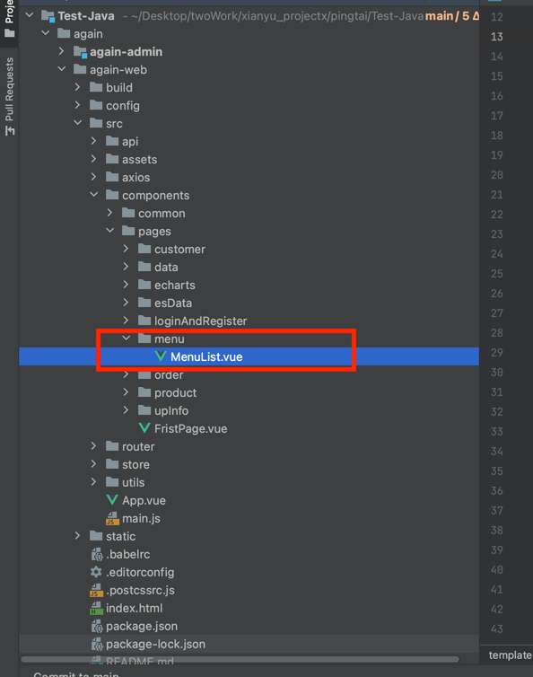

# 一、后端
## 1、新建菜单表并且初始化菜单数据
```sql
CREATE TABLE `menu` (
  `id` int(11) NOT NULL AUTO_INCREMENT COMMENT 'id',
  `name` varchar(255) DEFAULT NULL COMMENT '名称',
  `label` varchar(255) DEFAULT NULL COMMENT '标签',
  `icon` varchar(255) DEFAULT NULL COMMENT '图标',
  `url` varchar(255) DEFAULT NULL COMMENT '页面链接',
  `path` varchar(255) DEFAULT NULL COMMENT '链接',
  `parent` int(11) DEFAULT NULL COMMENT '父级Id，没有父级为0',
  PRIMARY KEY (`id`)
) ENGINE=InnoDB AUTO_INCREMENT=23 DEFAULT CHARSET=utf8;

INSERT INTO `menu` (`id`, `name`, `label`, `icon`, `url`, `path`, `parent`) VALUES (1, 'main', '首页', 's-home', 'Home/Home', '/', 0);
INSERT INTO `menu` (`id`, `name`, `label`, `icon`, `url`, `path`, `parent`) VALUES (2, 'customer', '用户管理', 'user', NULL, NULL, 0);
INSERT INTO `menu` (`id`, `name`, `label`, `icon`, `url`, `path`, `parent`) VALUES (3, 'customerList', '客户列表', 'setting', 'customer/customerList', '/CustomerList', 2);
INSERT INTO `menu` (`id`, `name`, `label`, `icon`, `url`, `path`, `parent`) VALUES (4, 'commonCustomer', '公海客户', 'setting', 'customer/commonCustomer', '/CommonCustomer', 2);
INSERT INTO `menu` (`id`, `name`, `label`, `icon`, `url`, `path`, `parent`) VALUES (5, 'product', '商品管理', 's-data', NULL, NULL, 0);
INSERT INTO `menu` (`id`, `name`, `label`, `icon`, `url`, `path`, `parent`) VALUES (6, 'Product', '商品列表', NULL, 'product/Product', '/Product', 5);
INSERT INTO `menu` (`id`, `name`, `label`, `icon`, `url`, `path`, `parent`) VALUES (7, 'Categories', '分类列表', NULL, 'product/Categories', '/Categories', 5);
INSERT INTO `menu` (`id`, `name`, `label`, `icon`, `url`, `path`, `parent`) VALUES (8, 'data', '数据管理', 's-fold', NULL, NULL, 0);
INSERT INTO `menu` (`id`, `name`, `label`, `icon`, `url`, `path`, `parent`) VALUES (9, 'AllData', '数据处理', NULL, 'data/AllData', '/AllData', 8);
INSERT INTO `menu` (`id`, `name`, `label`, `icon`, `url`, `path`, `parent`) VALUES (10, 'es', 'ES数据', 's-fold', NULL, NULL, 0);
INSERT INTO `menu` (`id`, `name`, `label`, `icon`, `url`, `path`, `parent`) VALUES (11, 'EsData', 'ES数据', NULL, 'es/AllData', '/esData', 10);
INSERT INTO `menu` (`id`, `name`, `label`, `icon`, `url`, `path`, `parent`) VALUES (12, 'echarts', 'Echarts图表', 's-opportunity', NULL, NULL, 0);
INSERT INTO `menu` (`id`, `name`, `label`, `icon`, `url`, `path`, `parent`) VALUES (13, 'Echarts', 'Echarts图表', NULL, 'echarts/Echarts', '/Echarts', 12);
INSERT INTO `menu` (`id`, `name`, `label`, `icon`, `url`, `path`, `parent`) VALUES (14, 'order', '订单管理', 's-order', NULL, NULL, 0);
INSERT INTO `menu` (`id`, `name`, `label`, `icon`, `url`, `path`, `parent`) VALUES (15, 'allOrder', '全部订单', 'setting', 'order/allOrder', '/AllOrder', 14);
INSERT INTO `menu` (`id`, `name`, `label`, `icon`, `url`, `path`, `parent`) VALUES (16, 'myOrder', '我的订单', 'setting', 'order/myOrder', '/MyOrder', 14);
```
## 2、新增 Menu.java 文件到 entity 包下
```java
package com.iweb.entity;

import com.baomidou.mybatisplus.annotation.IdType;
import com.baomidou.mybatisplus.annotation.TableField;
import com.baomidou.mybatisplus.annotation.TableId;
import com.baomidou.mybatisplus.annotation.TableName;
import java.io.Serializable;
import java.util.List;

/**
 * 
 * @TableName menu
 */
@TableName(value ="menu")
public class Menu implements Serializable {
    /**
     * id
     */
    @TableId
    private Integer id;

    /**
     * 名称
     */
    private String name;

    /**
     * 标签
     */
    private String label;

    /**
     * 图标
     */
    private String icon;

    /**
     * 页面链接
     */
    private String url;

    /**
     * 链接
     */
    private String path;

    /**
     * 父级Id，没有父级为0
     */
    private Integer parent;


    @TableField(exist = false)
    private List<Menu> children = null;

    public List<Menu> getChildren() {
        return children;
    }

    public void setChildren(List<Menu> children) {
        this.children = children;
    }

    /**
     * id
     */
    public Integer getId() {
        return id;
    }

    /**
     * id
     */
    public void setId(Integer id) {
        this.id = id;
    }

    /**
     * 名称
     */
    public String getName() {
        return name;
    }

    /**
     * 名称
     */
    public void setName(String name) {
        this.name = name;
    }

    /**
     * 标签
     */
    public String getLabel() {
        return label;
    }

    /**
     * 标签
     */
    public void setLabel(String label) {
        this.label = label;
    }

    /**
     * 图标
     */
    public String getIcon() {
        return icon;
    }

    /**
     * 图标
     */
    public void setIcon(String icon) {
        this.icon = icon;
    }

    /**
     * 页面链接
     */
    public String getUrl() {
        return url;
    }

    /**
     * 页面链接
     */
    public void setUrl(String url) {
        this.url = url;
    }

    /**
     * 链接
     */
    public String getPath() {
        return path;
    }

    /**
     * 链接
     */
    public void setPath(String path) {
        this.path = path;
    }

    /**
     * 父级Id，没有父级为0
     */
    public Integer getParent() {
        return parent;
    }

    /**
     * 父级Id，没有父级为0
     */
    public void setParent(Integer parent) {
        this.parent = parent;
    }
}
```
## 2、新增 MenuMapper.java 文件到 mapper 包下
```java
package com.iweb.mapper;

import com.iweb.entity.Menu;
import com.baomidou.mybatisplus.core.mapper.BaseMapper;


public interface MenuMapper extends BaseMapper<Menu> {

}

```
## 3、新增 MenuMapper.xml 文件到 resources 文件夹下 mapper 文件夹中
```xml
<?xml version="1.0" encoding="UTF-8"?>
<!DOCTYPE mapper
        PUBLIC "-//mybatis.org//DTD Mapper 3.0//EN"
        "http://mybatis.org/dtd/mybatis-3-mapper.dtd">
<mapper namespace="com.iweb.mapper.MenuMapper">

    <resultMap id="BaseResultMap" type="com.iweb.entity.Menu">
            <id property="id" column="id" jdbcType="INTEGER"/>
            <result property="name" column="name" jdbcType="VARCHAR"/>
            <result property="label" column="label" jdbcType="VARCHAR"/>
            <result property="icon" column="icon" jdbcType="VARCHAR"/>
            <result property="url" column="url" jdbcType="VARCHAR"/>
            <result property="path" column="path" jdbcType="VARCHAR"/>
            <result property="parent" column="parent" jdbcType="INTEGER"/>
    </resultMap>

    <sql id="Base_Column_List">
        id,name,label,
        icon,url,path,
        parent
    </sql>
</mapper>

```
## 4、新增 MenuService.java 文件到 service 包下
```java
package com.iweb.service;

import com.iweb.entity.Menu;
import com.baomidou.mybatisplus.extension.service.IService;

public interface MenuService extends IService<Menu> {

}

```
## 5、新增 MenuServiceImpl.java 文件到 service 下的 impl 包下
```java
package com.iweb.service.impl;

import com.baomidou.mybatisplus.extension.service.impl.ServiceImpl;
import com.iweb.entity.Menu;
import com.iweb.service.MenuService;
import com.iweb.mapper.MenuMapper;
import org.springframework.stereotype.Service;

@Service
public class MenuServiceImpl extends ServiceImpl<MenuMapper, Menu>
    implements MenuService{

}
```
## 6、新增 MenuController.java 文件到 controller 包下
```java
package com.iweb.controller;


import com.baomidou.mybatisplus.core.toolkit.CollectionUtils;
import com.iweb.config.Result;
import com.iweb.entity.ListProductsPageReq;
import com.iweb.entity.Menu;
import com.iweb.entity.Products;
import com.iweb.service.MenuService;
import com.iweb.service.ProductsService;
import org.springframework.web.bind.annotation.*;

import javax.annotation.Resource;
import java.util.List;
import java.util.stream.Collectors;

/**
 * <p>
 *  前端控制器
 * </p>
 *
 */
@RestController
@RequestMapping("/menu")
public class MenuController {

    @Resource
    private MenuService menuService;


    @RequestMapping("/list")
    public Result getList(){
        List<Menu> list = menuService.list();
        //获取全部一级
        List<Menu> parentMenu = list.stream().filter(item -> item.getParent().intValue()==0).collect(Collectors.toList());
        //组装一级中的所有二级
        for (Menu menu : parentMenu) {
            List<Menu> children = list.stream().filter(item -> item.getParent().equals(menu.getId())).collect(Collectors.toList());
            if(CollectionUtils.isNotEmpty(children)){
                menu.setChildren(children);
            }
        }
        return Result.success(parentMenu);
    }

    @RequestMapping("/delete/{id}")
    public Result delete(@PathVariable Integer id){
        Menu menu = menuService.getById(id);
        if(menu==null){
            return Result.failed(300,"菜单不存在");
        }
        if(menu.getParent()==0){
            //如果是父级菜单，判断下方是否有子菜单
            List<Menu> list = menuService.lambdaQuery().eq(Menu::getParent, id).list();
            if(CollectionUtils.isNotEmpty(list)){
                return Result.failed(300,"请先删除子菜单");
            }
        }
        menuService.removeById(id);
        return Result.success();
    }

    @PostMapping("/update")
    public Result update(@RequestBody Menu menu){
        menuService.updateById(menu);
        return Result.success();
    }

    @PostMapping("/add")
    public Result add(@RequestBody Menu menu){
        menuService.save(menu);
        return Result.success();
    }


    @RequestMapping("/getChildrenList")
    public Result getChildrenList(@RequestParam Integer id){
        List<Menu> list = menuService.lambdaQuery().eq(Menu::getParent, id).list();
        return Result.success(list);
    }

}

```

# 二、前端
## 1、 新增 menu.js 到 api 文件夹下，增加接口调用配置
```js
import http  from '../utils/request'

// 获取所有menu
export const getMenuList = () => {
  return http.get('/menu/list')
}


// 修改菜单数据
export const updateMenu = (data) => {
  return http.post('/menu/update', data)
}

// 新增菜单
export const addMenu = (data) => {
  return http.post('/menu/add', data)
}

// 根据id删除菜单
export const deleteMenu = (id) => {
  return http.post('/menu/delete/' + id )
}

//获取子级菜单
export const getChildrenList = (id) => {
  return http.get('/menu/getChildrenList?id='+id)
}

```
## 1、修改系统登陆后左侧导航栏为活的，调用接口渲染 ，修改 Aside.vue 文件
```js
//引入调用接口
import {getMenuList} from '@/api/menu'

//增加页面初始化调用方法
mounted() {
  this.getMenuListData();
},
//增加获取菜单方法
getMenuListData(){
    //获取数据库的menu
    getMenuList().then(res => {
        this.menuData=res.data;
    })
}
```
上面代码，会调用菜单接口，然后渲染系统的菜单，然后系统的菜单就变成动态读取数据库的了
## 2、增加菜单管理页面路由
```js
import MenuList from '../components/pages/menu/MenuList.vue'

{
    path: '/menuList',
    name: 'menuList',
    component: MenuList
}
```
## 3、新增菜单 vue 文件
```vue
<template>
  <div>
    <el-row>
      <el-col :span="24">
        <el-card>
          <div slot="header">
            <span>菜单管理</span>
          </div>
          <div>
            <el-button type="primary" @click="saveMenu(0)">新增</el-button>
          </div>
          <div style="height: 20px"></div>
          <el-table
            :data="menuData"
            border
            stripe
            :tree-props="{ children: 'children', hasChildren: 'hasChildren' }"
            :expand-row-keys="expandedRowKeys"
            @expand-change="handleExpandChange"
          >
            <el-table-column type="expand">
              <template #default="{ row }">
                <el-table
                  :data="row.children"
                  border
                  stripe
                  :tree-props="{ children: 'children', hasChildren: 'hasChildren' }"
                >
                  <el-table-column prop="label" label="菜单名称"></el-table-column>
                  <el-table-column prop="icon" label="菜单图标"></el-table-column>
                  <el-table-column prop="path" label="菜单路由"></el-table-column>
                  <el-table-column>
                    <template #default="{ row }">
                      <el-button size="mini" type="text" @click="editMenu(row)">编辑</el-button>
                      <el-button size="mini" type="text" @click="deleteMenu(row)">删除</el-button>
                    </template>
                  </el-table-column>
                </el-table>
              </template>
            </el-table-column>
            <el-table-column prop="label" label="菜单名称"></el-table-column>
            <el-table-column prop="icon" label="菜单图标"></el-table-column>
            <el-table-column prop="path" label="菜单路由"></el-table-column>
            <el-table-column>
              <template #default="{ row }">
                <el-button size="mini" type="text" @click="saveMenu(row.id)">新增</el-button>
                <el-button size="mini" type="text" @click="editMenu(row)">编辑</el-button>
                <el-button size="mini" type="text" @click="deleteMenu(row)">删除</el-button>
              </template>
            </el-table-column>
          </el-table>
        </el-card>
      </el-col>
    </el-row>
    <el-dialog :title="title" :visible.sync="dialogFormVisible" width="30%">
      <el-form label-width="80px" :model="form">
        <el-form-item label="菜单标识">
          <el-input v-model="form.name"></el-input>
        </el-form-item>
        <el-form-item label="菜单名称">
          <el-input v-model="form.label"></el-input>
        </el-form-item>
        <el-form-item label="菜单标签">
          <el-input v-model="form.icon"></el-input>
        </el-form-item>
        <el-form-item label="菜单路径">
          <el-input v-model="form.url"></el-input>
        </el-form-item>
        <el-form-item label="菜单路由">
          <el-input v-model="form.path"></el-input>
        </el-form-item>
        <el-button type="success" @click="saveOrUpdate()">{{ title }}</el-button>
      </el-form>
    </el-dialog>
  </div>
</template>

<script>
import { ref } from 'vue';
import { addMenu, deleteMenu, updateMenu, getMenuList ,getChildrenList} from '@/api/menu';

export default {
  data() {
    return {
      menuData: [],
      expandedRowKeys: [], // 存储展开的行的 key
      form: {},
      dialogFormVisible: false,
      title: '',
    };
  },
  mounted() {
    this.getMenuList();
  },
  methods: {
    async getMenuList() {
      const res = await getMenuList();
      if (res.code === 200) {
        this.menuData = res.data;
      } else {
        this.$message({
          type: 'error',
          message: res.message,
        });
      }
    },
    handleExpandChange(row, expanded) {
      if (expanded && !row.childrenLoaded) {
        this.loadChildren(row);
      }
    },
    async loadChildren(row) {
      row.childrenLoaded = true;
      const res = await getChildrenList(row.id);
      if (res.code === 200) {
        row.children = res.data;
      } else {
        this.$message({
          type: 'error',
          message: res.message,
        });
      }
    },
    saveMenu(parentId) {
      this.dialogFormVisible = true;
      this.title = '新增菜单';
      this.form = {
        parent:parentId
      }; // 清空表单数据
    },
    editMenu(data) {
      this.dialogFormVisible = true;
      this.title = '修改菜单';
      this.form = { ...data };
    },
    async deleteMenu(data) {
      this.$confirm('确定删除该菜单吗?', '提示', {
        confirmButtonText: '确定',
        cancelButtonText: '取消',
        type: 'warning',
      })
        .then(async () => {
          const res = await deleteMenu(data.id);
          if (res.code === 200) {
            this.$message({
              type: 'success',
              message: '删除成功!',
            });
            this.getMenuList();
          } else {
            this.$message({
              type: 'error',
              message: res.message,
            });
          }
        })
        .catch(() => {
          this.$message({
            type: 'info',
            message: '已取消删除',
          });
        });
    },
    async saveOrUpdate() {
      if (this.title === '新增菜单') {
        const res = await addMenu(this.form);
        if (res.code === 200) {
          this.$message({
            type: 'success',
            message: '新增成功!',
          });
          this.getMenuList();
        } else {
          this.$message({
            type: 'error',
            message: res.message,
          });
        }
      } else if (this.title === '修改菜单') {
        console.log(this.form);
        const res = await updateMenu(this.form);
        if (res.code === 200) {
          this.$message({
            type: 'success',
            message: '修改成功!',
          });
          this.getMenuList();
        } else {
          this.$message({
            type: 'error',
            message: res.message,
          });
        }
      }
      this.dialogFormVisible = false;
    },
  },
};
</script>

<style scoped>
.el-table .el-table__header {
  background: #f5f7fa;
}
</style>

```
