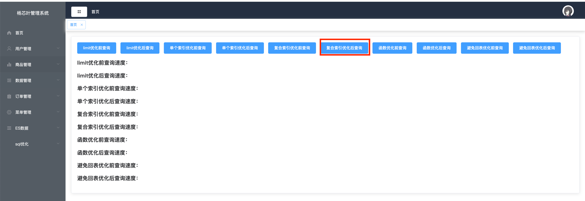

# 添加菜单
```sql
INSERT INTO `menu` (`id`, `name`, `label`, `icon`, `url`, `path`, `parent`) VALUES (21, 'es', 'ES数据', 's-fold', NULL, NULL, 0);
INSERT INTO `menu` (`id`, `name`, `label`, `icon`, `url`, `path`, `parent`) VALUES (22, 'echarts', 'Echarts图表', 's-fold', 'echarts/Echarts', '/Echarts', 21);
INSERT INTO `menu` (`id`, `name`, `label`, `icon`, `url`, `path`, `parent`) VALUES (23, 'sql/optimize', 'sql优化', NULL, NULL, NULL, 0);
INSERT INTO `menu` (`id`, `name`, `label`, `icon`, `url`, `path`, `parent`) VALUES (24, 'sqlOpt', 'sql查询优化', '', '/sql/opt/optimize', '/sqlOptimize', 23);
```
# 一、创建表sql
```sql
CREATE TABLE db_users (
                          id INT AUTO_INCREMENT PRIMARY KEY,
                          username VARCHAR(255) NOT NULL,
                          email VARCHAR(255) NOT NULL
);

CREATE TABLE db_orders (
                           id INT AUTO_INCREMENT PRIMARY KEY,
                           user_id INT NOT NULL,
                           order_date DATE NOT NULL
);

CREATE TABLE db_order_items (
                                id INT AUTO_INCREMENT PRIMARY KEY,
                                order_id INT NOT NULL,
                                product_name VARCHAR(255) NOT NULL,
                                quantity INT NOT NULL,
                                price DECIMAL(10, 2) NOT NULL
);
```
# 二、生成数据
user表数据生成为100万，orders表生成数据为1000万，order_items表生成数据为1000万
```sql

DELIMITER //

CREATE PROCEDURE generate_data3()
BEGIN
    DECLARE i INT DEFAULT 1;
    DECLARE user_count INT DEFAULT 1000000; -- 用户数量
    DECLARE order_count INT DEFAULT 10000000; -- 订单数量

    -- 插入用户数据
    WHILE i <= user_count DO
        INSERT INTO db_users (username, email) VALUES (CONCAT('user_', i), CONCAT('user_', i, '@example.com'));
        SET i = i + 1;
END WHILE;

    -- 插入订单数据
    SET i = 1;
    WHILE i <= order_count DO
        INSERT INTO db_orders (user_id, order_date) VALUES (FLOOR(1 + RAND() * user_count), CURDATE() - INTERVAL FLOOR(RAND() * 365) DAY);
        SET i = i + 1;
END WHILE;

    -- 插入订单项数据
    SET i = 1;
    WHILE i <= order_count DO
        INSERT INTO db_order_items (order_id, product_name, quantity, price) VALUES (i, CONCAT('product_', FLOOR(1 + RAND() * 1000)), FLOOR(1 + RAND() * 5), ROUND(RAND() * 100, 2));
        SET i = i + 1;
END WHILE;
END //

DELIMITER ;

-- 调用存储过程生成数据
CALL generate_data3();

```
# 三、前端代码
## 1、新增 optSql.js 文件
```js
import http  from '../utils/request'

// 获取全部商品数据
export const list1 = () => {
  return http.get('/sqlOpt/list1')
}
export const list2 = () => {
  return http.get('/sqlOpt/list2')
}
export const list3 = () => {
  return http.get('/sqlOpt/list3')
}
export const list4 = () => {
  return http.get('/sqlOpt/list3')
}
export const list5 = () => {
  return http.get('/sqlOpt/list5')
}
export const list6 = () => {
  return http.get('/sqlOpt/list6')
}

export const list7 = () => {
  return http.get('/sqlOpt/list7')
}

```
## 2、新增路由修改 router 下 index.js 文件
```js
{
        path: '/sqlOptimize',
        name: 'sqlOpt',
        component: SqlOut
}
```
## 3、新增 sqlOpt文件夹，然后再新增 sqlOut.vue 文件
```vue
<template>
  <div>
    <el-card>

      <el-form :inline="true" class="demo-form-inline">
        <el-button type="primary" @click="list1()">limit优化前查询</el-button>
        <el-button type="primary" @click="list2()">limit优化后查询</el-button>
        <el-button type="primary" @click="list3()">单个索引优化前查询</el-button>
        <el-button type="primary" @click="list3two()">单个索引优化后查询</el-button>
        <el-button type="primary" @click="list4()">复合索引优化前查询</el-button>
        <el-button type="primary" @click="list4two()">复合索引优化后查询</el-button>
        <el-button type="primary" @click="list5()">函数优化前查询</el-button>
        <el-button type="primary" @click="list6()">函数优化后查询</el-button>
        <el-button type="primary" @click="list7()">避免回表优化前查询</el-button>
        <el-button type="primary" @click="list7two()">避免回表优化后查询</el-button>
      </el-form>

      <h1>
        limit优化前查询速度：{{limit1}}
      </h1>
      <h1>
        limit优化后查询速度：{{limit2}}
      </h1>
      <h1>
        单个索引优化前查询速度：{{one1}}
      </h1>
      <h1>
        单个索引优化后查询速度：{{one2}}
      </h1>
      <h1>
        复合索引优化前查询速度：{{two1}}
      </h1>
      <h1>
        复合索引优化后查询速度：{{two2}}
      </h1>
      <h1>
        函数优化前查询速度：{{funBefore}}
      </h1>
      <h1>
        函数优化后查询速度：{{funAft}}
      </h1>
      <h1>
        避免回表优化前查询速度：{{huiBiao}}
      </h1>
      <h1>
        避免回表优化后查询速度：{{huiBiao2}}
      </h1>


    </el-card>
  </div>
</template>

<script>
import { list1,list2,list3,list4,list5,list6,list7 } from '@/api/optSql'

export default {
  name: 'SqlOut',
  data() {
    return {
      limit1:'',
      limit2:'',
      one1:'',
      one2:'',
      two1:'',
      two2:'',
      funBefore:'',
      funAft:'',
      huiBiao:'',
      huiBiao2:''
    }
  },
  mounted() {

  },
  methods: {
      list1(){
        list1().then(res=>{
          console.log(res);
          this.limit1=res.data +"毫秒，"+parseFloat(res.data)/1000+"秒";
        })
      },
    list2(){
      list2().then(res=>{
        console.log(res);
        this.limit2=res.data +"毫秒，"+parseFloat(res.data)/1000+"秒";
      })
    },
    list3(){
      list3().then(res=>{
        console.log(res);
        this.one1=res.data +"毫秒，"+parseFloat(res.data)/1000+"秒";
      })
    },
    list3two(){
      list3().then(res=>{
        console.log(res);
        this.one2=res.data +"毫秒，"+parseFloat(res.data)/1000+"秒";
      })
    },
    list4(){
      list4().then(res=>{
        console.log(res);
        this.two1=res.data +"毫秒，"+parseFloat(res.data)/1000+"秒";
      })
    },
    list4two(){
      list4().then(res=>{
        console.log(res);
        this.two2=res.data +"毫秒，"+parseFloat(res.data)/1000+"秒";
      })
    },
    list5(){
      list5().then(res=>{
        console.log(res);
        this.funBefore=res.data +"毫秒，"+parseFloat(res.data)/1000+"秒";
      })
    },
    list6(){
      list6().then(res=>{
        console.log(res);
        this.funAft=res.data +"毫秒，"+parseFloat(res.data)/1000+"秒";
      })
    },
    list7(){
      list7().then(res=>{
        console.log(res);
        this.huiBiao=res.data +"毫秒，"+parseFloat(res.data)/1000+"秒";
      })
    },
    list7two(){
      list7().then(res=>{
        console.log(res);
        this.huiBiao2=res.data +"毫秒，"+parseFloat(res.data)/1000+"秒";
      })
    },
    },
}
</script>


<style scoped>
.avatar-uploader .el-upload {
  border: 1px dashed #d9d9d9;
  border-radius: 6px;
  cursor: pointer;
  position: relative;
  overflow: hidden;
}

.avatar-uploader .el-upload:hover {
  border-color: #409EFF;
}

.avatar-uploader-icon {
  font-size: 28px;
  color: #8c939d;
  width: 178px;
  height: 178px;
  line-height: 178px;
  text-align: center;
  border: 1px dashed #8c939d;
}

.avatar {
  width: 178px;
  height: 178px;
  display: block;
}
</style>

```
# 四、后端代码
## 1、创建 DbOrders 实体
```java
package com.iweb.entity;

import lombok.Data;

/**
 * @Author：
 * @Package：com.iweb.entity
 * @Project：Test-Java
 * @name：DbOrders
 * @Date：2024/7/15 22:39
 * @Description:
 */
@Data
public class DbOrders {

    private Integer id;

    private Integer userId;

    private String orderDate;

}

```
## 2、创建 SqlOptimizeVo.java 文件
```java
package com.iweb.vo;

import lombok.Data;

/**
 * @Author：
 * @Package：com.iweb.vo
 * @Project：Test-Java
 * @name：SqlOptimizeVo
 * @Date：2024/7/15 12:43
 * @Description:
 */
@Data
public class SqlOptimizeVo {


    private String username;

    private String email;

    private Integer orderId;

    private String orderData;

    private String productName;

    private Integer quantity;

    private Double price;
}

```
## 3、新建 SqlOptimizeController.java 文件
```java
package com.iweb.controller;

import com.iweb.config.Result;
import com.iweb.entity.ListProductsPageReq;
import com.iweb.service.SqlOptimizeService;
import com.iweb.vo.SqlOptimizeVo;
import org.springframework.beans.factory.annotation.Autowired;
import org.springframework.web.bind.annotation.GetMapping;
import org.springframework.web.bind.annotation.RequestMapping;
import org.springframework.web.bind.annotation.RequestParam;
import org.springframework.web.bind.annotation.RestController;

import java.util.List;

/**
 * @Author：
 * @Package：com.iweb.controller
 * @Project：Test-Java
 * @name：SqlOptimizeController
 * @Date：2024/7/15 12:41
 * @Description:
 */
@RestController
@RequestMapping("/sqlOpt")
public class SqlOptimizeController {

    @Autowired
    private SqlOptimizeService sqlOptimizeService;

    @GetMapping("/list1")
    public Result list() {
        //limit 优化前
        long startTime = System.currentTimeMillis();
        sqlOptimizeService.list();
        long endTime = System.currentTimeMillis();
        long duration = endTime - startTime;
        return Result.success(duration);
    }
    @GetMapping("/list2")
    public Result list2() {
        //limit 优化后
        long startTime = System.currentTimeMillis();
        sqlOptimizeService.list2();
        long endTime = System.currentTimeMillis();
        long duration = endTime - startTime;
        return Result.success(duration);
    }

    @GetMapping("/list3")
    public Result list3() {
        //单个索引优化
        long startTime = System.currentTimeMillis();
        sqlOptimizeService.list3();
        long endTime = System.currentTimeMillis();
        long duration = endTime - startTime;
        return Result.success(duration);
    }

    @GetMapping("/list4")
    public Result list4() {
        //复合索引优化
        long startTime = System.currentTimeMillis();
        sqlOptimizeService.list4();
        long endTime = System.currentTimeMillis();
        long duration = endTime - startTime;
        return Result.success(duration);
    }
    @GetMapping("/list5")
    public Result list5() {
        //函数 优化前
        long startTime = System.currentTimeMillis();
        sqlOptimizeService.list5();
        long endTime = System.currentTimeMillis();
        long duration = endTime - startTime;
        return Result.success(duration);
    }
    @GetMapping("/list6")
    public Result list6() {
        //函数 优化后
        long startTime = System.currentTimeMillis();
        sqlOptimizeService.list6();
        long endTime = System.currentTimeMillis();
        long duration = endTime - startTime;
        return Result.success(duration);
    }

    @GetMapping("/list7")
    public Result list7() {
        //减少回表 优化后
        long startTime = System.currentTimeMillis();
        sqlOptimizeService.list7();
        long endTime = System.currentTimeMillis();
        long duration = endTime - startTime;
        return Result.success(duration);
    }
}

```
## 4、新建 SqlOptimizeService.java 文件
```java
package com.iweb.service;

import com.iweb.entity.DbOrders;
import com.iweb.vo.SqlOptimizeVo;

import java.util.List;

/**
 * @Author：
 * @Package：com.iweb.service
 * @Project：Test-Java
 * @name：SqlOptimizeService
 * @Date：2024/7/15 12:42
 * @Description:
 */
public interface SqlOptimizeService {


    List<DbOrders> list();

    List<DbOrders> list2();

    Integer list3();

    Integer list4();

    Integer list5();

    Integer list6();

    List<SqlOptimizeVo> list7();
}

```
## 5、新增 SqlOptimizeServiceImpl.java 文件
```java
package com.iweb.service.impl;

import com.iweb.entity.DbOrders;
import com.iweb.mapper.SqlOptimizeMapper;
import com.iweb.service.SqlOptimizeService;
import com.iweb.vo.SqlOptimizeVo;
import org.springframework.beans.factory.annotation.Autowired;
import org.springframework.stereotype.Service;

import java.util.List;

/**
 * @Author：
 * @Package：com.iweb.service.impl
 * @Project：Test-Java
 * @name：SqlOptimizeServiceImpl
 * @Date：2024/7/15 12:42
 * @Description:
 */
@Service
public class SqlOptimizeServiceImpl  implements SqlOptimizeService {

    @Autowired
    private SqlOptimizeMapper sqlOptimizeMapper;
    @Override
    public List<DbOrders> list() {
        return sqlOptimizeMapper.list();
    }

    @Override
    public List<DbOrders> list2() {
        return sqlOptimizeMapper.list2();
    }

    @Override
    public Integer list3() {
        return sqlOptimizeMapper.list3();
    }

    @Override
    public Integer list4() {
        return sqlOptimizeMapper.list4();
    }

    @Override
    public Integer list5() {
        return sqlOptimizeMapper.list5();
    }

    @Override
    public Integer list6() {
        return sqlOptimizeMapper.list6();
    }

    @Override
    public List<SqlOptimizeVo> list7() {
        return sqlOptimizeMapper.list7();
    }
}

```
## 6、新增 SqlOptimizeMapper.java 文件
```java
package com.iweb.mapper;

import com.iweb.entity.DbOrders;
import com.iweb.vo.SqlOptimizeVo;
import org.apache.ibatis.annotations.Mapper;

import java.util.List;

/**
 * @Author：
 * @Package：com.iweb.mapper
 * @Project：Test-Java
 * @name：SqlOptimizeMapepr
 * @Date：2024/7/15 12:46
 * @Description:
 */

@Mapper
public interface SqlOptimizeMapper {
    List<DbOrders> list();

    List<DbOrders> list2();

    Integer list3();

    Integer list4();

    Integer list5();

    Integer list6();

    List<SqlOptimizeVo> list7();
}

```
## 7、新增 SqlOptimizeMapper.xml 文件
```java
<?xml version="1.0" encoding="UTF-8"?>
<!DOCTYPE mapper PUBLIC "-//mybatis.org//DTD Mapper 3.0//EN" "http://mybatis.org/dtd/mybatis-3-mapper.dtd">
<mapper namespace="com.iweb.mapper.SqlOptimizeMapper">

    <!-- 通用查询结果列 -->


    <select id="list" resultType="com.iweb.entity.DbOrders">
        select id,user_id userId,order_date orderDate from db_orders
        limit 9000000,10
    </select>
    <select id="list2" resultType="com.iweb.entity.DbOrders">
        select t.id id,t.user_id userId,t.order_date orderDate from db_orders t , (
            select id from db_orders where id > 9000000 limit 10
        ) a where t.id = a.id;
    </select>
    <select id="list3" resultType="java.lang.Integer">
        SELECT
            count(*)
        FROM
            db_users u
                JOIN
            db_orders o ON u.id = o.user_id
                JOIN
            db_order_items od ON o.id = od.order_id
        WHERE od.product_name='product_444'
        ORDER BY
            u.id, o.id, od.id
    </select>
    <select id="list4" resultType="java.lang.Integer">
        SELECT
            count(*)
        FROM
            db_users u
                JOIN
            db_orders o ON u.id = o.user_id
                JOIN
            db_order_items od ON o.id = od.order_id
        WHERE od.product_name='product_444'
          and od.price > 50
        ORDER BY
            u.id, o.id, od.id
    </select>
    <select id="list5" resultType="java.lang.Integer">
        SELECT
            count(*)
        FROM
            db_users u
                JOIN
            db_orders o ON u.id = o.user_id
                JOIN
            db_order_items od ON o.id = od.order_id
        WHERE DATE(o.order_date) = '2023-01-01'
        ORDER BY
    u.id, o.id, od.id
    </select>
    <select id="list6" resultType="java.lang.Integer">
        SELECT
            count(*)
        FROM
            db_users u
                JOIN
            db_orders o ON u.id = o.user_id
                JOIN
            db_order_items od ON o.id = od.order_id
        WHERE o.order_date = '2023-01-01'
        ORDER BY
    u.id, o.id, od.id
    </select>
    <select id="list7" resultType="com.iweb.vo.SqlOptimizeVo">

        SELECT
            o.id AS order_id,
            u.username,
            u.email,
            o.order_date orderData,
            i.product_name productName,
            i.quantity,
            i.price
        FROM
            db_orders o
                JOIN
            db_users u ON o.user_id = u.id
                JOIN
            db_order_items i ON o.id = i.order_id
        WHERE
            u.username = 'user_1';
    </select>
</mapper>

```

# 三、优化方式
## 1、添加 limit 关键字优化方式
### 1.1、优化sql
```sql
#优化前
select id,user_id userId,order_date orderDate from db_orders
limit 9000000,10

#优化后                          
select t.id id,t.user_id userId,t.order_date orderDate from db_orders t , (
    select id from db_orders where id > 9000000 limit 10
) a where t.id = a.id;
```
### 1.2、验证流程
点击优化前按钮 和 优化后查询按钮，就可以看到不同的执行时间

### 1.3、优化结果


## 2、添加普通索引查询优化方式
### 2.1、优化sql
```sql
#给订单项表的商品名称字段添加索引
CREATE INDEX idx_product_name ON db_order_items(product_name);

SELECT
    count(*)
FROM
    db_users u
        JOIN
    db_orders o ON u.id = o.user_id
        JOIN
    db_order_items od ON o.id = od.order_id
WHERE od.product_name='product_444'
ORDER BY
    u.id, o.id, od.id
```
### 2.2、验证流程
1、先去页面点击 单个索引优化前查询 按钮

2、点击完以后进行创建普通索引
```sql
CREATE INDEX idx_product_name ON db_order_items(product_name);
```
3、再去页面点击 单个索引优化后查询 按钮

### 2.3、验证结果

### 2.4、备注
如果想要再次验证时，记着执行 DROP INDEX idx_product_name ON db_order_items; 语句吧索引删除掉然后
再进行点击 优化前sql ，然后添加上索引以后再点击 优化后sql，这样能看到明显索引效果
## 3、添加复合索引查询优化方式
### 3.1、优化sql
```sql
CREATE INDEX idx_product_name_price ON db_order_items(product_name, price);

SELECT
    count(*)
FROM
    db_users u
        JOIN
    db_orders o ON u.id = o.user_id
        JOIN
    db_order_items od ON o.id = od.order_id
WHERE od.product_name='product_444'
  and od.price > 50
ORDER BY
    u.id, o.id, od.id;
```
### 3.2、验证流程
1、删除之前创建的单个索引
```sql
DROP INDEX idx_product_name ON db_order_items;
```
2、先去页面点击 复合索引优化前查询 按钮

3、新增复合索引
```sql
CREATE INDEX idx_product_name_price ON db_order_items(product_name, price);
```
4、再去页面点击 复合索引优化后查询 按钮

### 3.3、验证结果

### 3.4、备注
复合索引验证时，记得吧之前的单个索引给删除掉，然后再点击 优化前 按钮，点击完之后，进行新增复合索引，新增完以后，点击 优化后 按钮就可以看到图片中的效果
## 4、避免函数操作和计算，优化
### 4.1、优化sql
```sql
CREATE INDEX db_order_order_date ON db_orders(order_date);

# 优化前sql
SELECT
    count(*)
FROM
    db_users u
        JOIN
    db_orders o ON u.id = o.user_id
        JOIN
    db_order_items od ON o.id = od.order_id
WHERE DATE(o.order_date) = '2023-01-01';
ORDER BY 
    u.id, o.id, od.id
    
#优化后sql
SELECT
    count(*)
FROM
    db_users u
        JOIN
    db_orders o ON u.id = o.user_id
        JOIN
    db_order_items od ON o.id = od.order_id
WHERE o.order_date = '2023-01-01';
ORDER BY 
    u.id, o.id, od.id
```
### 4.2、验证流程
1、新增索引
```sql
CREATE INDEX db_order_order_date ON db_orders(order_date);
```
2、点击 函数优化前查询 按钮

3、点击 函数优化后查询 按钮

### 4.3、验证结果

## 5、避免回表优化
### 5.1、优化sql
```sql
#优化前sql
SELECT
    o.id AS order_id,
    u.username,
    u.email,
    o.order_date orderData,
    i.product_name productName,
    i.quantity,
    i.price
FROM
    db_orders o
        JOIN
    db_users u ON o.user_id = u.id
        JOIN
    db_order_items i ON o.id = i.order_id
WHERE
    u.username = 'user_1';

#优化后sql
ALTER TABLE `db_users` ADD INDEX `idx_username_email` (`username`, `email`);
ALTER TABLE `db_orders` ADD INDEX `idx_user_id_order_date` (`user_id`, `order_date`);
ALTER TABLE `db_order_items` ADD INDEX `idx_order_id_product_quantity_price` (`order_id`, `product_name`, `quantity`, `price`);
SELECT
    o.id AS order_id,
    u.username,
    u.email,
    o.order_date orderData,
    i.product_name productName,
    i.quantity,
    i.price
FROM
    db_orders o
        JOIN
    db_users u ON o.user_id = u.id
        JOIN
    db_order_items i ON o.id = i.order_id
WHERE
    u.username = 'user_1';
```
### 5.2、验证流程
1、删除上面创建的所有索引
```sql
DROP INDEX idx_product_name ON db_order_items;
DROP INDEX idx_product_name_price ON db_order_items;
DROP INDEX db_order_order_date ON db_orders;
```
2、点击 避免回表优化前查询 按钮

3、新建覆盖索引
```sql
ALTER TABLE `db_users` ADD INDEX `idx_username_email` (`username`, `email`);
ALTER TABLE `db_orders` ADD INDEX `idx_user_id_order_date` (`user_id`, `order_date`);
ALTER TABLE `db_order_items` ADD INDEX `idx_order_id_product_quantity_price` (`order_id`, `product_name`, `quantity`, `price`);
```
4、点击 避免回表优化后查询 按钮

### 5.3、验证结果

## 6、删除索引sql
```sql
DROP INDEX idx_product_name ON db_order_items;

DROP INDEX idx_product_name_price ON db_order_items;

DROP INDEX db_order_order_date ON db_orders;

DROP INDEX idx_username_email ON db_users;
DROP INDEX idx_user_id_order_date ON db_orders;
DROP INDEX idx_order_id_product_quantity_price ON db_order_items;
```

注意：创建索引语句可能较慢，所以等索引创建完以后，再进行操作点击下一流程