# 准备

## 数据的准备

导入`district.sql`文件，并新建表

```sql
CREATE TABLE datas (
    id INT PRIMARY KEY AUTO_INCREMENT COMMENT '收货地址 ID',
    name VARCHAR(255) COMMENT '收货人姓名',
    phone VARCHAR(255) COMMENT '收货人电话',
    address VARCHAR(255) COMMENT '收货地址'
);
```

### 说明

`district`是用来获取`省市区`数据的，我们展示数据内容的是表`datas`

## 前端新建页面

创建`pages/data/AllData.vue`页面来作为新页面

```vue
<template>
    <div>
        <h1>数据管理页面</h1>
    </div>
</template>

<script>
export default {
    name: 'AllData',
    data() {
        return{}
    }
}
</script>
```

在`router/index.js`中声明路由

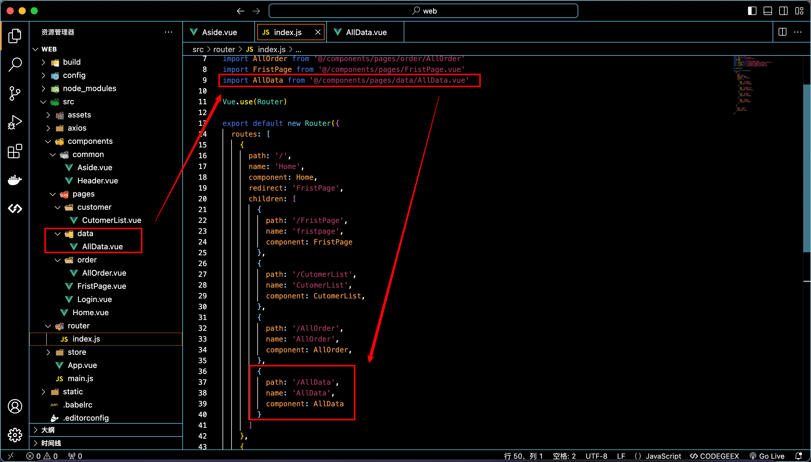

在`Aside.vue`中声明侧边栏的规则

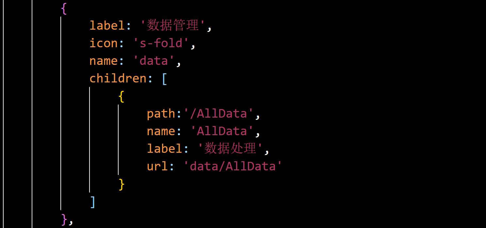

## 最后的效果

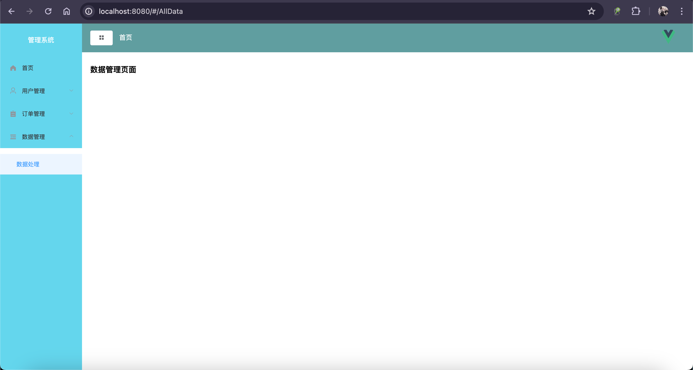

## 后端利用代码生成器自动生成两个表对应的文件

分页实体类

```java
@Data
public class ListDataPageReq {
    /**
     * 用户名称
     */
    private String name;
}

```

controller

```java
@RestController
@RequestMapping("/data")
public class DataController {

    @Resource
    private DataService dataService;

    /*
     **  增加
     */
    @PostMapping("/insert")
    public Result insert(@RequestBody Datas data){
        dataService.saveData(data);
        return Result.success();
    }

    /*
     ** 删
     */
    @PostMapping("/delete/{id}")
    public Result delete(@PathVariable("id") Integer id){
        dataService.deleteData(id);
        return Result.success();
    }

    /*
     ** 改
     */
    @PostMapping("/update")
    public Result update(@RequestBody Datas data){
        dataService.updateData(data);
        return Result.success();
    }


    /*
     **  查询全部数据
     */
    @GetMapping("/selectAll")
    public Result selectAll(){
        return Result.success(dataService.selectAll());
    }

    /**
     * 分页查询所有数据
     *
     * @param listDataPageReq 请求体
     * @param pageNum         当前页
     * @param pageSize        每页大小
     */
    @GetMapping("/list")
    public Result listUserPage(ListDataPageReq listDataPageReq,
                               @RequestParam(value = "pageNum", defaultValue = "1") Integer pageNum,
                               @RequestParam(value = "pageSize", defaultValue = "20") Integer pageSize) {
        return Result.success(dataService.listDataPage(pageNum, pageSize, listDataPageReq));
    }


}
```

service

```java
public interface DataService extends IService<Datas> {

    Datas selectAll();

    Page<Datas> listDataPage(Integer pageNum, Integer pageSize, ListDataPageReq listDataPageReq);

    void saveData(Datas data);

    void deleteData(Integer id);

    void updateData(Datas data);
}
```

impl

```java
@Service
public class DataServiceImpl extends ServiceImpl<DataMapper, Datas> implements DataService {

    @Resource
    private DataMapper dataMapper;

    @Override
    public Datas selectAll() {
        return dataMapper.selectAll();
    }

    @Override
    public Page<Datas> listDataPage(Integer pageNum, Integer pageSize, ListDataPageReq listDataPageReq) {
        LambdaQueryWrapper<Datas> lambdaQuery = Wrappers.<Datas>lambdaQuery();
        lambdaQuery.like(StrUtil.isNotBlank(listDataPageReq.getName()), Datas::getName, listDataPageReq.getName());

        Page<Datas> page = new Page<>(pageNum, pageSize);
        Page<Datas> results = baseMapper.selectPage(page, lambdaQuery);
        return results;
    }
    @Override
    public void saveData(Datas data) {
        baseMapper.insert(data);
    }

    @Override
    public void deleteData(Integer id) {
        baseMapper.deleteById(id);
    }

    @Override
    public void updateData(Datas data) {
        baseMapper.updateById(data);
    }

}
```

mapper

```java
public interface DataMapper extends BaseMapper<Datas> {

    Datas selectAll();
}
```

xml

```xml
<?xml version="1.0" encoding="UTF-8"?>
<!DOCTYPE mapper PUBLIC "-//mybatis.org//DTD Mapper 3.0//EN" "http://mybatis.org/dtd/mybatis-3-mapper.dtd">
<mapper namespace="com.iweb.mapper.DataMapper">

    <!-- 通用查询结果列 -->
    <sql id="Base_Column_List">
        id, name, phone, address
    </sql>


    <select id="selectAll" resultType="com.iweb.entity.Datas">
        select * from data
    </select>

</mapper>
```

## 完成前端页面的增删改查和分页

### data.js

```js
import http  from '../utils/request'

// 获取用户的详细数据
export const getData = (params) => {
    return http.get('/data/list', params)
}

// 修改用户的数据
export const updateData = (params) => {
    return http.post('/data/update', params)
}

// 删除用户的数据
export const deleteData = (id) => {
    return http.post('/data/delete/', id)
}

// 新增用户的数据
export const insertData = (data) => {
    return http.post('/data/insert', data)
}

// 获取省市区的数据
export const getDataProvinceAndCityAndArea = (params) => {
    return http.get('/district/listDistrict', params)
}   
```

```vue
<template>
  <div>
    <el-form :inline="true" class="demo-form-inline">
      <el-form-item label="搜索信息">
        <el-input placeholder="请输入..."></el-input>
      </el-form-item>
      <el-form-item>
        <el-button type="primary" @click="getData()">查询</el-button>
        <el-button type="primary" @click="openDialog()">新增</el-button>
        <template>
          <el-button type="warning" @click="open">注意</el-button>
        </template>
      </el-form-item>
    </el-form>
    <el-table :data="dataList" border style="width: 100%">
      <el-table-column prop="id" label="编号" width="180" header-align="center" align="center">
      </el-table-column>
      <el-table-column prop="name" label="姓名" width="180" header-align="center" align="center">
      </el-table-column>
      <el-table-column prop="phone" label="手机号" width="180" header-align="center" align="center">
      </el-table-column>
      <el-table-column prop="address" label="地址" width="180" header-align="center" align="center">
      </el-table-column>
      <el-table-column label="操作" width="180" header-align="center" align="center">
        <template slot-scope="scope">
          <el-button type="primary" @click="openDialogUpdate(scope.row)">编辑</el-button>
          <el-button type="danger" @click="deleteUser(scope.row.id)">删除</el-button>
        </template>
      </el-table-column>
    </el-table>
    <el-pagination @size-change="sizeChangeHandle" @current-change="currentChangeHandle" :current-page="pageIndex"
                   :page-sizes="[3, 5, 10, 20, 50, 100]" :page-size="pageSize" :total="total"
                   layout="total, sizes, prev, pager, next, jumper" style="margin-top:30px;">
    </el-pagination>

    <!-- 弹框 -->
    <el-dialog :title="title" :visible.sync="dialogFormVisible" width="30%">
      <el-form label-width="80px" :model="form">
        <el-form-item label="姓名">
          <el-input v-model="form.name"></el-input>
        </el-form-item>
        <el-form-item label="手机号">
          <el-input v-model="form.phone"></el-input>
        </el-form-item>
        <el-form-item label="地址">
          地址
        </el-form-item>
        <el-button type="success" @click="saveOrUpdate()">{{ title }}</el-button>
      </el-form>
    </el-dialog>
  </div>
</template>

<script>
import { getData, insertData, updateData, deleteData } from '@/api/data'

export default {
  name: 'AllData',
  data() {
    return {
      dataList: [],
      pageIndex: 1,
      pageSize: 3,
      total: 0,
      title: '新增',
      dialogFormVisible: false,
      form: {
        id: '',
        name: '',
        phone: '',
        address: ''
      },
    }
  },
  mounted() {
    this.getData()
  },
  methods: {
    getData() {
      const params = {
        pageNum: this.pageIndex,
        pageSize: this.pageSize
      }
      getData({params}).then(res => {
        this.dataList = res.data.records
        // 获取总数据
        this.total = res.data.total
      })
    },
    openDialog() {
      this.dialogFormVisible = true
    },
    saveOrUpdate() {
      if (this.form.id) {
        this.update()
      } else {
        this.insert()
      }
    },
    insert() {
      // 新增
      insertData(this.form).then(res => {
        if (res.code === 200) {
          this.$message({
            message: '添加成功',
            type: 'success'
          })
          this.getData()
          this.dialogFormVisible = false
        } else {
          this.$message({
            message: '添加失败',
            type: 'error'
          })
        }

      })
    },
    openDialogUpdate(dataList) {
      // 打开窗口
      this.dialogFormVisible = true;
      this.title = '修改用户'
      this.form = {
        ...dataList
      }
    },
    update() {
      const data = {
        ...this.form
      }
      // 修改
      updateData(data).then(res => {
        if (res.code === 200) {
          this.listData = this.form.address
          this.$message({
            message: '修改成功',
            type: 'success'
          })
          this.getData()
          this.dialogFormVisible = false
        } else {
          this.$message({
            message: '修改失败',
            type: 'error'
          })
        }
      })
    },
    // 每页数
    sizeChangeHandle(val) {
      this.pageSize = val;
      this.getData();
    },
    // 当前页
    currentChangeHandle(val) {
      this.pageIndex = val;
      this.getData();
    },
    // 删除用户
    deleteUser(id) {
      deleteData(id).then(res => {
        if (res.code === 200) {
          this.$message({
            message: '删除成功',
            type: 'success'
          })
          this.getData()
        } else {
          this.$message({
            message: '删除失败',
            type: 'error'
          })
        }
      })
    },
    open() {
      this.$alert('地区的选择可以按需选择', '说明', {});
    }
  }
}
</script>

```

## 最后效果

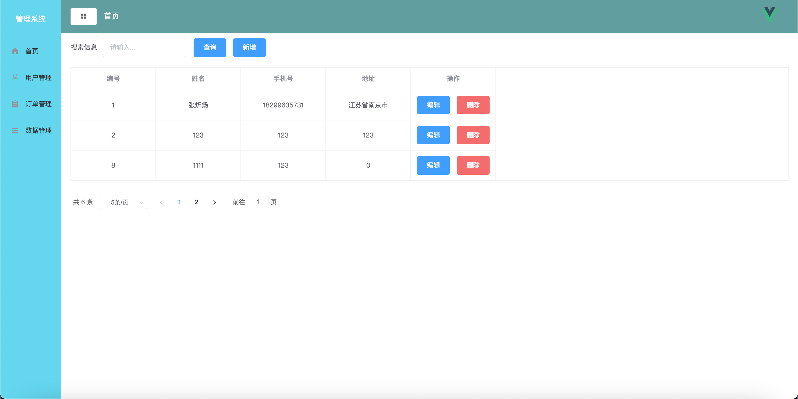

# 省市区三级联动

## 需求

在地址的选择中改为下拉框选择地址，选择省后，出现市的数据，选择市的数据后，出现县/区的数据，选择别的省之后，市、区的数据清空，市同理

## Java

controller

```java
@RestController
@RequestMapping("/district")
public class DistrictController {

    @Resource
    private DistrictService districtService;

    /**
     * 获取省份区域信息
     *
     * @param districtId 区域id
     * @param level      区域级别
     * @return
     */
    @GetMapping("/listDistrict")
    public Result listDistrict(@RequestParam(value = "districtId", required = false) String districtId,
                               @RequestParam(value = "level", required = false) String level) {
        return Result.success(districtService.getDistrict(districtId, level));
    }


}
```

service

```java
public interface DistrictService extends IService<District> {


    /**
     * 获取省份区域信息
     *
     * @param districtId 区域id
     * @param level      区域级别
     */
    List<District> getDistrict(String districtId, String level);
}
```

impl

```java
@Override
public List<District> getDistrict(String districtId, String level) {
    if (StrUtil.isAllBlank(districtId, level)) {
        throw new RuntimeException("id和level不能同时为空");
    }
    // 如果传递id，则查询该id下的下一级
    if (StrUtil.isNotBlank(districtId)) {
        return this.list(Wrappers.<District>lambdaQuery().eq(District::getParentId, districtId));
    }
    // 如果传递level，则查询该level对应的数据
    return this.list(Wrappers.<District>lambdaQuery().eq(District::getLevel, level));
}
```

## 前端

### 按照层级获取数据

1.修改表单为三级数据获取的样式

```html
 <el-form-item label="地址">
     <div class="block">
         <el-cascader v-model="form.address" :options="options">
         </el-cascader>
     </div>
</el-form-item>
```

2.书写获取省市区数据的方法

```js
import { getDataProvinceAndCityAndArea } from '@/api/data'

export default {
    name: 'AllData',
    data() {
        return {
            options: []
        }
    },
    mounted() {
        this.getData()
        this.getTree()
    },
    methods: {
        getTree() {
            const level = {
                level: 'province'
            }
            getDataProvinceAndCityAndArea({ params: level }).then(res => {
                // console.log(res);
                this.options = res.data
                // console.log(this.options);

                this.options.forEach(item => {
                    item.value = item.id
                    item.label = item.name

                    const levelCity = {
                        districtId: item.id,
                        level: 'province'
                    }
                    getDataProvinceAndCityAndArea({ params: levelCity }).then(res => {
                        // console.log(res);
                        item.children = res.data
                        item.children.forEach(item => {
                            item.value = item.id
                            item.label = item.name
                            const levelArea = {
                                districtId: item.id,
                                level: 'city'
                            }
                            getDataProvinceAndCityAndArea({ params: levelArea }).then(res => {
                                // console.log(res);
                                item.children = res.data
                                item.children.forEach(item => {
                                    item.value = item.id
                                    item.label = item.name
                                })
                                // console.log(item.children);
                            })
                        })
                    })
                })
            })
        },
	}
```

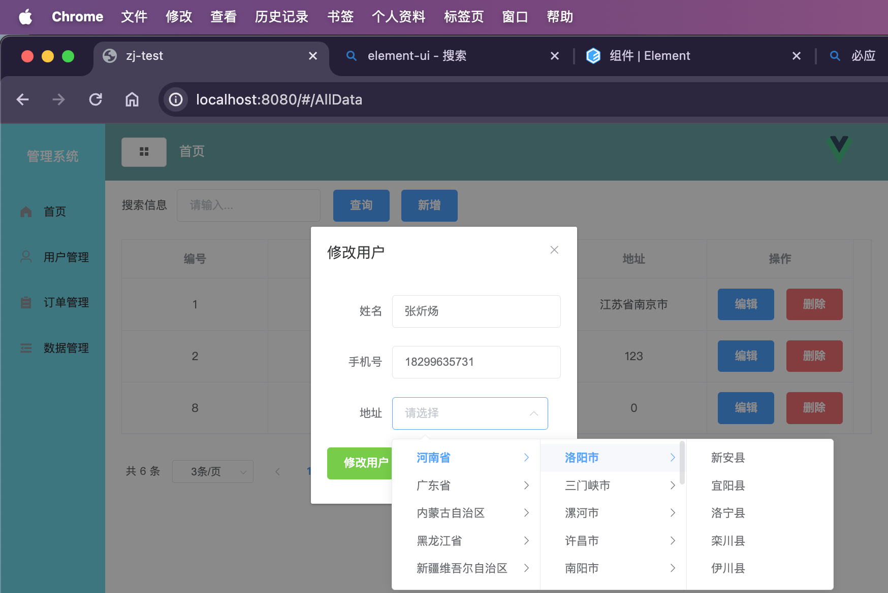

3.完成选择省的时候清空市和区的数据，并且表格只显示省的数据，其他情况一样

```vue
<el-cascader ref="cascader" v-model="list" :options="options" :props="{ checkStrictly: true }"></el-cascader>
```

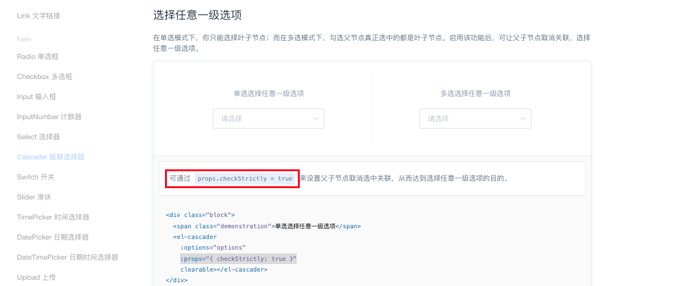
4.将数据输入到表格当中，在`update`方法中循环获取省市区的数据，利用提供的方法

```js
 update() {
            let arr = this.$refs.cascader.getCheckedNodes()
            let SHENG = ''
            let SHI = ''
            let QU = ''
            for (let i = 0; i < arr.length; i++) {
                QU = arr[i].label
                if (arr[i].parent) {
                    SHI = arr[i].parent.label
                    if (arr[i].parent.parent) {
                        SHENG = arr[i].parent.parent.label
                    }
                }
            }
            let address = SHENG + SHI + QU
            this.form.address = address

			// 省略...
```

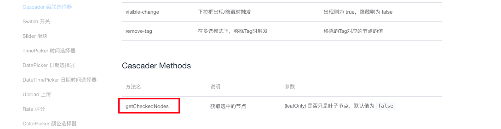


## 最终效果

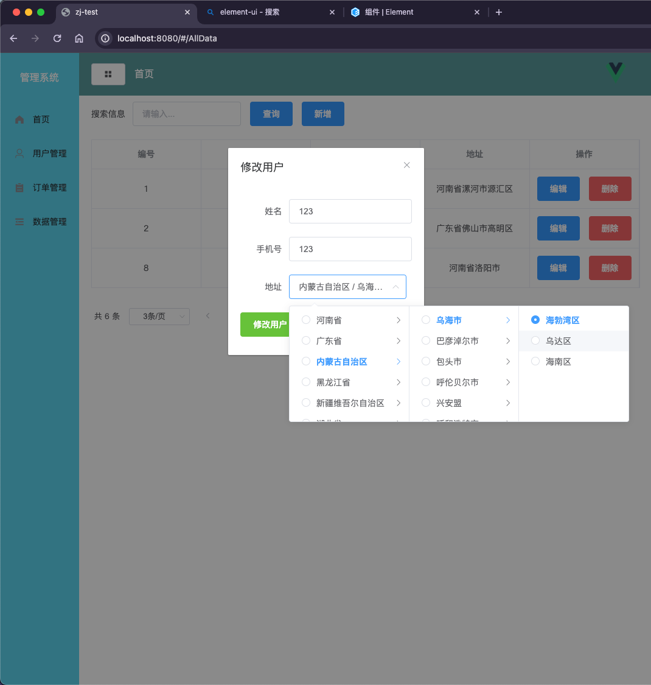

# 树形结构的查询

## 说明

最基础的树形结构就只需要一个pid，在这里pid的值是id

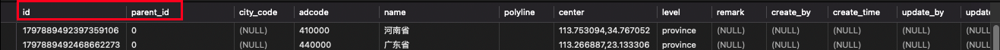

但是这样不能满足一些业务需求，id是每个数据都会有的

## 需求

返回该数据和改数据下的所有数据，比如在请求中提供河南省的id，返回河南省以及河南省以下的所有数据

## Java

1.添加子集

```java
    /** 子级 */
    @TableField(exist = false)
    private List<District> children = new ArrayList<>();
```

2.controller

```java
    /**
     * 获取省份区域信息
     *
     * @param districtId 区域id
     * @param level      区域级别
     * @return
     */
    @GetMapping("/listDistrict")
    public Result listDistrict(@RequestParam(value = "districtId", required = false) String districtId,
                               @RequestParam(value = "level", required = false) String level) {
        return Result.success(districtService.getDistrict(districtId, level));
    }
```

3.service

```java
    /**
     * 获取id对应的区域信息
     *
     * @param districtId 区域id
     */
    List<District> getDistrictInfo(String districtId);
```

4.impl

```java
		@Override
    public List<District> getDistrictInfo(String districtId) {
        if (StrUtil.isAllBlank(districtId)) {
            throw new RuntimeException("id不能为空");
        }
        // 传递id，查询该id下的下一级以及当前id对应的数据
        List<District> districtList = districtMapper.getDistrictList(districtId);
        List<District> returnList = new ArrayList();
        List<String> tempList = districtList.stream().map(District::getId).collect(Collectors.toList());
        for (District item : districtList) {
            // 如果是顶级节点, 遍历该父节点的所有子节点
            if (!tempList.contains(item.getParentId())) {
                recursionFn(districtList, item);
                returnList.add(item);
            }
        }
        if (returnList.isEmpty()) {
            returnList = districtList;
        }
        return returnList;
    }

    /**
     * 递归列表
     */
    private void recursionFn(List<District> list, District t) {
        // 得到子节点列表
        List<District> childList = getChildList(list, t);
        t.setChildren(childList);
        for (District tChild : childList) {
            if (hasChild(list, tChild)) {
                recursionFn(list, tChild);
            }
        }
    }

    /**
     * 得到子节点列表
     */
    private List<District> getChildList(List<District> list, District t) {
        List<District> tlist = new ArrayList<District>();
        Iterator<District> it = list.iterator();
        while (it.hasNext()) {
            District n = (District) it.next();
            if (n.getParentId() !=null && n.getParentId().equals(t.getId())) {
                tlist.add(n);
            }
        }
        return tlist;
    }

    /**
     * 判断是否有子节点
     */
    private boolean hasChild(List<District> list, District t) {
        return getChildList(list, t).size() > 0 ? true : false;
    }
```

5.mapper

```java
List<District> getDistrictList(@Param("districtId") String districtId);
```

6.xml，我们需要通过递归查询获取 `district` 表中的数据，并根据 `districtId` 条件筛选出符合要求的记录。

```xml
    <select id="getDistrictList" resultType="com.iweb.entity.District">
        WITH RECURSIVE district_list AS (
        <!-- 初始查询 -->
        SELECT id, parent_id, city_code, adcode, name, polyline, center, level, remark, create_by, create_time, update_by, update_time, deleted
        FROM district
        <where>
            <if test="districtId != null  and districtId != ''">
                id = #{districtId}
            </if>
        </where>
        UNION ALL
        <!-- 递归查询 -->
        SELECT d.id, d.parent_id, d.city_code, d.adcode, d.name, d.polyline, d.center, d.level, d.remark, d.create_by, d.create_time, d.update_by, d.update_time, d.deleted
        FROM district d
        INNER JOIN district_list dl ON d.parent_id = dl.id
        )
        SELECT * FROM district_list
    </select>
```

## xml代码说明

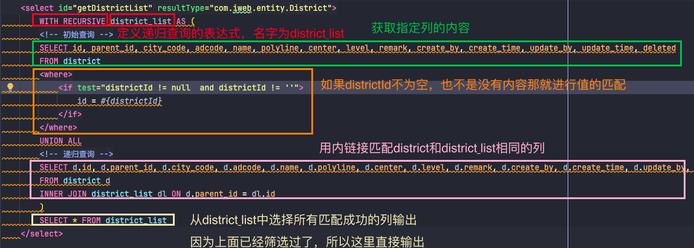

## 接口测试

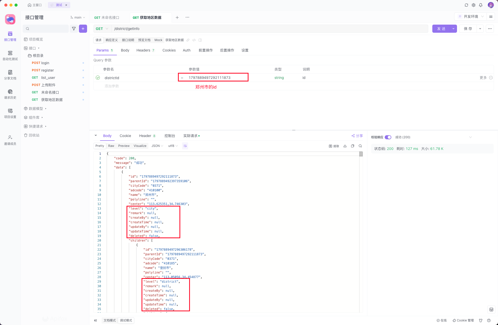
