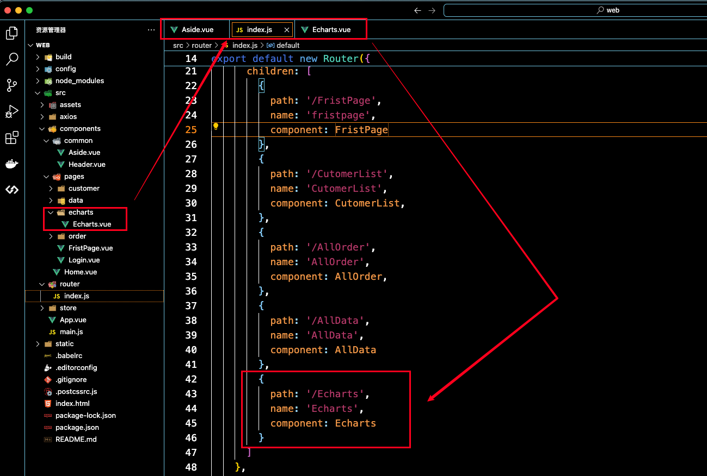

# 新建页面

## 文件



## 页面


# Echarts

## 安装

```bash
npm install echarts
```

## 页面

1.放置样式

```html
<template>
    <el-card style=" margin-top: 20px">
        <div ref="echarts" style="height:300px;"></div>
    </el-card>
</template>
```

2.引入`Echarts`

```js
import * as echarts from 'echarts';
```

3.基于准备好的dom，初始化echarts实例

```js
 mounted() {
        // 基于准备好的dom，初始化echarts实例
        var myChart = echarts.init(this.$refs.echarts);
 } 
```

4.官网复制配置项

```js
var option = {
            	// ...
        };
```

5.绑定数据

```js
        myChart.setOption(option);
```


