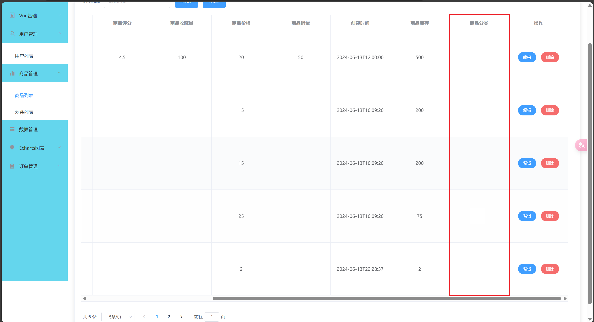

# 准备工作

## 数据库

```sql
CREATE TABLE products (
    id INT PRIMARY KEY AUTO_INCREMENT,
    image VARCHAR(255) COMMENT '商品图片',
    name VARCHAR(255) COMMENT '商品名称',
    rating DECIMAL(3, 2) COMMENT '商品评分',
    favorites INT COMMENT '商品收藏量',
    price DECIMAL(10, 2) COMMENT '商品价格',
    sales INT COMMENT '商品销量'
);

CREATE TABLE categories (
  id int NOT NULL AUTO_INCREMENT PRIMARY KEY COMMENT '分类表 id',
  p_id int DEFAULT NULL COMMENT '商品表 id',
  categoryname varchar(255) COMMENT '分类名称',
  season varchar(255) COMMENT '所属季节'
)

CREATE TABLE category_tempalte  (
  id int NOT NULL AUTO_INCREMENT PRIMARY KEY COMMENT '模版表 id',
  categoryname varchar(255) COMMENT '分类名称',
  season varchar(255) COMMENT '所属季节',
)
```

product是正常的商品数据表，categories是分类和product的关系表，category_tempalte是模板表，只用来展示有哪些分类的数据

## 前后端

快速利用代码生成器来创建对应的后端文件，复制之前的前端生成最基础的前后端的页面

# 商品分类的添加

## 问题

现在我在前端添加了一个选项叫`商品分类`，但是商品分类并不是属于商品表的我该如何解决？



## 前端

### 修改接口文件


### 修改样式

在表格中代码

```html
<el-table-column prop="categoryName" label="商品分类" width="180" header-align="center" align="center">
</el-table-column>
```

### 修改方法
无


## 后端
修改查询接口
Products 类中添加 categoryName 商品分类属性
```java
@Data
@EqualsAndHashCode(callSuper = false)
public class Products implements Serializable {

    //......新增属性

    /**
     * 商品分类
     */
    @TableField(exist = false)
    private String categoryName;


}

```


# 商品分类名称的多个展示

## 问题

我现在希望`商品列表`模块中的`商品分类`的数据可以展示很多个，比如`甜点、热饮`

## 前端
无

### 修改接口文件


### 修改样式
无


### 完善方法
无


## 后端
修改 ProductsServiceImpl 中的 listUserPage 方法
```java
    @Service
public class ProductsServiceImpl extends ServiceImpl<ProductsMapper, Products> implements ProductsService {

    //新增的属性
    @Autowired
    private CategoriesService categoriesService;

    @Override
    public Page<Products> listUserPage(Integer pageNum, Integer pageSize, ListProductsPageReq listProductsPageReq) {
        //........此处省略
        //下面新增代码，此处就是获得商品绑定的所有的分类
        for (Products record : records) {
            List<Categories> list = categoriesService.lambdaQuery().eq(Categories::getPId, record.getId()).list();
            if (CollectionUtils.isNotEmpty(list)) {
                List<String> collect = list.stream().map(Categories::getCategoryname).collect(Collectors.toList());
                record.setCategoryName(String.join(", ", collect));
            }
        }
        return resultPage;
    }
}
```


# 商品分类的删除

## 问题

我现在希望当我删除`分类列表`模块中的`商品分类名称`中的数据时候，对应的`商品列表`模块中的`商品分类`列表中的数据也能够被删除

## 前端
无

### 修改接口文件


### 修改样式
无


### 完善方法
无


## 后端
修改 CategoryTempalteServiceImpl 中的 deleteOrder 方法
```java
@Service
public class CategoryTempalteServiceImpl extends ServiceImpl<CategoryTempalteMapper, CategoryTempalte> implements CategoryTempalteService {

    @Autowired
    private CategoriesService categoriesService;
    
    @Override
    public void deleteOrder(Integer id) {
        //....此处省略之前代码，下面为新增代码
        CategoryTempalte categoryTempalte = baseMapper.selectById(id);
        String categoryname = categoryTempalte.getCategoryname();
        QueryWrapper<Categories> categoriesQueryWrapper = new QueryWrapper<>();
        categoriesQueryWrapper.eq("categoryname",categoryname);
        categoriesService.remove(categoriesQueryWrapper);
    }
}
```


# 完善新增和修改

## 问题

在`商品列表`模块中的`新增`按钮和`修改`按钮应该对应不同的数据展示，点击`新增`按钮商品分类的展示应该是下拉菜单，点击`修改`按钮商品分类展示的应该是标签，并且如果没有想要的分类名称可以点击标签进行添加

## 前端

### 修改接口文件


### 修改样式


### 完善方法


## 后端

