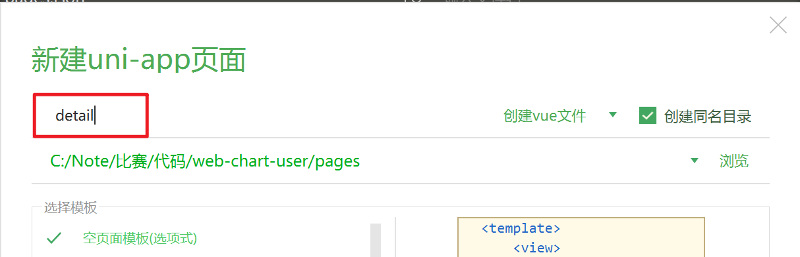
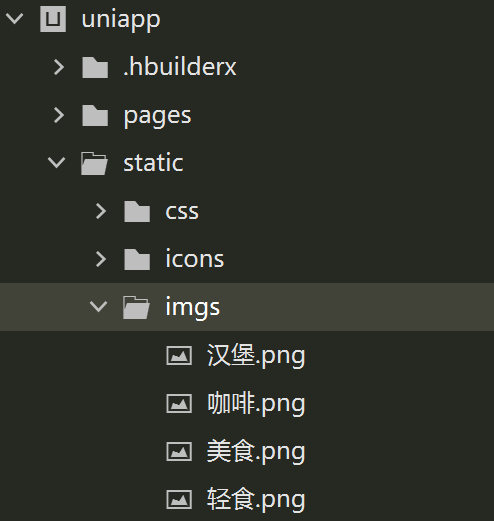
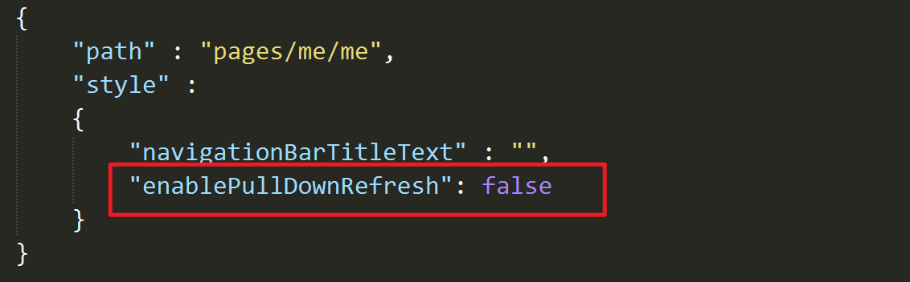
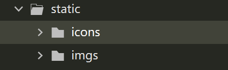
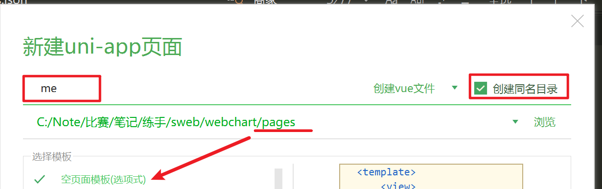
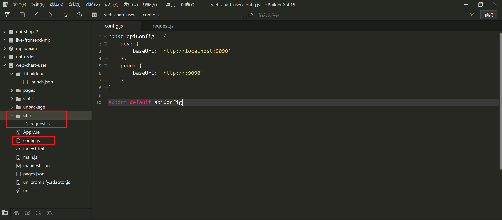

# 准备

## 创建页面

`detail`



## 准备图片



## index.vue的结构准备

```vue
<template>
	<view>
		<!-- 搜索框 -->
		··· ···
		<!-- 轮播图 -->
		··· ···
		<!-- 轮播图结束 -->

		<!-- 轮播图下方布局 -->
		··· ···
			<!-- 公告结束 -->


			<!-- 商品分类 -->
			··· ···
			<!-- 商品分类结束 -->


			<!-- 商品列表 -->
			··· ···
			<!-- 右侧区域 -->
			··· ···
			<!-- 右侧区域结束 -->

		<!-- 轮播图下方布局结束 -->
	</view>
</template>
```

## pages.json配置

```JSON
"globalStyle": {
  // 导航栏标题颜色及状态栏前景颜色，仅支持 black/white
  "navigationBarTextStyle": "black",
  // 导航栏标题文字内容
  "navigationBarTitleText": "杨芯叶外卖",
  // 导航栏背景颜色（同状态栏背景色）
  "navigationBarBackgroundColor": "#ffd100",
  //  下拉显示出来的窗口的背景色
  "backgroundColor": "#F8F8F8"
},
```

### 创建me

在`pages.json`中会自动引入，需要设置内容



## 导入icon和图片素材



## 创建个人页



## tarbar配置

在`pages.json`中与`pages`同级书写`tabBar`

```JSON
"tabBar": {
    "selectedColor": "#ffd100",
    "color": "#666",
    "list": [
      {
        "pagePath": "pages/index/index",   // 菜单路径
        "text": "首页",
        "iconPath": "static/icons/home.png",   // 默认图标
        "selectedIconPath": "static/icons/home-active.png"  // 高亮图标
      },
      {
        "pagePath": "pages/me/me",
        "text": "我的",
        "iconPath": "static/icons/me.png",
        "selectedIconPath": "static/icons/me-active.png"
      }
    ]
}
```

## http请求工具

在项目中创建`config.js`和`utils/request.js`



config.js

```JavaScript
const apiConfig = {
    dev: {
        baseUrl: 'http://localhost:9090'
    },
    prod: {
        baseUrl: 'http://:9090'
    }
}

export default apiConfig
```

request.js

```JavaScript
import apiConfig from '@/config.js'


const baseUrl = process.env.NODE_ENV === "development" ? apiConfig.dev.baseUrl : apiConfig.prod.baseUrl

const request = (options = {}) => {
    return new Promise((resolve, reject) => {
        uni.request({
            url: baseUrl + options.url || '',
            method: options.method || 'GET',
            data: options.data || {},
            header: options.header || {"Content-Type": "application/json", token: uni.getStorageSync('xm-user')?.token}      
        }).then(res => {
            let { data } = res
            if (data.code === '401') {
                uni.navigateTo({
                    url: '/pages/login/login'
                })
            }
            resolve(data);
        }).catch(error => {
            reject(error)
        })
    });
}

const get = (url, data, options = {}) => {
    options.method = 'GET'
    options.data = data
    options.url = url
    return request(options)
}

const post = (url, data, options = {}) => {
    options.method = 'POST'
    options.data = data
    options.url = url
    return request(options)
}

const put = (url, data, options = {}) => {
    options.method = 'PUT'
    options.data = data
    options.url = url
    return request(options)
}

const del = (url, data, options = {}) => {
    options.method = 'DELETE'
    options.data = data
    options.url = url
    return request(options)
}

export default  {
    request,
    get,
    post,
    put,
    del
}
```

在`main.js`中引入书写的请求规则

```JavaScript
import request from '@/utils/request.js'

Vue.prototype.$request = request
```

# 布局说明

`<view style="padding: 20rpx;">`这一层是同时嵌套了商品分类和商品列表

```vue
		轮播图
<view style="padding: 20rpx;">
    	商品分类
    
    	商品列表
</view>
```

# 轮播图

## 页面代码

```html
<swiper circular autoplay :interval="3000" :duration="500" indicator-dots style="height: 350rpx;"
        indicator-color="rgba(255, 255, 255, 0.6)" indicator-active-color="#3CB371">
    <swiper-item v-for="item in banners" :key="item.id">
        <navigator>
            <image :src="item.img" alt="" mode="widthFix" style="width: 100%;" />
        </navigator>
    </swiper-item>
</swiper>
```

### 方法

```js
data() {
    return {
        banners: [],
        businessList: []
    }
},
onLoad() {
        this.load()
    },
methods: {
    load() {
        // 获取轮播图数据
        this.$request.get('/banners/findAll').then(res => {
            this.banners = res.data || []
        })
    }
}
```

# 商品分类列表

```html
<view style="padding: 20rpx;">

    <!-- 商品分类 -->
    <view class="box" style="margin: 20rpx 0;">
        <view style="display: flex;">
            <view class="category-item">
                <image src="@/static/imgs/咖啡.png" mode="widthFix" style="width: 50%;"></image>
                <text>奶茶饮品</text>
            </view>
            <view class="category-item">
                <image src="@/static/imgs/轻食.png" mode="widthFix" style="width: 50%;"></image>
                <text>轻食简餐</text>
            </view>
            <view class="category-item">
                <image src="@/static/imgs/汉堡.png" mode="widthFix" style="width: 50%;"></image>
                <text>炸鸡汉堡</text>
            </view>
            <view class="category-item">
                <image src="@/static/imgs/美食.png" mode="widthFix" style="width: 50%;"></image>
                <text>特色美味</text>
            </view>
        </view>
    </view>
</view>
<!-- 商品分类结束 -->
```

### 样式

```css
.category-item {
  flex: 1;
  display: flex;
  flex-direction: column;
  justify-content: space-between;
  align-items: center;
  grid-gap: 10rpx;
}
```

# 商品列表

## 页面布局


```html
<!-- 商品列表 -->
<view class="box" style="color: orange; font-size: 32rpx; font-weight: bold; margin-bottom: 10rpx;">
    全部商品
</view>

<view>
    <view class="box" v-for="item in businessList" :key="item.id"
          style="display: flex; grid-gap: 30rpx; margin-bottom: 10rpx;">
        <view style="width: 30%;">
            <image :src="item.image"
                   style="width: 100%; height: 200rpx; border-radius: 10rpx; display: block;"></image>
        </view>
        <view
              style="flex: 1; display: flex; flex-direction: column; justify-content: space-between; grid-gap: 10rpx;">
            <view style="font-size: 36rpx; font-weight: bold;">{{ item.name }}</view>

            <view style="display: flex;  color: #666; ">
                <view style="flex: 1;">
                    <text style="color: #ff9800; font-weight: bold;">{{ item.rating }}</text>
                    <text style="margin-left: 10rpx;">最近已售：{{ item.sales }}</text>
                </view>
                <view style="flex: 1; text-align: right;">{{ item.price }}
                </view>
            </view>

            <view style="color: #ff9800;">上架日期：{{ item.createTime }}</view>

            <view style="background-color: #ffd281; color: brown; border-radius: 4rpx; width: fit-content;
                         padding: 0 8rpx;">已经有{{ item.favorites }}人收藏了！</view>

        </view>
    </view>
```

### 方法

在`load中`添加获取商品列表数据的方法

```js
// 获取商品的列表
this.$request.get('/products/list').then(res => {
    console.log(res.data.records);
    this.businessList = res.data.records || []
})
```

# 完整代码

```vue
<template>
	<view>
		<swiper circular autoplay :interval="3000" :duration="500" indicator-dots style="height: 350rpx;"
			indicator-color="rgba(255, 255, 255, 0.6)" indicator-active-color="#3CB371">
			<swiper-item v-for="item in banners" :key="item.id">
				<navigator>
					<image :src="item.img" alt="" mode="widthFix" style="width: 100%;" />
				</navigator>
			</swiper-item>
		</swiper>

		<view style="padding: 20rpx;">

			<!-- 商品分类 -->
			<view class="box" style="margin: 20rpx 0;">
				<view style="display: flex;">
					<view class="category-item">
						<image src="@/static/imgs/咖啡.png" mode="widthFix" style="width: 50%;"></image>
						<text>奶茶饮品</text>
					</view>
					<view class="category-item">
						<image src="@/static/imgs/轻食.png" mode="widthFix" style="width: 50%;"></image>
						<text>轻食简餐</text>
					</view>
					<view class="category-item">
						<image src="@/static/imgs/汉堡.png" mode="widthFix" style="width: 50%;"></image>
						<text>炸鸡汉堡</text>
					</view>
					<view class="category-item">
						<image src="@/static/imgs/美食.png" mode="widthFix" style="width: 50%;"></image>
						<text>特色美味</text>
					</view>
				</view>
			</view>

			<!-- 商品列表 -->
			<view class="box" style="color: orange; font-size: 32rpx; font-weight: bold; margin-bottom: 10rpx;">
				全部商品
			</view>

			<view>
				<view class="box" v-for="item in businessList" :key="item.id"
					style="display: flex; grid-gap: 30rpx; margin-bottom: 10rpx;">
					<view style="width: 30%;">
						<image :src="item.image"
							style="width: 100%; height: 200rpx; border-radius: 10rpx; display: block;"></image>
					</view>
					<view
						style="flex: 1; display: flex; flex-direction: column; justify-content: space-between; grid-gap: 10rpx;">
						<view style="font-size: 36rpx; font-weight: bold;">{{ item.name }}</view>

						<view style="display: flex;  color: #666; ">
							<view style="flex: 1;">
								<text style="color: #ff9800; font-weight: bold;">{{ item.rating }}</text>
								<text style="margin-left: 10rpx;">最近已售：{{ item.sales }}</text>
							</view>
							<view style="flex: 1; text-align: right;">{{ item.price }}
							</view>
						</view>

						<view style="color: #ff9800;">上架日期：{{ item.createTime }}</view>

						<view style="background-color: #ffd281; color: brown; border-radius: 4rpx; width: fit-content;
							padding: 0 8rpx;">已经有{{ item.favorites }}人收藏了！</view>

					</view>
				</view>
			</view>
		</view>
	</view>
</template>

<script>
	export default {
		data() {
			return {
				banners: [],
				businessList: []
			}
		},
		onLoad() {
			this.load()
		},
		methods: {
			load() {

				// 获取轮播图数据
				this.$request.get('/banners/findAll').then(res => {
					this.banners = res.data || []
				})

				// 获取商品的列表
				this.$request.get('/products/list').then(res => {
					console.log(res.data.records);
					this.businessList = res.data.records || []
				})
			}
		}
	}
</script>

<style>
	.category-item {
		flex: 1;
		display: flex;
		flex-direction: column;
		justify-content: space-between;
		align-items: center;
		grid-gap: 10rpx;
	}
</style>
```

