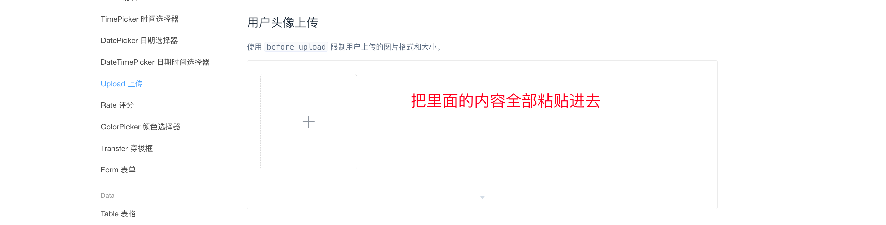

# 完成头像的上传

## 本地上传

```java
@Slf4j
@RestController
public class UploadController {


    @PostMapping("/upload")
    public Result upload(String username, String age, MultipartFile avatar) throws IOException {
        // 获取文件的原始名称
        String originalFilename = avatar.getOriginalFilename();

        // 获取文件扩展名
        int index = originalFilename.lastIndexOf(".");

        // 字符串截取,extName = .xxxx
        String extName = originalFilename.substring(index);
        log.info("文件后缀名为：" + extName);

        // 生成新的文件名 UUID.xx
        String newFileName = UUID.randomUUID().toString() + extName;
        log.info("新文件名为：" + newFileName);

        // 存储文件到指定目录
        // 后端代码在哪跑，哪个电脑就会被认为是服务器
        avatar.transferTo(new File("C:\\ComputerProgram\\Java\\spring-boot-web01\\src\\main\\resources\\file\\" + newFileName));

        return Result.success(url);
    }

}

```

## 阿里云上传

### 依赖

```yml
aliyun:
  oss:
    endpoint: https://oss-cn-nanjing.aliyuncs.com
    accessKeyId: LTAI5tKsJtiRmt7F1sFBLdiV
    accessKeySecret: BIQsoZUAdwPeYBhv7bTOOJkxNOUhVw
    bucketName: yxy-study
```

### 实体类

```java
@Data
@Component
public class AliOss {

    private String endpoint = "https://oss-cn-nanjing.aliyuncs.com";
    private String accessKeyId = "LTAI5tKsJtiRmt7F1sFBLdiV";
    private String accessKeySecret = "BIQsoZUAdwPeYBhv7bTOOJkxNOUhVw";
    private String bucketName = "yxy-study";

}
```

### 工具类

```java
@Component
public class AliOSSUtils {

    /**
     * 实现上传图片到OSS
     */
    public String upload(MultipartFile file) throws IOException {
        AliOss aliOss = new AliOss();
        String endpoint = aliOss.getEndpoint();
        String accessKeyId = aliOss.getAccessKeyId();
        String accessKeySecret = aliOss.getAccessKeySecret();
        String bucketName = aliOss.getBucketName();
        System.out.println(aliOss);
        // 获取上传的文件的输入流
        InputStream inputStream = file.getInputStream();

        // 避免文件覆盖
        String originalFilename = file.getOriginalFilename();
        String fileName = UUID.randomUUID().toString() + originalFilename.substring(originalFilename.lastIndexOf("."));

        //上传文件到 OSS
        OSS ossClient = new OSSClientBuilder().build(endpoint, accessKeyId, accessKeySecret);
        ossClient.putObject(bucketName, fileName, inputStream);

        //文件访问路径
        String url = endpoint.split("//")[0] + "//" + bucketName + "." + endpoint.split("//")[1] + "/" + fileName;
        // 关闭ossClient
        ossClient.shutdown();
        return url;// 把上传到oss的路径返回
    }
}

```


### 接口

```java
@Slf4j
@RestController
public class UploadController {


    @PostMapping("/upload")
    public Result upload(@RequestBody MultipartFile file) throws IOException {
        String username = "";
        log.info("文件上传" + username +  file);
        AliOSSUtils aliOSSUtils = new AliOSSUtils();

        String url = aliOSSUtils.upload(file);
        log.info("文件上传成功" + file);
        return Result.success(url);
    }

}

```

## 前端

从element-ui复制样式下来,粘贴里面的全部代码



修改部分代码,因为我们有token验证,在样式内修改了`action`添加了`header`

```html
<el-form-item label="商品图片">
  <el-upload class="avatar-uploader" action="http://localhost:8080/upload" :headers="header"       
      :show-file-list="false" :on-success="handleAvatarSuccess" :before-upload="beforeAvatarUpload">
      
      <i v-else class="el-icon-plus avatar-uploader-icon"></i>
  </el-upload>
</el-form-item>
```

对应在下方的属性中添加`header`用来获取token,其他粘贴过来的内容不变

```js
 return {
    header:{
      token:localStorage.getItem('token')
  }
 }
```

具体的方法再次确认

```js
		handleAvatarSuccess(res, file) {
            this.form.image = res.data;
            this.imageUrl = URL.createObjectURL(file.raw);
        },
        beforeAvatarUpload(file) {
            const isJPG = file.type === 'image/jpeg';
            const isLt2M = file.size / 1024 / 1024 < 2;

            if (!isJPG) {
                this.$message.error('上传头像图片只能是 JPG 格式!');
            }
            if (!isLt2M) {
                this.$message.error('上传头像图片大小不能超过 2MB!');
            }
            return isJPG && isLt2M;
        },
```

