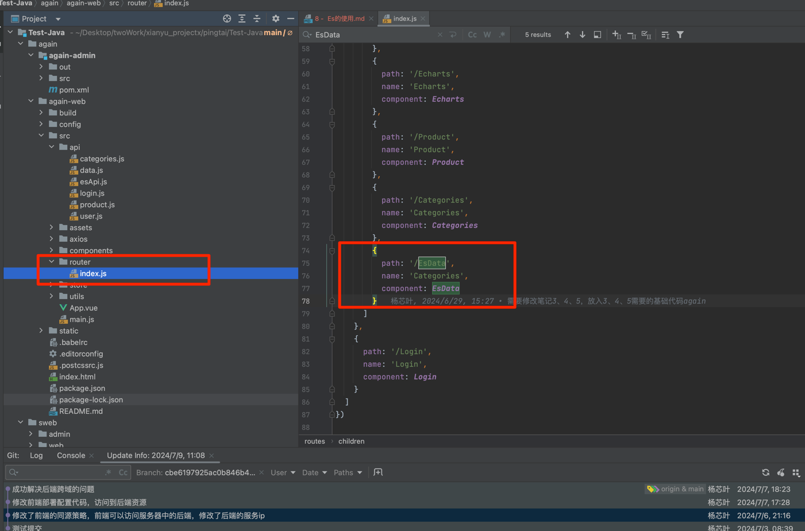
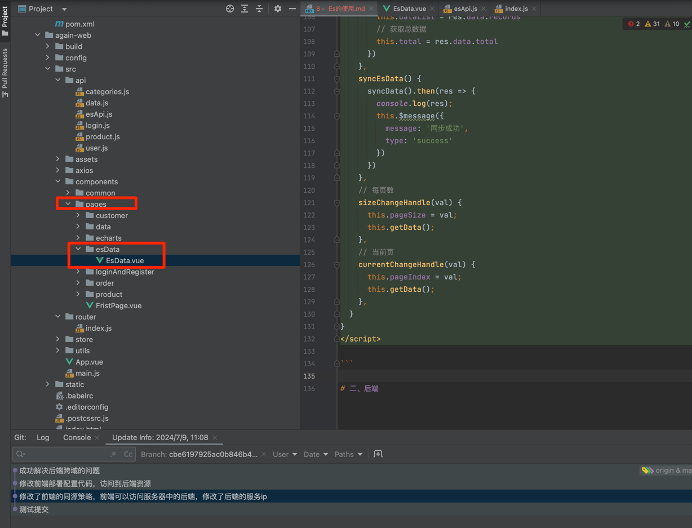
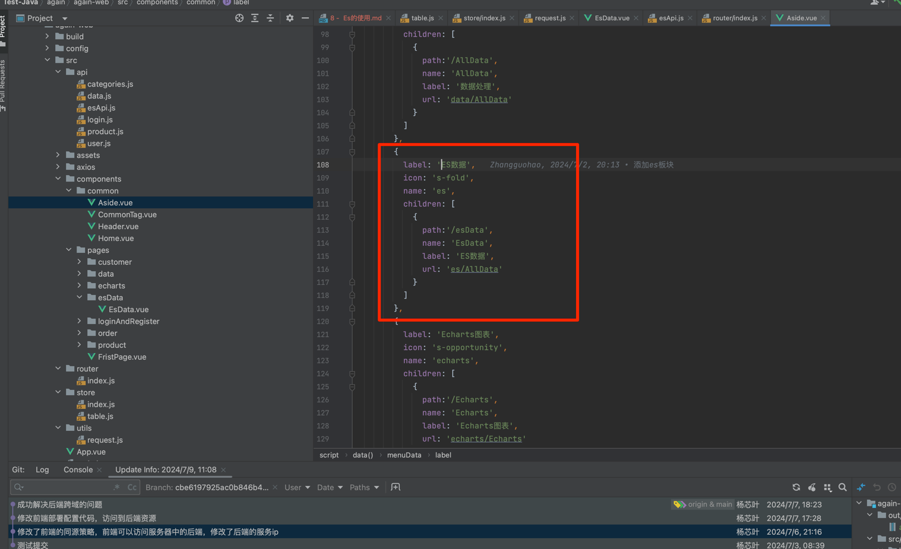

# 一、前端
## 1.1、进行配置页面路由
```js
//新增页面引入
import EsData from '../components/pages/esData/EsData.vue'

routes: [
    {
        // 修改这里的路由规则
        path: '/',
        name: 'Home',
        redirect:'FristPage',
        component: Home,
        // 在这书写子路由规则，这样页面就可以嵌套进主路由当中
        children: [
            //新增ES跳转
            {
                path: '/EsData',
                name: 'Categories',
                component: EsData
            }
        ]
    },
    {
        path: '/Login',
        name: 'Login',
        component: Login
    }
]
})

```

## 1.2、新增 esApi.js 文件到 api 目录下
```js
import http  from '../utils/request'

// 同步数据
export const getData = (params) => {
  return http.get('/es/list', params)
}


export const syncData = () => {
  return http.get('/es/syncData')
}

```
## 1.3、在 pages 目录新增 esData 目录，并且新增 EsData.vue 文件
```vue
<template>
  <div>
    <el-form :inline="true" class="demo-form-inline">
      <el-form-item label="搜索信息">
        <el-input placeholder="请输入..." v-model="name"></el-input>
      </el-form-item>
      <el-form-item>
        <el-button type="primary" @click="getData()">查询</el-button>
        <el-button type="primary" @click="syncEsData()">同步ES数据</el-button>
      </el-form-item>
    </el-form>
    <el-table :data="dataList" border style="width: 100%">
      <el-table-column prop="cityCode" label="城市编码" width="180" header-align="center" align="center">
      </el-table-column>
      <el-table-column prop="adcode" label="区域编码" width="180" header-align="center" align="center">
      </el-table-column>
      <el-table-column prop="name" label="行政区名称" width="180" header-align="center" align="center">
      </el-table-column>
      <el-table-column prop="center" label="区域中心点" width="180" header-align="center" align="center">
      </el-table-column>
      <el-table-column prop="level" label="行政区划级别" width="180" header-align="center" align="center">
      </el-table-column>
    </el-table>
    <el-pagination @size-change="sizeChangeHandle" @current-change="currentChangeHandle" :current-page="pageIndex"
                   :page-sizes="[3, 5, 10, 20, 50, 100]" :page-size="pageSize" :total="total"
                   layout="total, sizes, prev, pager, next, jumper" style="margin-top:30px;">
    </el-pagination>
  </div>
</template>

<script>
import { getData,syncData  } from '@/api/esApi'

export default {
  name: 'EsData',
  data() {
    return {
      dataList: [],
      pageIndex: 1,
      pageSize: 3,
      total: 0,
      name:"",
    }
  },
  mounted() {
    this.getData()
  },
  methods: {
    getData() {
      const params = {
        pageNum: this.pageIndex,
        pageSize: this.pageSize,
        name:this.name
      }
      getData({params}).then(res => {
        this.dataList = res.data.records
        // 获取总数据
        this.total = res.data.total
      })
    },
    syncEsData() {
      syncData().then(res => {
        console.log(res);
        this.$message({
          message: '同步成功',
          type: 'success'
        })
      })
    },
    // 每页数
    sizeChangeHandle(val) {
      this.pageSize = val;
      this.getData();
    },
    // 当前页
    currentChangeHandle(val) {
      this.pageIndex = val;
      this.getData();
    },
  }
}
</script>

```

## 1.4、添加页面菜单，修改 Aside.vue 文件
```js
{
          label: 'ES数据',
          icon: 's-fold',
          name: 'es',
          children: [
            {
              path:'/esData',
              name: 'EsData',
              label: 'ES数据',
              url: 'es/AllData'
            }
          ]
        },
```

# 二、后端
## 1、pom文件中新增ES依赖
```xml
        <dependency>
            <groupId>co.elastic.clients</groupId>
            <artifactId>elasticsearch-java</artifactId>
            <version>8.1.0</version>
        </dependency>
        <dependency>
            <groupId>org.apache.httpcomponents.client5</groupId>
            <artifactId>httpclient5</artifactId>
            <version>5.1.3</version>
        </dependency>
        <!-- Jackson JSON Processor -->
        <dependency>
            <groupId>com.fasterxml.jackson.core</groupId>
            <artifactId>jackson-databind</artifactId>
            <version>2.13.4</version>
        </dependency>
        <dependency>
            <groupId>com.fasterxml.jackson.core</groupId>
            <artifactId>jackson-core</artifactId>
            <version>2.13.4</version>
        </dependency>
        <dependency>
            <groupId>com.fasterxml.jackson.core</groupId>
            <artifactId>jackson-annotations</artifactId>
            <version>2.13.4</version>
        </dependency>

        <!-- Jakarta JSON -->
        <dependency>
            <groupId>org.glassfish</groupId>
            <artifactId>jakarta.json</artifactId>
            <version>2.0.1</version>
        </dependency>
```
## 2、新增 EsService.java 文件
```java
package com.iweb.service;

import com.baomidou.mybatisplus.extension.plugins.pagination.Page;
import com.iweb.entity.District;

import java.util.List;

/**
 * @Author：
 * @Package：com.iweb.service
 * @Project：Test-Java
 * @name：EsService
 * @Date：2024/7/2 17:16
 * @Description:
 */
public interface EsService {
    void syncData();

    Page<District> list(String name, Integer pageNum, Integer pageSize);

}

```
## 3、新增 EsServiceImpl.java 文件
```java
package com.iweb.service.impl;

import cn.hutool.db.PageResult;
import co.elastic.clients.elasticsearch.ElasticsearchClient;
import co.elastic.clients.elasticsearch._types.query_dsl.MatchAllQuery;
import co.elastic.clients.elasticsearch._types.query_dsl.Query;
import co.elastic.clients.elasticsearch._types.query_dsl.WildcardQuery;
import co.elastic.clients.elasticsearch.core.SearchRequest;
import co.elastic.clients.elasticsearch.core.SearchResponse;
import co.elastic.clients.elasticsearch.core.search.Hit;
import co.elastic.clients.elasticsearch.indices.DeleteIndexRequest;
import co.elastic.clients.elasticsearch.indices.ExistsRequest;
import co.elastic.clients.json.jackson.JacksonJsonpMapper;
import co.elastic.clients.transport.ElasticsearchTransport;
import co.elastic.clients.transport.rest_client.RestClientTransport;
import com.baomidou.mybatisplus.extension.plugins.pagination.Page;
import com.iweb.entity.District;
import com.iweb.entity.Products;
import com.iweb.service.DistrictService;
import com.iweb.service.EsService;
import lombok.SneakyThrows;
import org.apache.http.HttpHost;
import org.elasticsearch.client.RestClient;
import org.springframework.beans.factory.annotation.Autowired;
import org.springframework.stereotype.Service;
import org.springframework.util.StringUtils;

import java.io.IOException;
import java.util.ArrayList;
import java.util.List;

/**
 * @Author：
 * @Package：com.iweb.service.impl
 * @Project：Test-Java
 * @name：EsServiceImpl
 * @Date：2024/7/2 17:16
 * @Description:
 */
@Service
public class EsServiceImpl implements EsService {

    @Autowired
    private DistrictService districtService;

    private final ElasticsearchClient client;

    public EsServiceImpl() {
        RestClient restClient = RestClient.builder(new HttpHost("localhost", 9200)).build();
        ElasticsearchTransport transport = new RestClientTransport(restClient, new JacksonJsonpMapper());
        this.client = new ElasticsearchClient(transport);
    }


    private static final String INDEX_NAME = "district";
    private static final String INDEX_MAPPING = "{\n" +
            "  \"mappings\": {\n" +
            "    \"properties\": {\n" +
            "      \"id\": { \"type\": \"keyword\" },\n" +
            "      \"parent_id\": { \"type\": \"keyword\" },\n" +
            "      \"city_code\": { \"type\": \"keyword\" },\n" +
            "      \"adcode\": { \"type\": \"keyword\" },\n" +
            "      \"name\": { \"type\": \"text\", \"analyzer\": \"standard\" },\n" +
            "      \"polyline\": { \"type\": \"text\" },\n" +
            "      \"center\": { \"type\": \"text\" },\n" +
            "      \"level\": { \"type\": \"keyword\" },\n" +
            "      \"remark\": { \"type\": \"text\" },\n" +
            "      \"create_by\": { \"type\": \"keyword\" },\n" +
            "      \"create_time\": { \"type\": \"date\", \"format\": \"yyyy-MM-dd HH:mm:ss||yyyy-MM-dd||epoch_millis\" },\n" +
            "      \"update_by\": { \"type\": \"keyword\" },\n" +
            "      \"update_time\": { \"type\": \"date\", \"format\": \"yyyy-MM-dd HH:mm:ss||yyyy-MM-dd||epoch_millis\" },\n" +
            "      \"deleted\": { \"type\": \"boolean\" }\n" +
            "    }\n" +
            "  }\n" +
            "}";

    @SneakyThrows
    @Override
    public void syncData() {

        // 检查索引是否存在
        boolean indexExists = client.indices().exists(new ExistsRequest.Builder().index(INDEX_NAME).build()).value();

        if (!indexExists) {
            // 创建索引
            client.indices().create(c -> c
                    .index(INDEX_NAME)
                    .mappings(m -> m
                            .properties("id", p -> p.keyword(k -> k))
                            .properties("parent_id", p -> p.keyword(k -> k))
                            .properties("city_code", p -> p.keyword(k -> k))
                            .properties("adcode", p -> p.keyword(k -> k))
                            .properties("name", p -> p.text(t -> t.analyzer("standard")))
                            .properties("polyline", p -> p.text(t -> t))
                            .properties("center", p -> p.text(t -> t))
                            .properties("level", p -> p.keyword(k -> k))
                            .properties("remark", p -> p.text(t -> t))
                            .properties("create_by", p -> p.keyword(k -> k))
                            .properties("create_time", p -> p.date(d -> d.format("yyyy-MM-dd HH:mm:ss||yyyy-MM-dd||epoch_millis")))
                            .properties("update_by", p -> p.keyword(k -> k))
                            .properties("update_time", p -> p.date(d -> d.format("yyyy-MM-dd HH:mm:ss||yyyy-MM-dd||epoch_millis")))
                            .properties("deleted", p -> p.boolean_(b -> b))
                    )
            );
        } else {
            // 删除现有索引
            client.indices().delete(new DeleteIndexRequest.Builder().index(INDEX_NAME).build());
            // 重新创建索引
            client.indices().create(c -> c
                    .index(INDEX_NAME)
                    .mappings(m -> m
                            .properties("id", p -> p.keyword(k -> k))
                            .properties("parent_id", p -> p.keyword(k -> k))
                            .properties("city_code", p -> p.keyword(k -> k))
                            .properties("adcode", p -> p.keyword(k -> k))
                            .properties("name", p -> p.text(t -> t.analyzer("standard")))
                            .properties("polyline", p -> p.text(t -> t))
                            .properties("center", p -> p.text(t -> t))
                            .properties("level", p -> p.keyword(k -> k))
                            .properties("remark", p -> p.text(t -> t))
                            .properties("create_by", p -> p.keyword(k -> k))
                            .properties("create_time", p -> p.date(d -> d.format("yyyy-MM-dd HH:mm:ss||yyyy-MM-dd||epoch_millis")))
                            .properties("update_by", p -> p.keyword(k -> k))
                            .properties("update_time", p -> p.date(d -> d.format("yyyy-MM-dd HH:mm:ss||yyyy-MM-dd||epoch_millis")))
                            .properties("deleted", p -> p.boolean_(b -> b))
                    )
            );
        }
        //同步数据
        List<District> list = districtService.list();
        for (District district : list) {
            client.index(i -> i
                    .index(INDEX_NAME)
                    .id(district.getId())
                    .document(district));
        }


    }

    @SneakyThrows
    @Override
    public Page<District> list(String name, Integer pageNum, Integer pageSize){
        SearchRequest searchRequest = new SearchRequest.Builder()
                .index(INDEX_NAME)
                .query(q -> q
                        .bool(b -> b
                                .must(m -> m
                                        .wildcard(wc -> wc
                                                .field("name")
                                                .value("*" + name + "*")  // 模糊匹配的值
                                        )
                                )
                        )
                )
                .from(pageNum * pageSize)  // 设置分页起始位置
                .size(pageSize)         // 设置每页的大小
                .build();
        if(StringUtils.isEmpty(name)){
            searchRequest = new SearchRequest.Builder()
                    .index(INDEX_NAME)
                    .from(pageNum * pageSize)  // 设置分页起始位置
                    .size(pageSize)
                    .trackTotalHits(t -> t.enabled(true))
                    .build();
        }

        // 执行查询请求
        SearchResponse<District> searchResponse = client.search(searchRequest, District.class);

        // 处理查询结果
        List<District> districts = new ArrayList<>();
        for (Hit<District> hit : searchResponse.hits().hits()) {
            District district = hit.source();
            district.setId(hit.id());
            districts.add(district);
        }

        Page<District> returnPage = new Page<>(pageNum, pageSize);
        returnPage.setTotal(searchResponse.hits().total().value());
        returnPage.setRecords(districts);
        return returnPage;
    }
}

```
## 4、新增 EsDataController.java 文件
```java
package com.iweb.controller;

import com.baomidou.mybatisplus.extension.plugins.pagination.Page;
import com.iweb.config.Result;
import com.iweb.entity.District;
import com.iweb.service.EsService;
import org.springframework.beans.factory.annotation.Autowired;
import org.springframework.web.bind.annotation.GetMapping;
import org.springframework.web.bind.annotation.RequestMapping;
import org.springframework.web.bind.annotation.RequestParam;
import org.springframework.web.bind.annotation.RestController;

import java.util.List;

/**
 * @Author：
 * @Package：com.iweb.controller
 * @Project：Test-Java
 * @name：EsDataController
 * @Date：2024/7/2 17:08
 * @Description:
 */

@RestController
@RequestMapping("/es")
public class EsDataController {

    @Autowired
    private EsService esService;

    @GetMapping("/syncData")
    public Result syncData() {
        esService.syncData();
        return Result.success(true);
    }


    @GetMapping("/list")
    public Result list(@RequestParam(value = "",required = false) String name,
                       @RequestParam(value = "pageNum", defaultValue = "1") Integer pageNum,
                       @RequestParam(value = "pageSize", defaultValue = "20") Integer pageSize) {
        Page<District> list = esService.list(name,pageNum,pageSize);
        return Result.success(list);
    }
}
```


