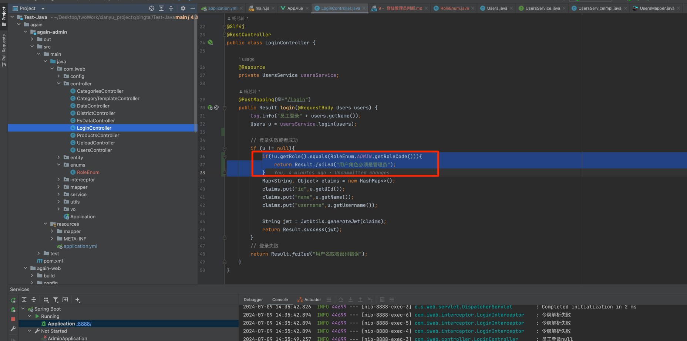

# 一、后端
## 1、新增 enums 包

## 2、在 enums 包下新增 RoleEnum.java 角色枚举类
```java
package com.iweb.enums;

import lombok.AllArgsConstructor;
import lombok.Getter;

/**
 * 角色枚举
 */
@Getter
@AllArgsConstructor
public enum RoleEnum {

  ADMIN("ADMIN","管理员");

  private String roleCode;

  private String remark;


}

```
## 3、修改 LoginController 接口
新增判断角色逻辑
```java
if(!u.getRole().equals(RoleEnum.ADMIN.getRoleCode())){
                return Result.failed("用户角色必须是管理员");
}
```

